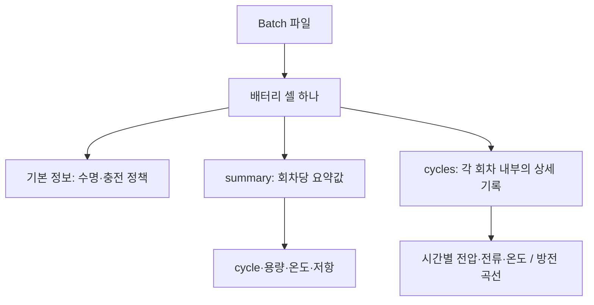

# 배터리 데이터셋, 처음부터 이해하기

이 데이터는 **여러 배터리를 반복해서 충전하고 방전하면서, 각 배터리가 어떻게 변하고 얼마나 오래 버티는지 기록한 실험 일지**입니다.

노트북이나 모델부터 이해할 필요는 없습니다. 먼저 “무엇을 실험했고, 숫자가 무엇을 뜻하는가”를 알아보겠습니다. 설명용으로 만든 숫자와 실제 파일에서 확인한 숫자는 구분해서 표시합니다.

## 1. 무엇을 알고 싶은 실험인가?

같은 종류의 새 배터리라도 사용 조건에 따라 수명이 달라질 수 있습니다. 끝까지 사용해 보면 실제 수명을 알 수 있지만, 그만큼 오래 기다려야 합니다.

이 연구의 질문은 **“아직 새것처럼 보이는 초기 측정값만 보고, 나중에 얼마나 오래 사용할 수 있을지 알아낼 수 있을까?”**입니다. 원 연구는 LFP/흑연 리튬이온 셀을 다양한 급속 충전 조건에서 시험했습니다. [원 논문](https://www.nature.com/articles/s41560-019-0356-8)

다음은 이해를 위한 가상 예시입니다.

| 배터리 | 첫 100회 동안 얻은 정보 | 끝까지 시험한 결과 |
|---|---|---|
| A | 용량·온도·저항·전압 곡선 | 600회 부근에서 수명 기준 도달 |
| B | 용량·온도·저항·전압 곡선 | 1,200회 부근에서 수명 기준 도달 |

우리의 분석은 A와 B의 초기 기록을 비교해서, 수명 차이를 설명할 만한 신호가 있는지 찾는 과정입니다. 이 표의 600·1,200은 실제 셀 결과가 아닙니다.

## 2. Cell, cycle, Batch는 무엇인가?

### Cell: 시험 대상인 배터리 하나

여기서 **cell(셀)**은 하나의 배터리 단위입니다. 여러 셀을 조립한 전기차 배터리 팩 전체를 한 행으로 기록한 데이터가 아닙니다.

현재 코드의 `cell_id=0`은 파일에서 첫 번째 셀이라는 뜻입니다. 다른 Batch의 `cell_id=0`과 같은 물리 배터리라는 뜻은 아닙니다. 그래서 분석에서는 `(batch, cell_id)`를 함께 사용합니다.

### Cycle: 한 번의 충전·방전 시험

이 실험에서 **cycle(사이클)**은 충전하고 방전하는 시험 한 회차로 이해하면 됩니다. 회차 안에는 조건에 따른 휴식이나 측정 단계도 포함될 수 있습니다.

```text
셀 하나
→ 충전·방전 1회차의 기록
→ 충전·방전 2회차의 기록
→ 충전·방전 3회차의 기록
→ …
```

cycle 100은 100일이라는 뜻이 아닙니다. 한 cycle 안에도 시간에 따른 전압·전류·온도 측정값이 여러 개 있습니다.

### Batch: 함께 묶여 제공되는 실험 집합

각 Batch는 여러 셀의 실험 기록을 묶은 단위입니다. 실험 집합마다 측정 조건이나 데이터 특성이 다를 수 있으므로, 우선 각각 살펴본 뒤 비교합니다.

우리 프로젝트의 Batch 이름은 다음 파일을 가리킵니다. 아래 수치는 **현재 로컬 원본 파일 점검 결과**입니다.

| 이름 | 파일 앞부분 | 셀 항목 수 | summary 행 수 |
|---|---|---:|---:|
| Batch 1 | `2017-05-12_…` | 46 | 38,811 |
| Batch 2 | `2018-02-20_…` | 47 | 26,904 |
| Batch 3 | `2018-04-12_…` | 46 | 51,007 |

합계 139개는 파일에 들어 있는 셀 **항목** 수입니다. 원 논문에서 분석한 124개 셀과 같은 집합이라고 가정하면 안 됩니다. 누락·제외·실험 연장 여부와 파일 구성을 확인해야 하며, 지금은 서로 다른 물리 셀 139개라고 확정하지 않았습니다.

## 3. 용량, 충전량, 수명은 어떻게 다른가?

### 현재 충전량: 지금 얼마나 충전되어 있는가?

휴대전화의 “배터리 80%”처럼 현재 충전 상태를 나타내는 개념을 **SOC(State of Charge)**라고 합니다. 방전하면 내려가고 충전하면 올라갑니다.

### 용량: 충전한 뒤 꺼내 쓸 수 있는 전하의 양

**용량(capacity)**은 배터리가 담고 내보낼 수 있는 전하량입니다. 여기서는 `Ah` 단위를 많이 사용합니다.

단위의 뜻을 보여주는 이상적인 예시로, 1 Ah는 1 A 전류를 1시간 흘렸을 때의 전하량입니다. 실제 사용 시간은 부하와 시험 조건에 따라 달라집니다. Ah는 전하량이고, Wh로 표현하는 에너지와는 다릅니다.

배터리가 노화되면 완충 표시가 100%여도 꺼내 쓸 수 있는 양이 줄 수 있습니다. 예를 들어 새 배터리는 1.1 Ah를 내보내는데, 오래 사용한 뒤에는 0.9 Ah만 내보낼 수 있는 식입니다. 이 용량 감소가 여기서 살펴볼 **열화**입니다.

### 수명: 정해진 용량 기준에 도달하기까지의 회차 수

원 논문은 공칭 용량의 80%에 도달하는 cycle 수를 수명 기준으로 사용합니다. 공칭 용량은 1.1 Ah이므로 기준 용량은 다음과 같습니다. [원 논문 Methods 및 수명 정의](https://web.mit.edu/braatzgroup/Severson_NatureEnergy_2019.pdf)

```text
1.1 Ah × 0.80 = 0.88 Ah
```

`cycle_life=1000`은 이런 수명 기준과 연결된 값입니다. 배터리가 1000번째 회차에 완전히 작동을 멈췄다는 뜻으로 읽으면 안 됩니다.

**SOC 80%**는 지금 충전된 비율이고, **공칭 용량의 80%**는 노화로 남은 용량의 기준입니다. 두 숫자가 같아도 의미는 다릅니다.

또한 파일에 저장된 마지막 cycle 번호가 반드시 `cycle_life`와 같지는 않습니다. 실제로 Batch 2의 첫 셀은 `cycle_life=477`인데 summary는 496회차까지 기록되어 있습니다. 현재 이 차이의 원인은 추가 확인 대상입니다.

## 4. 파일 안에는 어떤 층위의 데이터가 있나?

셀마다 **기본 정보**, **회차별 요약**, **회차 내부 상세 측정**이 있습니다. 이 구분은 연구자의 데이터 설명에 기반합니다. [공식 데이터 처리 저장소](https://github.com/rdbraatz/data-driven-prediction-of-battery-cycle-life-before-capacity-degradation)



### 기본 정보: 이 셀을 설명하는 값

| 필드 | 쉽게 읽는 뜻 |
|---|---|
| `cycle_life` | 그 셀의 수명 값; 예측할 대상 후보 |
| `policy_readable` | 사람이 읽기 쉬운 충전 정책 문자열 |
| `policy` | 원본 충전 정책 표현 |
| `barcode`, `channel_id` | 셀·시험 채널 관련 원본 정보; 현재 숫자 표현을 보존하며 식별 방식은 미확인 |
| `Vdlin` | 보간된 방전 곡선을 비교하는 데 쓰는 전압 격자 |

### summary: 회차 하나를 한 줄로 요약

| 원본 필드 | 분석 표의 이름 | 의미 |
|---|---|---|
| `cycle` | `cycle` | 원본 회차 번호 |
| `QDischarge` | `QD` | 해당 회차에서 내보낸 방전 용량, Ah |
| `QCharge` | `QC` | 해당 회차에서 충전한 전하량, Ah |
| `IR` | `IR` | 측정된 내부 저항, Ω |
| `Tavg` | `Tavg` | 회차의 평균 온도, °C |
| `Tmax` | `Tmax` | 회차의 최대 온도, °C |
| `Tmin` | `Tmin` | 회차의 최소 온도, °C |
| `chargetime` | `chargetime` | 충전 시간 지표; 집계 구간과 원본 단위는 처리 정의를 추가 확인 |

내부 저항은 배터리 안에서 전류 흐름을 방해하는 정도로 생각하면 됩니다. 하나의 값만으로 수명을 단정할 수는 없습니다.

다음은 **실제 Batch 1의 첫 셀에서 읽은 값**을 반올림한 표입니다.

| cycle | QD (Ah) | QC (Ah) | IR (Ω) | Tavg (°C) |
|---:|---:|---:|---:|---:|
| 1 | 0 | 0 | 0 | 0 |
| 2 | 1.070689 | 1.071042 | 0.016742 | 31.875 |
| 3 | 1.071901 | 1.071674 | 0.016724 | 31.931 |

두 번째 행은 “첫 셀의 원본 2회차에서 약 1.070689 Ah를 방전했고 평균 온도는 약 31.875°C였다”라고 읽으면 됩니다. 이 셀의 수명 값은 1190이며, 그 값이 각 회차 행에 붙어 있어도 회차별로 새 수명 측정을 했다는 뜻은 아닙니다.

첫 행의 0은 실제 상태를 정확히 나타내는 값인지, 초기화·기록상의 값인지 아직 확인하지 않았습니다. “배터리 용량이 0이었다”라고 바로 결론 내리지 않습니다.

### cycles: 회차 내부를 자세히 들여다보기

`summary`가 시험 한 회의 성적표라면, `cycles`는 시험 중에 측정한 상세 기록입니다.

| 필드 | 의미 |
|---|---|
| `t` | 회차 내부 측정 시간 좌표 |
| `I` | 전류 |
| `V` | 전압 |
| `T` | 온도 |
| `Qc`, `Qd` | 회차 내부의 누적 충전·방전 전하량 |
| `Qdlin` | 공통 전압 위치에 맞춰 보간한 방전 용량 곡선 |
| `Tdlin` | 보간된 방전 온도 곡선 |
| `discharge_dQdV` | 전압 변화에 대한 방전 용량 변화율; 이후 상세 탐색에 활용 |

이 상세 필드들은 숫자 하나가 아니라 보통 **배열**입니다. `summary.QDischarge`와 `cycles.Qd`는 이름이 비슷하지만, 전자는 회차별 요약값이고 후자는 한 회차 안의 상세 값들입니다. [공식 필드 설명](https://github.com/rdbraatz/data-driven-prediction-of-battery-cycle-life-before-capacity-degradation)

`Qdlin`의 배열 길이는 시간 측정 횟수를 뜻하지 않습니다. 현재 파일에서는 `Vdlin`의 1,000개 전압 위치에 맞춘 곡선을 확인했습니다. 서로 다른 회차를 같은 전압에서 비교하려고 위치를 맞춘 것입니다.

## 5. 충전 정책의 C는 무엇인가?

**C-rate**는 공칭 용량을 기준으로 전류 크기를 표현하는 방법입니다. 이 실험 셀은 1.1 Ah이므로 1C는 1.1 A, 4C는 4.4 A에 해당합니다. 전류가 일정하다는 이상적인 계산에서 1C는 약 1시간 분량의 속도지만, 실제 충전 시간에는 충전 구간·전압 제어·휴식 등이 영향을 줍니다. [원 논문 Methods](https://web.mit.edu/braatzgroup/Severson_NatureEnergy_2019.pdf)

설명용 정책 `6C(50%)-4C`는 다음처럼 읽습니다.

```text
SOC 0% → 50%: 6C
SOC 50% → 80%: 4C
SOC 80% → 100%: 별도의 공통 1C CC-CV 단계
```

원 실험의 다양한 정책은 **0–80% SOC 구간**을 바꾸고, 이후 80–100%는 공통 단계로 충전합니다. CC-CV는 정전류로 충전하다가 정전압 제어로 전환하는 방식입니다. 따라서 정책의 두 번째 C-rate를 “남은 구간을 100%까지 그 속도로 충전한다”라고 해석하지 않습니다. [원 논문 충전 절차](https://web.mit.edu/braatzgroup/Severson_NatureEnergy_2019.pdf)

현재 파일의 정책 문자열에는 `-newstructure` 같은 추가 표기도 있습니다. 표시 문구의 의미는 별도로 확인해야 합니다. EDA에서는 정책별 셀 수와 수명을 먼저 비교하고, C-rate를 숫자로 분리하는 작업은 표현 규칙을 확인한 후 진행합니다.

## 6. 열화 곡선과 ΔQ(V)는 각각 무엇을 보여주나?

### 열화 곡선: 오래 사용하면서 용량이 어떻게 변했나?

- 가로축: cycle 번호
- 세로축: 그 cycle의 방전 용량 `QD`
- 선 하나: 셀 하나의 기록

곡선이 내려가면 방전해 꺼낼 수 있는 양이 줄었다는 뜻입니다. 처음부터 일정하게 감소할 수도 있고, 한동안 비슷하다가 감소가 빨라질 수도 있습니다. 감소가 크게 가속되는 전환 부근을 **knee point**라고 부릅니다. 초기 구간에는 용량이 잠깐 증가하는 패턴도 있을 수 있으므로 매 회차 감소를 전제하지 않습니다.

### Q(V): 한 번 방전하는 동안의 곡선

여기서는 시간이나 회차 번호 대신 **전압 V**를 기준으로, 그 지점까지의 방전 용량 Q를 봅니다. 따라서 위의 전체 열화 곡선과는 다른 그림입니다.

### ΔQ(V): 같은 셀의 두 회차 곡선이 얼마나 달라졌나?

과제에서는 다음을 계산합니다.

```text
ΔQ(V) = 100회차의 Q(V) − 10회차의 Q(V)
```

다음 숫자는 개념을 설명하기 위한 가상 예시입니다.

| 비교 전압 | 10회차 Q(V) | 100회차 Q(V) | 차이 ΔQ(V) |
|---|---:|---:|---:|
| 3.0 V | 0.500 Ah | 0.490 Ah | −0.010 Ah |
| 2.8 V | 0.800 Ah | 0.770 Ah | −0.030 Ah |

차이는 전압마다 하나씩 계산되므로 **ΔQ(V)도 곡선**입니다. ΔQ의 평균·분산·최솟값 등은 이 곡선을 몇 개 숫자로 요약하는 방법입니다. 그렇게 만든 분석용 숫자를 **Feature(특징 변수)**라고 부릅니다.

전체 방전 용량이 비슷해 보여도 중간 전압 구간의 곡선은 달라질 수 있어, 초기 변화 신호를 탐색합니다. 관련 접근은 원 논문에서 제시되었으며, 우리 Batch에서 수명과 어떤 관계를 보이는지는 직접 확인해야 합니다. [원 논문 Figure 2](https://www.nature.com/articles/s41560-019-0356-8)

코드에서는 “cycle 10”과 배열의 저장 위치가 어떻게 대응하는지 먼저 확인해야 합니다. 지금 미리보기의 `CYCLE_INDEX=1`은 두 번째 **저장 위치**이며, 검증 없이 실험 2회차라고 확정하지 않습니다.

## 7. 왜 CSV처럼 바로 열 수 없고 파일도 큰가?

CSV는 보통 하나의 직사각형 표입니다. 이 데이터는 셀마다 회차 수가 다르고, 회차마다 상세 배열 길이도 다를 수 있습니다. 표 하나 안에 표와 배열이 여러 층으로 들어 있는 형태입니다.

MATLAB v7.3 파일은 HDF5 기반입니다. HDF5의 **group**은 폴더처럼 자료를 묶고, **dataset**은 배열을 담습니다. 이 파일의 `batch` 필드에는 각 셀 자료로 연결하는 **객체 참조**가 들어 있습니다. Python에서는 `h5py`로 필요한 부분만 읽을 수 있습니다. [h5py 공식 안내](https://docs.h5py.org/en/stable/quick.html)

다음은 Batch 1의 첫 셀 summary를 읽는 최소 예시입니다. 프로젝트 루트에서 실행합니다.

```python
from pathlib import Path
import h5py
import pandas as pd

path = Path("data/raw/2017-05-12_batchdata_updated_struct_errorcorrect.mat")

with h5py.File(path, "r") as file:
    # 셀의 summary로 연결되는 참조 배열을 읽는다.
    refs = file["batch"]["summary"][()].reshape(-1, order="F")

    # 첫 셀의 실제 summary 그룹으로 이동한다.
    summary_group = file[refs[0]]

    # 필요한 두 필드만 메모리에 읽는다.
    table = pd.DataFrame({
        "cycle": summary_group["cycle"][()].reshape(-1),
        "QD": summary_group["QDischarge"][()].reshape(-1),
    })

# 파일은 닫혔지만 읽어 둔 table은 사용할 수 있다.
print(table.head())
```

로딩 단계는 **파일 열기 → 참조 읽기 → 대상 그룹 찾기 → 필요한 배열 읽기 → 표 만들기**입니다. 파일을 열었다고 3 GiB 전체가 즉시 메모리에 올라가는 것은 아닙니다. 다만 상세 배열까지 모두 읽으면 메모리 사용량이 커집니다.

현재 프로젝트에서는 셀 메타데이터와 summary를 우선 읽고, 상세 곡선은 필요한 셀·저장 위치·필드만 읽습니다. 변환한 summary는 나중에 Parquet으로 저장할 수 있지만, 원본 상세 데이터를 단순 CSV 하나로 바꾸는 것이 필수는 아닙니다.

## 8. 노트북에서는 어떤 순서로 보면 좋을까?

1. `notebooks/batch1_raw_preview.ipynb`를 프로젝트 `.venv` 커널로 실행합니다.
2. 전체 셀 요약에서 “셀 하나에 수명과 정책이 하나씩 붙어 있구나”를 확인합니다.
3. 한 셀의 summary에서 “행 하나가 한 cycle이구나”를 확인합니다.
4. QD 그래프에서 오래 사용하며 용량이 어떻게 변하는지 봅니다.
5. `cycles`와 `Qdlin` 배열에서 “한 cycle 안에도 여러 측정·보간 값이 있구나”를 확인합니다.
6. `CELL_ID`를 바꾸고 다시 실행해 다른 셀과 비교합니다.
7. Batch 2·3 미리보기를 같은 방식으로 확인합니다.

그 뒤 `00_data_inspection.ipynb`에서 공통 로더의 결과와 데이터 품질을 살펴보면 됩니다.

## 9. 지금 알고 있는 것과 아직 확인할 것

현재 원본 점검에서 Batch 2의 `cycle_life` 8개, Batch 3의 2개가 NaN이었습니다. NaN은 값이 없다는 표시이며 수명이 0이라는 뜻이 아닙니다. Batch 1에는 QD=0인 행 46개가 있습니다. Batch 2에서 수명이 있는 39개 셀은 모두 기록 최대 cycle이 수명 값을 초과합니다.

이 값들의 원인, Batch 간 같은 물리 셀의 연장 실험 여부, 상세 저장 위치와 cycle 번호 대응은 후속 확인 대상입니다. 현재는 원본을 보존하고 이 차이를 드러내는 단계입니다.

또한 summary 행이 많아도 모델링 대상인 셀이 같은 수만큼 늘어나는 것은 아닙니다. 한 셀의 여러 회차가 반복된 기록입니다. 나중에 초기 Feature로 셀의 수명을 예측할 때는 **한 셀을 하나의 사례로 요약**하고, 예측 시점 이후의 정보는 입력에 넣지 않습니다.

읽고 나서 다음 세 문장이 이해되면 첫 노트북을 살펴볼 준비가 된 것입니다.

- 셀 하나에는 여러 cycle의 기록이 있다.
- summary는 cycle별 요약이고, cycles는 각 cycle 내부의 상세 기록이다.
- 초기 기록으로 끝까지 시험한 수명과 연관된 신호를 찾는 것이 이 프로젝트의 목적이다.
