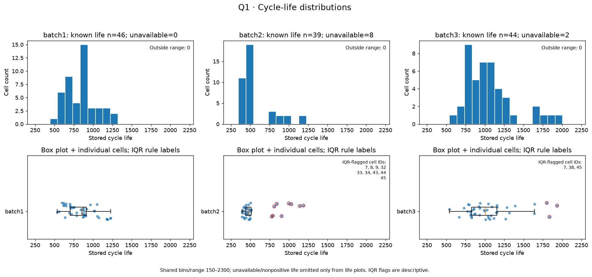
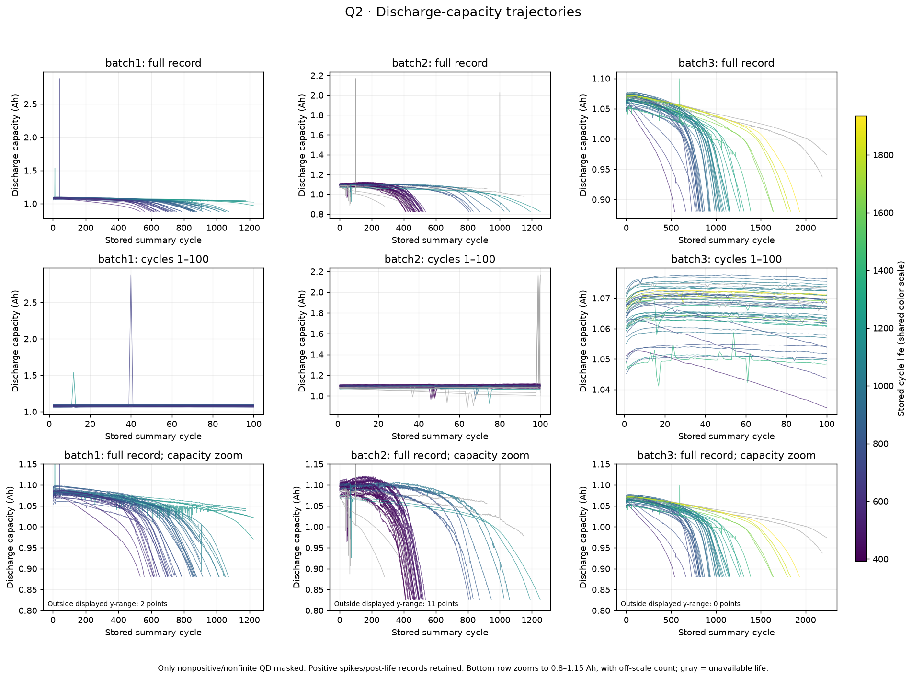
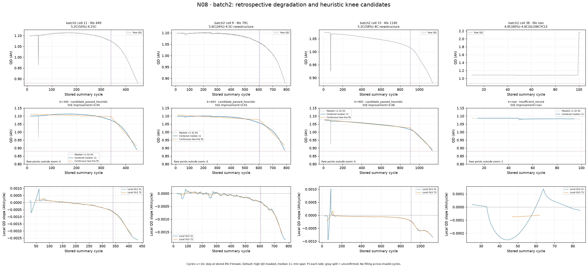
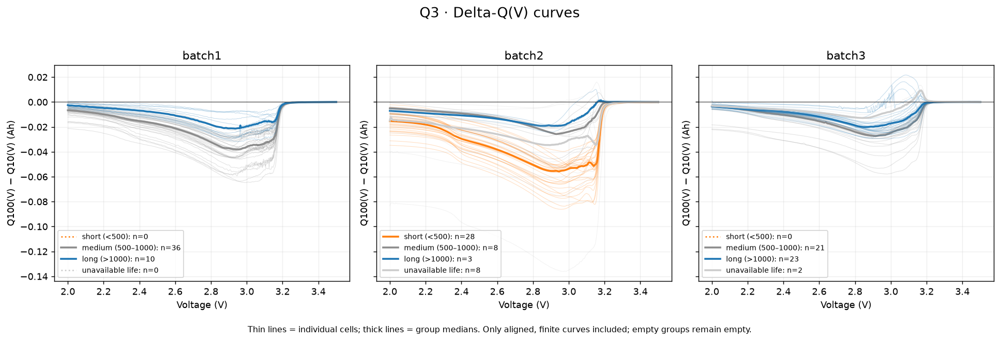
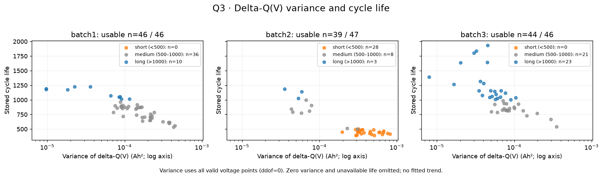
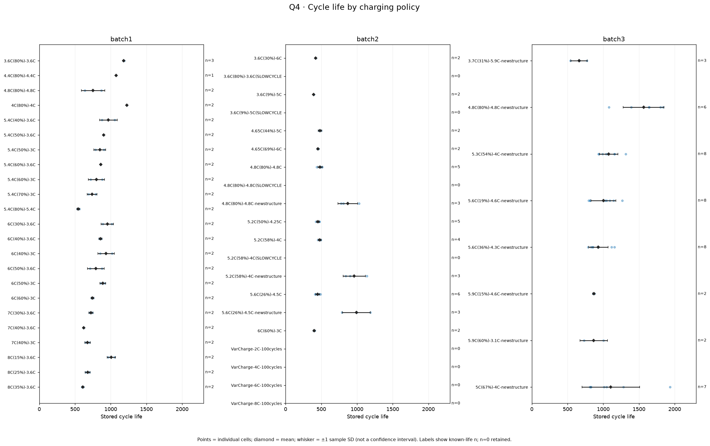
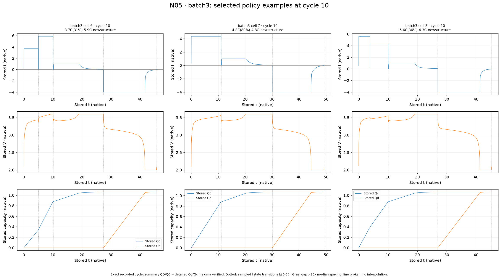
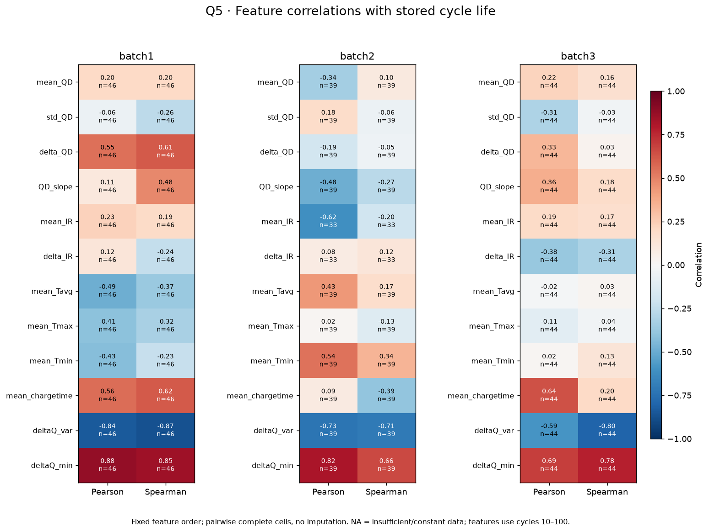
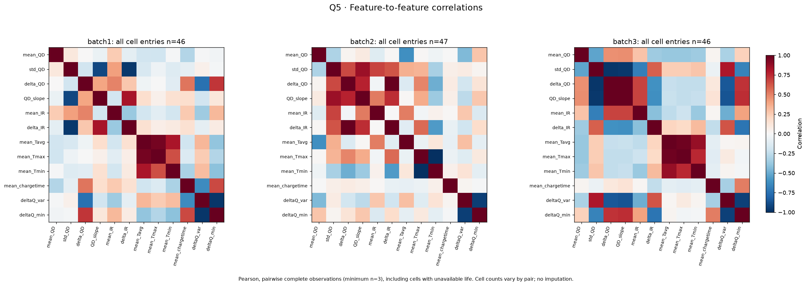

# ESS Battery Health — DAY1 모델 설계 보고서

**초기 배터리 관측 데이터의 EDA와 수명 예측 전략**

| 제출 정보 | 내용 |
|---|---|
| 캠퍼스·반 | 울산 캠퍼스 3반 |
| 작성자 | 최수빈 |
| 작성일 | 2026-10-01 |
| 제출 파일명 | `DS-MINI-Design-울산캠퍼스_3반-최수빈.pdf` |

## 1. 분석 목적과 설계 요약

본 보고서는 Batch 1·2·3의 배터리 데이터를 탐색하여 수명 분포, 용량 열화, 초기 ΔQ(V), 충전 조건, 특징 간 관계를 비교하고 후속 모델링 전략을 수립한다. DAY1의 결과는 EDA 근거에 따른 설계안이며 실제 모델 학습·성능 평가 결과는 아니다.

세 batch는 수명 분포가 크게 다르지만, 초기 ΔQ 분산·최솟값은 수명과 일관된 방향의 관계를 보였다. 반면 초기 용량 기울기는 전처리와 batch에 민감했고, 충전 전류 패턴도 지표별 관계가 달랐다. 이에 다음 기본안을 선정했다.

| 설계 항목 | 선정안 |
|---|---|
| 예측 문제 | 초기 100회 관찰에 기반한 전체 Cycle Life 회귀 |
| 타깃 | 원본 `cycle_life`; 학습 표현은 `log10(cycle_life)` |
| 기본 특징 | log10 ΔQ 분산 + 급등 마스킹 초기 QD 기울기 |
| 우선 모델 | Ridge; 일반 선형 회귀와 Gradient Boosting을 비교 후보로 둠 |
| 보조 특징 | cycle 10 최대 전류부터 패턴 하나씩 추가하여 효과 검증 |
| 검증 방향 | 동일 물리 셀 대응을 확인한 후 batch 하나씩 제외하는 개발 평가 |

선정안은 후속 실험의 출발점이다. 로그 변환, 기울기의 추가 효과, Ridge의 성능 우위는 아직 검증되지 않았다.

## 2. 데이터 개요와 분석 기준

### 2.1 데이터 구조와 사용 표본

MATLAB v7.3 형식의 계층적 데이터에서 필요한 필드만 선택 로드했다. 한 셀 항목에는 수명·충전 정책, 회차별 요약(`summary`), 회차 내부의 시간·전류·전압·용량 기록(`cycles`)이 들어 있다.

| 항목 | Batch 1 | Batch 2 | Batch 3 |
|---|---:|---:|---:|
| 원본 셀 항목 | 46 | 47 | 46 |
| 수명 유효 항목 | 46 | 39 | 44 |
| 수명 누락 항목 | 0 | 8 | 2 |

총 139개 파일 항목을 분석했으며, 수명 관련 통계에는 유효한 129개를 사용했다. `cell_id`는 파일 안의 위치이고 독립적인 물리 배터리 ID로 확정되지 않았다. batch 간 측정 연장·중복 여부는 후속 학습 전에 확인해야 한다.

### 2.2 공통 계산·품질 기준

- 수명은 원본 `cycle_life`다. 기록 종료 회차로 바꾸거나 누락을 0으로 채우지 않았다.
- 단수명은 `<500`, 중수명은 `500–1000`, 장수명은 `>1000`이다. 500·1000은 중수명에 포함한다.
- 초기 요약 특징은 cycle 10–100에서 계산했다. QD는 회차별 방전 용량, Q(V)는 전압별 방전 용량 곡선이다.
- 기본 EDA는 비유한 값과 0 이하 QD·IR을 분석용 열에서 가렸다. 양수 QD 급등값은 유지하고, QD>1.32 Ah 마스킹을 별도 민감도 조건으로 비교했다.
- 상관은 변수 쌍별 유효값으로 계산했다. 표시용 로그 축과 Pearson 계산에 넣은 원래 값을 구별한다.
- 전류·시간은 저장된 수치의 단위·집계 의미가 미확정이므로 원본 스케일을 유지했다.

Q100−Q10 계산에서는 139개 항목 ×2회차의 상세 Qd 최댓값과 요약 QD 대응, 전압 격자의 유한값·단조성·일치를 확인했다. 보완 분석에서는 cycle 10 전류 패턴 139건의 표본 길이·시간 순서·요약 QC/QD와 상세 최댓값 대응도 확인했다. 이는 저장 내용 대응 검증이며 실험적 의미나 모든 값의 품질을 보장하지 않는다.

## 3. Q1 — Cycle Life 분포와 짧은 수명 셀

### 3.1 분포·장단수명 비율

**핵심 답변:** Batch 1은 중수명 중심, Batch 2는 단수명 중심에 긴 수명 꼬리, Batch 3는 장수명 비중이 큰 분포다.



*그림 1. 상단은 150–2300 cycle 공통 구간 히스토그램, 하단은 개별 셀과 상자 그림이다. 빨간 표시는 batch별 IQR 기준이다.*

| 통계량 · cycle | Batch 1 | Batch 2 | Batch 3 |
|---|---:|---:|---:|
| 평균 | 844.7 | 565.7 | 1059.7 |
| 중앙값 | 858.5 | 472.0 | 1005.5 |
| 최소–최대 | 534–1227 | 392–1186 | 541–1935 |

유효 수명값은 모두 150–2300 범위 안에 있다. Batch 2는 평균이 중앙값보다 약 94 cycle 높아 일부 장수명 값이 평균에 영향을 준다. Batch 3는 중심이 가장 높고 긴 수명 쪽으로 넓게 퍼져 있다.

| 그룹 · 전체 항목 기준 | Batch 1 | Batch 2 | Batch 3 |
|---|---:|---:|---:|
| 단수명 | 0 · 0.0% | 28 · 59.6% | 0 · 0.0% |
| 중수명 | 36 · 78.3% | 8 · 17.0% | 21 · 45.7% |
| 장수명 | 10 · 21.7% | 3 · 6.4% | 23 · 50.0% |
| 수명 누락 | 0 · 0.0% | 8 · 17.0% | 2 · 4.3% |

분모는 수명 누락을 포함한 전체 항목이다. 유효 수명만 분모로 두면 Batch 2 단수명은 71.8%, Batch 3 장수명은 52.3%다. Batch 1·3에는 단수명 항목이 없어 해당 그룹의 특징을 직접 비교할 수 없다.

### 3.2 이상치와 짧은 수명 원인 가설

1.5×IQR 기준 표시 셀은 Batch 2의 `7, 8, 9, 32, 33, 34, 43, 44, 45`, Batch 3의 `7, 38, 45`이며 모두 장수명 쪽이다. Batch 1에는 없다. 따라서 이번 데이터에서 단수명 셀을 곧바로 분포상 이상치나 오류로 취급할 수 없다.

각 batch의 가장 짧은 3개씩 총 9개를 초기 신호와 동일 정책의 다른 셀로 비교했다. 아래는 설명을 위한 대표 사례다. Batch 1·3은 해당 batch 안에서 상대적으로 짧은 사례이며 `<500` 기준의 단수명은 아니다.

| batch · 셀 | 수명 | ΔQ 분산 / batch 중앙값 | 마스킹 QD 기울기 · Ah/cycle | 동일 정책의 다른 셀 수명 중앙값 |
|---|---:|---:|---:|---:|
| Batch 1 · 20 | 534 | 3.05배 | −0.000149 | 559.0 · n=1 |
| Batch 1 · 21 | 559 | 3.17배 | −0.000090 | 534.0 · n=1 |
| Batch 2 · 19 | 392 | 1.57배 | +0.000012 | 408.0 · n=1 |
| Batch 2 · 6 | 393 | 0.91배 | +0.000058 | 396.0 · n=1 |
| Batch 3 · 28 | 541 | 5.29배 | −0.000205 | 719.5 · n=2 |
| Batch 3 · 6 | 667 | 4.46배 | −0.000203 | 656.5 · n=2 |

Batch 1 cell 20·21은 같은 `5.4C(80%)-5.4C`, Batch 3 cell 28·6은 같은 `3.7C(31%)-5.9C-newstructure` 정책이다. 큰 ΔQ 변화와 초기 용량 감소가 짧은 수명과 함께 나타나고 같은 정책 셀에도 가까운 수명이 관측되어 실험 조건과의 연관성을 검토할 근거가 있다. 그러나 정책별 비교 표본이 작아 정책 효과와 셀 편차를 분리하지 못한다.

Batch 2는 중요한 예외다. 단수명 28개의 ΔQ 분산 중앙값은 0.000358 Ah²로 비단수명 11개의 0.000059 Ah²보다 약 **6.10배** 크지만, 초기 QD 기울기 중앙값은 각각 +0.000035와 −0.000053 Ah/cycle이다. 가장 짧은 일부 셀도 초기 용량이 증가한다. ‘초기 용량이 빠르게 감소해서 짧다’는 하나의 설명은 모든 사례에 적용되지 않는다.

**설계 시사점:** 실제 짧은 수명은 타깃 정보로 유지한다. batch별 분포 차이와 초기 신호의 예외를 검증에 반영한다. 원인 가설은 관측된 연관성으로 제시하며 제조 편차·실험 조건·측정 과정의 인과 효과는 미확인으로 남긴다.

## 4. Q2 — 방전 용량 열화와 knee 탐색

### 4.1 감소 추이와 열화 속도

**핵심 답변:** 초기 곡선은 겹치거나 증가하기도 하지만, 전체 기록에서는 완만한 변화 뒤 감소가 가팔라지는 사례가 있다. 일정한 속도의 열화로만 설명하기 어렵다.



*그림 2. 한 선은 한 셀의 기록이다. 상단은 전체, 중단은 초기 100회, 하단은 용량 0.8–1.15 Ah 확대다. 전체 기록에는 양수 급등과 수명 이후 기록이 남아 있다.*

초기 약 1 Ah 부근에서 곡선이 겹쳐 초기 용량 수준만으로 수명 그룹을 분리하기 어렵다. QD>1.32 Ah는 Batch 1 2건, Batch 2 11건, Batch 3 0건이다. Batch 1 cell 0 cycle 12는 약 1.539 Ah, cell 18 cycle 40은 약 2.884 Ah다. Batch 2의 11건은 수명 누락 8개 셀에서 나타났다.

Batch 1 초기 QD 기울기–수명 Pearson은 급등 유지 +0.109에서 마스킹 +0.524로 바뀐다. 일부 상세 회차는 긴 기록·공백·추가 용량 누적을 포함하므로 기울기를 고유 열화 속도로 해석하기 전에 처리 조건을 확인해야 한다. Batch 2의 수명 유효 39개 모두에 수명 이후 기록이 있어 곡선의 끝을 수명으로 읽지 않았다.

### 4.2 Knee point 후보



*그림 3. 원본 QD, 처리·평활 곡선과 연속 분할 직선, 국소 기울기를 비교한다. 실제 전환점이 아니라 명시적 기준으로 찾은 후보다.*

기본 조건은 QD 급등 마스킹, 중앙 이동 중앙값 11회, 분할 양쪽 최소 75 cycle·20개 점이다. 가장 긴 연속 유효 구간에 연속 분할 직선을 적합하고, 단일 직선 대비 잔차제곱합 20% 이상 개선·후반 음의 기울기·기울기 감소량 1e−5 Ah/cycle 초과를 요구했다. 전반 기울기가 음수면 후반 크기가 1.5배 이상이어야 한다. 알려진 수명 이후 기록은 제외했다.

| 대표 후보 | 후보 cycle | 전반→후반 기울기 · Ah/cycle | 해석 |
|---|---:|---|---|
| Batch 1 · cell 11 | 590 | −0.000063→−0.000704 | 감소 가속 후보 |
| Batch 1 · cell 2 | 445 | −0.000024→−0.000045 | 통과했지만 완만한 변화 |
| Batch 2 · cell 11 | 340 | −0.000044→−0.001776 | 감소 가속 후보 |
| Batch 3 · cell 5 | 675 | −0.000082→−0.000726 | 감소 가속 후보 |

선택 셀 10개는 급등 유지·마스킹, 평활 3조건, 최소 구간 2조건의 총 120개 적합을 비교했다. 동일 기본 조건을 전체 항목에도 적용한 결과는 다음과 같다.

| batch | 전체 | 기준 통과 후보 | 기준 미통과 | 기록 부족 |
|---|---:|---:|---:|---:|
| Batch 1 | 46 | 45 | 1 | 0 |
| Batch 2 | 47 | 44 | 1 | 2 |
| Batch 3 | 46 | 46 | 0 | 0 |

전체 139개 중 135개 통과는 완만한 곡률에도 반응하는 탐색 기준의 특성을 반영한다. 실제 급격한 knee 발생률로 해석하지 않는다. 미통과는 Batch 1 cell 0·Batch 2 cell 22, 기록 부족은 Batch 2 cell 37·38이다. 수명 유효 항목의 통과 후보 cycle 중앙값은 610·340·817.5지만 기록 범위와 수명 분포가 달라 batch 고유의 전환 시점 차이로 확정하지 않는다. 전체 항목의 개별 이미지·조건 민감도를 모두 검토한 것은 아니다.

**설계 시사점:** 초기 추세와 후기 가속을 구별한다. 전체 기록과 수명을 사용한 knee는 사후 설명 지표로 두며 초기 예측 입력에서 제외한다.

## 5. Q3 — 초기 ΔQ(V)의 차이와 특징 추출

### 5.1 Q100−Q10과 수명 그룹 비교

**핵심 답변:** 전압별 용량 변화에는 수명과 연결된 차이가 보인다. 그룹의 완전한 분리는 아니지만 분산·최솟값은 세 batch에서 일관된 관계를 보인다.

```text
ΔQ(V) = Q100(V) − Q10(V)
```

같은 전압 격자에서 계산하며 음수는 cycle 100의 방전 용량이 더 작다는 뜻이다. 회차별 QD의 양 끝 차이와 구별한다.



*그림 4. 얇은 선은 개별 셀, 굵은 선은 전압 지점별 그룹 중앙값이다. 중앙값 곡선은 실제 한 셀의 기록이 아니다.*

Batch 1은 장수명 중앙값이 중수명보다 대체로 0에 가깝다. Batch 2는 단수명의 음의 골이 더 깊지만 장수명 그룹은 3개뿐이다. Batch 3는 중·장수명 곡선의 겹침이 크고 일부 장수명 셀에서 약 3.0–3.2 V의 양수 봉우리가 있다. Batch 1·3에는 단수명 그룹이 없어 장·단수명 직접 비교를 수행할 수 없다.

### 5.2 통계 특징과 수명 관계

분산·최솟값·평균·평균 절댓값을 추출했다. 분산은 한 셀의 전압 지점별 ΔQ 퍼짐이고 `ddof=0`을 사용했다.



*그림 5. 가로축은 로그 표시다. 아래 Pearson은 로그 변환값이 아닌 원래 분산값 기준이며 Spearman은 순위 관계다.*

| 특징–수명 · Pearson / Spearman | Batch 1 · n=46 | Batch 2 · n=39 | Batch 3 · n=44 |
|---|---:|---:|---:|
| ΔQ 분산 | −0.838 / −0.871 | −0.733 / −0.709 | −0.590 / −0.797 |
| ΔQ 최솟값 | +0.882 / +0.850 | +0.819 / +0.661 | +0.692 / +0.776 |

분산이 작고 최솟값이 덜 음수인 셀에 긴 수명이 연결된다. 종료 관측을 50회로 바꿔도 분산의 Spearman은 −0.792·−0.437·−0.549로 음수다. 다만 이 탐색으로 최적 관측 시점이나 예측 성능이 결정된 것은 아니다.

품질 검토에서는 Batch 2 cell 33 cycle 75의 보간 Qdlin이 −84.27–306.74 Ah인 극단 범위를 보였다. 같은 회차 상세 Qd 최댓값은 약 0.926 Ah다. 이 회차는 Q75−Q10 관계에 영향을 주지만 기본 Q100−Q10에는 직접 사용되지 않는다. 유한값·대응 검증만으로 보간 품질을 보장하지 않는다.

**설계 시사점:** ΔQ 분산·최솟값을 우선 후보로 두고 대표 통계 하나를 선택한다. 정책 내부 관계와 곡선 품질을 검토하며 전체 상관을 모든 정책의 예측력으로 확대하지 않는다.

## 6. Q4 — 충전 조건·전류 패턴과 수명

### 6.1 정책별 평균 수명과 고속 충전 해석

**핵심 답변:** 정책별 차이는 있지만 한 가지 ‘충전 속도’로 모든 수명 차이를 설명하기 어렵다. 단계별 조건·batch·정책 내부 편차를 함께 고려해야 한다.



*그림 6. 점은 셀, 마름모는 평균, 가로 막대는 ±1 표본 표준편차다. 신뢰구간이 아니며 n=0은 수명 누락을 의미한다.*

| batch | 정책 | 평균 수명 | 유효 n |
|---|---|---:|---:|
| Batch 1 | `4C(80%)-4C` | 1226.5 | 2 |
| Batch 1 | `5.4C(80%)-5.4C` | 546.5 | 2 |
| Batch 2 | `4.8C(80%)-4.8C` | 483.6 | 5 |
| Batch 2 | `4.8C(80%)-4.8C-newstructure` | 871.7 | 3 |
| Batch 3 | `4.8C(80%)-4.8C-newstructure` | 1564.2 | 6 |
| Batch 3 | `3.7C(31%)-5.9C-newstructure` | 660.0 | 3 |

Batch 1의 두 사례는 높은 표기 C-rate 정책에서 짧은 수명을 보이지만 각각 2개로 일반화하기 어렵다. 비슷한 정책명도 `newstructure`·batch가 다르면 평균이 달라지고, Batch 3 `5C(67%)-4C-newstructure`는 동일 정책에서 813–1935(n=7)로 퍼진다. 첫 전류·최대 전류 하나를 전체 프로토콜의 속도로 간주할 수 없다.

### 6.2 전류 패턴과 초기 열화·수명



*그림 7. 시간–전류·전압·용량에서 단계적 전환을 확인한다. 예시 세 셀의 패턴이며 아래 통계는 세 batch의 모든 항목에서 별도로 계산했다.*

cycle 10 상세 139건에서 최대 양수 I, 시간 가중 평균 양수 I, 관측 양수 시간, 최대 I 80% 이상 유지 비율, 후반−전반 평균 I를 계산했다. 시간 구간 양 끝 I>0.05이고 간격이 양수인 경우만 사용하며, 양수 간격 중앙값의 20배를 넘는 공백과 부호 전환을 가로질러 적분하지 않았다. 전반·후반은 누적 관측 양수 시간의 절반이며 SOC나 실제 정책 단계의 절반이 아니다.

다음은 **마스킹 초기 QD 기울기와의 Pearson / Spearman**이다. 수명 유효 표본을 사용했고, 음수는 큰 지표에 더 음수인 초기 기울기가 연결됨을 뜻한다.

| 패턴–초기 QD 기울기 | Batch 1 · n=46 | Batch 2 · n=39 | Batch 3 · n=44 |
|---|---:|---:|---:|
| 최대 양수 I | −0.157 / −0.440 | −0.374 / −0.341 | −0.385 / −0.480 |
| 시간 가중 평균 양수 I | −0.339 / −0.394 | −0.099 / −0.268 | −0.199 / −0.267 |
| 관측 양수 시간 | +0.258 / +0.324 | +0.125 / +0.170 | +0.207 / +0.283 |
| 최대값 80% 이상 유지 비율 | −0.035 / +0.267 | +0.233 / +0.135 | +0.192 / +0.106 |
| 후반−전반 평균 I | +0.481 / +0.344 | +0.060 / +0.125 | +0.245 / +0.370 |

최대·평균 전류는 모두 음의 관계지만 지표별 크기는 다르다. 기울기는 초기 용량 증가도 포함하므로 이 상관을 전체 기간의 열화나 인과적 전류 효과로 해석하지 않는다. 최대 전류–기울기의 Batch 1 Pearson은 급등 유지 시 +0.147로 방향이 달라져 전처리 민감도도 확인됐다.

**수명 자체와의 관계**도 다음처럼 다르다.

| 패턴–cycle_life · Pearson / Spearman | Batch 1 | Batch 2 | Batch 3 |
|---|---:|---:|---:|
| 최대 양수 I | −0.580 / −0.495 | −0.161 / −0.328 | −0.708 / −0.585 |
| 시간 가중 평균 양수 I | −0.644 / −0.638 | −0.102 / +0.014 | −0.199 / +0.025 |
| 최대값 80% 이상 유지 비율 | +0.409 / +0.297 | +0.054 / +0.128 | +0.504 / +0.510 |
| 후반−전반 평균 I | +0.779 / +0.696 | +0.193 / +0.284 | +0.320 / +0.088 |

최대 전류가 큰 쪽에 짧은 수명이 연결되는 방향은 공통이지만 평균·유지 비율·전후 차이를 동일한 고속 충전 변수로 취급할 수 없다. Batch 1 cell 18의 시간 공백을 제외한 n=45에서도 후반−전반 I–수명 Pearson은 +0.791로 전체 +0.779와 같은 방향이지만 정책 영향은 남는다.

정책 내부에서는 평균 I–기울기 Pearson이 Batch 2 `4.8C(80%)-4.8C` +0.391(n=5), Batch 3의 해당 `newstructure` 정책 −0.595(n=6)로 달랐다. 작은 표본이며 동일 정책의 미세한 전류 차이가 실험 설정 변경을 뜻한다고 보장되지 않는다. cycle 10 한 회차와 미확정 단위만으로 초기 기간 전체 프로토콜·최적 정책·인과 효과를 확정할 수 없다.

**설계 시사점:** 최대 전류는 첫 보조 후보로 두되 ΔQ 밖의 추가 효과를 검증한다. 다른 패턴은 batch별 관계가 달라 한 개씩 비교하며 일괄 입력하지 않는다.

## 7. Q5 — 수명 관련 신호와 특징 중복

### 7.1 초기 특징–수명 관계와 가장 강한 신호

**핵심 답변:** 원래 검토한 12개 특징에서는 ΔQ 분산·최솟값이 세 batch에서 가장 강하고 일관된 관계를 보인다. 다른 요약 특징은 batch·특이값에 더 민감하다.



*그림 8. Pearson·Spearman과 각 특징의 유효 n을 함께 표시한다. QD 기울기는 급등 유지 조건이며 후속 기본안의 마스킹 조건과 구별한다.*

| 특징–수명 · Pearson / Spearman | Batch 1 | Batch 2 | Batch 3 |
|---|---:|---:|---:|
| ΔQ 분산 | −0.84 / −0.87 | −0.73 / −0.71 | −0.59 / −0.80 |
| ΔQ 최솟값 | +0.88 / +0.85 | +0.82 / +0.66 | +0.69 / +0.78 |
| QD 기울기 · 급등 유지 | +0.11 / +0.48 | −0.48 / −0.27 | +0.36 / +0.18 |
| 평균 chargetime | +0.56 / +0.62 | +0.09 / −0.39 | +0.64 / +0.20 |
| 평균 Tavg | −0.49 / −0.37 | +0.43 / +0.17 | −0.02 / +0.03 |

12개 특징 중 Pearson 절댓값 1위는 모두 ΔQ 최솟값, Spearman 절댓값 1위는 모두 ΔQ 분산이다. 이는 검토한 집합의 상관 순위이며 추가 전류 패턴 전체의 순위나 예측 성능 순위가 아니다. Batch 2 IR 관련 수명 상관은 n=33으로 다른 주요 특징 n=39와 다르다.

### 7.2 Multicollinearity와 특이값 영향



*그림 9. Pearson 행렬은 수명 누락 셀도 포함한 변수 쌍별 유효값 기준이다. 그림 8과 표본 집합이 다르다.*

| 특징 쌍 | Batch 1 | Batch 2 | Batch 3 |
|---|---:|---:|---:|
| ΔQ 분산–최솟값 | −0.973 | −0.938 | −0.934 |
| 대표적인 추가 중복 | std_QD–QD_slope: −0.910 | delta_QD–delta_IR: +0.993(n=40) | delta_QD–QD_slope: +0.992 |

ΔQ 두 특징은 상당 부분 함께 움직여 기본안에서 하나를 대표로 선택한다. 용량·온도 요약도 중복될 수 있다. 한편 Batch 2 평균 Tmax–Tmin은 전체에서 −0.999지만 cell 38의 극단값(Tmax=400, Tmin=−270)을 제외하면 +0.550이다. 해당 셀은 수명이 누락되어 특징–수명 상관에는 들어가지 않았다.

**설계 시사점:** 강한 중복과 극단값에 의한 상관을 구별한다. 대표 특징 선택과 규제를 비교하고 학습 분할 안에서 전처리를 정한다. 쌍별 상관은 다중공선성의 초기 점검이며 VIF 등 최종 설계 행렬 진단은 아직 수행하지 않았다.

## 8. Feature Engineering과 타깃 선정

### 8.1 특징 구성의 대안과 선정

| 대안 | 구성 | 장점·한계 | 결정 |
|---|---|---|---|
| F1 | log10 ΔQ 분산 하나 | 공통 신호를 단순하게 사용; 초기 추세 미반영 | 필수 비교안 |
| F2 | F1 + 마스킹 초기 QD 기울기 | 전압별 변화·회차별 추세를 비교; 기울기는 batch 의존 | **기본안** |
| F3 | F2의 분산을 ΔQ 최솟값으로 교체 | 강한 다른 통계 검토; 분산과 중복 | 대체 비교안 |
| F4 | 용량·IR·온도·시간 등 폭넓은 요약 | 추가 신호 가능; 표본 대비 중복·품질 문제 | 후순위 |
| F5 | ΔQ 곡선 약 1000개 지점 직접 입력 | 형태 정보 보존; 129개 타깃 대비 고차원 | 기본안에서 제외 |
| F6 | F1/F2 + 전류 패턴 하나 | 충전 관측 정보 추가; 정책·batch와 중복 가능 | 보조안 · 최대 I부터 |

ΔQ 분산은 세 batch에서 수명과 공통 방향의 관계가 확인된 핵심 특징이므로 F1을 필수 기준으로 둔다. F2는 전압별 용량 변화에 회차별 용량 추세를 하나 더하여 추가 정보의 효과를 확인하는 첫 실험 구성이다. 서로 다른 관측 정보를 요약한다는 점은 후보 선정의 근거이며, 두 특징의 독립성이나 보완 효과를 입증한 것은 아니다. 마스킹 기울기–수명 Pearson도 Batch 1 +0.524, Batch 2 −0.484, Batch 3 +0.361로 다르다. 따라서 F2 선정은 성능 우위의 결론이 아니며, 같은 모델·분할에서 F1과 비교해 batch별 오차와 평균 MAE의 개선 여부를 확인한다. 기울기를 공통 열화 원인으로 해석하지 않으며 추가 효과가 없으면 F1로 줄인다.

기본 특징은 다음처럼 고정한다.

- **log10 ΔQ 분산:** Q100−Q10 전체 전압 지점의 분산에 log10 적용. 0 이하·비유한 분산에 임의의 작은 상수를 더하지 않는다.
- **마스킹 QD 기울기:** cycle 10–100에서 0 이하·비유한 QD 및 QD>1.32를 가린 뒤 실제 cycle 번호로 직선 적합. 유효 5개 이상일 때 계산한다.

**마스킹 기준의 근거:** 1.32 Ah는 기존 전처리 코드 `QualityConfig`의 용량 기준값 1.1 Ah와 높은 QD 검토 비율 1.2를 곱한 탐색용 휴리스틱이다. 측정 오류를 확정하는 물리적 한계나 학습으로 최적화한 임계값은 아니다. 원본을 유지한 조건과 비교해 특징·상관의 민감도를 확인했으며, 후속 모델 평가에서도 두 조건을 비교한다.

**선택 입력 특징의 분포:** 아래 통계는 수명 라벨이 유효한 129개 항목(Batch 1·2·3 각각 46·39·44개)에 한정하며, 결측 대체·표준화 전 값이다. 기존 ΔQ 특징 표와 품질 민감도 표를 `batch`·`cell_id`로 연결해 집계했다. 사분위 구간은 Q1–Q3이며, 기울기의 단위는 Ah/cycle이다.

| Batch | 입력 특징 | 유효 수 | 결측 수 | 중앙값 | 사분위 구간 (Q1–Q3) | 최솟값 | 최댓값 |
|---|---|---:|---:|---:|---|---:|---:|
| 1 | log10 ΔQ 분산 | 46 | 0 | −3.851 | −4.053–−3.668 | −5.015 | −3.350 |
| 1 | 마스킹 QD 기울기 | 46 | 0 | −1.371e−05 | −2.037e−05–−8.482e−07 | −1.495e−04 | 1.674e−05 |
| 2 | log10 ΔQ 분산 | 39 | 0 | −3.487 | −3.674–−3.336 | −4.449 | −3.086 |
| 2 | 마스킹 QD 기울기 | 39 | 0 | 1.981e−05 | −4.627e−05–5.426e−05 | −1.860e−04 | 1.264e−04 |
| 3 | log10 ΔQ 분산 | 44 | 0 | −4.175 | −4.323–−4.066 | −5.099 | −3.452 |
| 3 | 마스킹 QD 기울기 | 44 | 0 | −1.515e−05 | −2.358e−05–−9.470e−06 | −2.047e−04 | 1.185e−07 |

Batch 2는 log10 ΔQ 분산 중앙값이 가장 크고 Batch 3는 가장 작다. 이는 앞서 확인한 수명 분포와 ΔQ 분산–수명의 음의 관계에 부합하지만, batch 차이만으로 개별 셀의 예측력을 입증하지 않는다. 기울기 중앙값은 Batch 2에서 양수, Batch 1·3에서 음수여서 초기 증가·감소가 batch에 따라 다름을 보여준다. 두 입력의 분포 차이도 batch 단위 검증과 F1/F2 비교의 근거다. 현재 129개 항목에서 두 특징의 결측은 없지만, 후속 데이터의 품질 검토와 학습 분할 내 결측 처리 원칙은 유지한다.

집계 원본: [선택 특징 통계표](../../tables/day1_answer_support/selected_feature_summary.csv). 입력 자료: [ΔQ 특징 표](../../figures/question_gallery/cell_features_for_gallery.csv), [품질 민감도 특징 표](../../figures/quality_sensitivity/early_qd_sensitivity.csv).

ΔQ 최솟값은 주요 대체 후보지만 분산과 동시에 기본 입력으로 넣지 않는다. `std_QD`·`delta_QD`도 기울기와의 중복을 검토한다. IR·온도·요약 시간·정책은 품질·집계 의미와 작은 정책 표본을 고려해 확장한다. `batch`·`cell_id`는 분할·관리 키이며 기본 수치 입력으로 쓰지 않는다.

knee, 전체 기록 길이·평균·기울기, 수명 그룹, 수명 이후 관측 정보는 미래 또는 타깃 정보를 포함하므로 초기 예측에서 제외한다. 전류 패턴은 cycle 10 정보만 사용하며 최대 I부터 한 개씩 추가해 같은 모델에서 성능을 비교한다.

### 8.2 Regression vs Classification

| 대안 | 타깃·표본 | 장점 | 현재 한계 |
|---|---|---|---|
| **회귀** | 원본 수명 · 129개 | 연속적 차이 보존, cycle 수명 제시 | 분포 차이·큰 오차 고려 |
| 장·단수명 2분류 | <500 / >1000 · 64개 | 극단 그룹 선별 | 중수명 65개 제외, 단수명은 모두 Batch 2 |
| 단·중·장 3분류 | 129개 | 과제 그룹과 대응 | 경계 근처 정보 손실·batch별 클래스 부재 |
| 장수명 여부 2분류 | >1000 / 나머지 · 129개 | 표본 유지, 선별 기준 단순 | 단·중수명 차이 손실, 운영 목적 미정 |

**회귀를 선정한다.** 수명은 연속값이고 초기 신호와 연관성이 관찰됐다. 운영상 합격·불합격 목적이 제시되지 않아 임의 경계보다 연속 수명 정보를 유지한다. 상관이 관측됐다는 사실은 선형성이나 예측 가능성의 입증은 아니다.

### 8.3 타깃 표현

타깃은 원본 `cycle_life`, 학습 표현은 `log10(cycle_life)`로 제안한다. 수명은 양수이고 큰 값과 작은 값의 상대적 차이를 다루기 위한 시도다. 예측을 `10**예측값`으로 복원하고 성능은 원래 cycle 단위로 평가한다. 로그 역변환이 원수명의 조건부 평균과 같지 않으며 MAE 개선도 보장되지 않아 원수명 학습과 비교한다.

예측 시점은 100회 관찰 직후이고, 예측값은 남은 수명 대신 전체 수명이다. 현재 유효 수명 최소는 392로, 100회 이전 실패 셀에 대한 적용성은 검증하지 않았다.

## 9. Modeling Strategy — 데이터 처리와 후보 모델

### 9.1 데이터 처리 계획

| 항목 | 계획과 EDA 근거 |
|---|---|
| 타깃 누락 | 10개를 지도학습 정답에서 제외하고 원본은 유지. 누락을 실패·검열로 가정하지 않음 |
| 특징 결측 | 필요하면 학습 중앙값 대체·결측 표시. 기본 특징은 현재 대체가 필요하지 않을 수 있음 |
| ΔQ 정의 실패 | 잘못된 격자·회차 대응은 단순 결측과 구별해 확인 전 제외하고 수·이유 기록 |
| QD 급등 | 분석용 마스킹과 원본 유지 민감도 비교. 낮은 양수 QD·초기 증가를 임의 삭제하지 않음 |
| 전류 공백·단위 | 기존 공백 제외 기준·원스케일 유지. 미관측 구간 복원이나 임의 단위 변환 없음 |
| 특징 중복 | ΔQ 대표 하나 선정; 특징 확대 시 규제·중복 진단 |
| 표준화 | Ridge 입력의 평균·표준편차를 각 학습 분할에서만 계산 |
| 학습·평가 분리 | 결측 대체·스케일·특징 선택·튜닝을 학습 내부에서 수행 |

전처리와 모델은 Pipeline으로 묶는 것을 계획한다. 한 학습 분할에서 전부 결측인 특징은 중앙값 대체가 불가능하므로 사용을 중단하고 원인을 기록한다. 실제 셀 제외가 생기면 학습·평가 표본 수를 다시 산정한다.

### 9.2 후보 모델과 EDA의 연결

| 후보 | 알고리즘 관점 | 데이터 관점과 역할 |
|---|---|---|
| 학습 수명 중앙값 | 특징 없는 상수 예측 | batch 분포 차이를 고려한 필수 기준 |
| 일반 선형 회귀 | 적은 계수로 값 관계 적합 | 두 특징의 단순 관계와 규제 필요성 비교 |
| **Ridge** | 선형 적합에 L2 계수 제약 | 학습 83–90개, 적은 특징, 계수 크기 통제 · **우선안** |
| **Gradient Boosting** | 여러 트리를 순차적으로 결합 | 단순 모델에 없는 관계·상호작용의 추가 이득 비교 · **우선 비선형안** |
| Random Forest | 여러 회귀 트리를 평균 | 비선형 비교의 보조 대안 |
| XGBoost / LightGBM | 규제·샘플링을 활용하는 부스팅 | 필요 시 구현 확대; 모두 동시 대규모 탐색하지 않음 |
| Elastic Net | L1·L2 규제 | 중복 특징을 확장할 때 검토 |

**Ridge 우선 선정 이유:** 작은 표본에서 두 특징으로 단순 관계를 먼저 확인하고, 계수 크기를 제한하면서 보조 신호의 효과를 비교하기 쉽다. Ridge는 예측 오차 제곱합에 계수 제곱합 패널티를 더한다. 규제가 강하면 필요한 관계도 줄어 과소적합할 수 있어 일반 선형 회귀와 함께 검증한다. 기본안은 ΔQ 두 통계를 함께 사용하지 않으므로 다중공선성 때문에 Ridge가 반드시 필요하다고 주장하지 않는다.

**부스팅을 비교할 이유와 우선안을 달리 둔 이유:** 초기 기울기·전류 패턴의 batch별 차이는 단순 모델의 한계를 확인할 근거다. 다만 비선형성의 입증은 아니며, 표본 129개와 batch 3개에서 넓은 튜닝은 검증 자료에 맞춰 선택될 위험이 있다. 작은 표본만으로 부스팅을 배제하지 않고 깊이·리프 크기·학습률·트리 수를 제한해 비교한다. 미관측 실험 조건이나 입력 품질 문제는 어느 모델도 자동으로 해결하지 못한다.

첫 부스팅 비교는 기존 환경의 `GradientBoostingRegressor`로 계획한다. 작은 표본에서는 일반 구현을 고려할 수 있다는 공식 안내를 참고했으며, 이 규모에서 대용량 처리 속도는 주요 선정 근거가 아니다. 모델 특성과 전처리 원칙은 부록의 공식 기술 문서에 근거하며 본 데이터에 대한 우선순위는 EDA 기반 판단이다.

## 10. 후속 검증 계획과 선택 기준

### 10.1 검증 목적과 분할

관측하지 않은 batch로의 전이를 개발 단계에서 점검하는 것을 주 목적으로 선택했다. 과제는 batch 비교를 요구하지만 특정 분할 방식은 지정하지 않는다. 동일 batch의 새 셀 예측이 실제 목적이라면 그에 맞는 별도 검증이 필요하다.

| 평가 batch | 학습 batch | 학습 항목 | 평가 항목 |
|---|---|---:|---:|
| Batch 1 | Batch 2 + Batch 3 | 83 | 46 |
| Batch 2 | Batch 1 + Batch 3 | 90 | 39 |
| Batch 3 | Batch 1 + Batch 2 | 85 | 44 |

위 수는 현재 파일 항목 기준이다. 동일 물리 셀의 연장·중복 여부와 수명 정의를 먼저 확인한다. 반복 셀이 있다면 평가 항목과 연결된 물리 셀을 학습에서 제외하거나 기록 통합 방식을 결정하고 표본 수를 다시 산정한다. 단순히 cell_id가 같다는 이유로 같은 물리 셀로 판단하지 않는다.

Batch 3 최대 수명 1935는 Batch 1·2의 1227·1186을 넘어 학습 범위 밖 평가가 생긴다. 실패를 모델 복잡도만으로 설명하지 않고 분포·범위 차이도 고려한다. 세 batch 모두 EDA에서 이미 봤으므로 후속 평가는 보지 않은 독립 최종 시험이라고 부르지 않는다.

### 10.2 제한된 튜닝·평가 지표

외부 평가 batch를 제외한 두 학습 batch를 내부 검증에서 하나씩 제외하여 설정을 선택한다. 내부 batch가 둘뿐이라는 한계를 기록한다. Ridge alpha는 예를 들어 0.1·1·10·100, 부스팅은 깊이 1·2 × 트리 수 50·100의 네 조합에서 시작하고 리프 최소 10·학습률 0.05를 고정하는 안을 제시한다. 이는 검증된 최적 설정이 아니다. early stopping을 쓴다면 평가 batch를 중단 결정에 사용하지 않는다.

주 지표는 **원래 단위 MAE(cycle)**다. 내부 검증 batch별 MAE 단순 평균으로 선택하며 RMSE·MAPE·batch별 R²를 보조로 기록한다. 외부 세 batch의 평균 MAE는 개발 평가 요약이며 그 결과로 설정을 반복 선택하지 않는다. MAPE의 짧은 수명 가중과 좁은 타깃 범위의 R² 해석에 유의하고 음수 R²도 기록한다.

### 10.3 비교 순서와 추천안 변경 조건

| 비교 | 확인할 사항 |
|---|---|
| 중앙값 → 단일 ΔQ → 두 특징, 일반 선형 회귀 vs Ridge | 주요 신호·기울기·규제가 각각 추가 이득을 주는가? |
| 로그 타깃 vs 원수명, ΔQ 분산 vs 최솟값 | 변환·대표 통계가 cycle 오차에 도움이 되는가? |
| QD 급등 유지 vs 마스킹 | 처리 조건이 성능·계수·개별 오차를 얼마나 바꾸는가? |
| 같은 특징의 Ridge vs 제한한 부스팅 | 모델 복잡도의 추가 효과가 있는가? |
| 같은 모델에 최대 I 하나 추가 | 충전 관측이 기존 특징 밖의 정보를 주는가? |

선택은 학습 내부 검증에서 수행한다. 기울기나 로그 타깃이 도움이 되지 않으면 제거·교체한다. 부스팅이 평균 MAE를 줄이고 특정 batch에만 개선이 집중되지 않는다면 대체 후보로 선택한다. 전류 패턴도 같은 모델·분할에서 하나씩 추가 효과를 확인한다. 작은 차이는 확정적 우위로 보지 않고 안정성과 단순성을 함께 판단한다. 활용상의 허용 오차가 정해지면 의미 있는 개선 기준을 실험 전에 정한다.

## 11. DAY1 설계 결론

EDA에서는 ΔQ 특징의 공통 관계와 함께 batch별 수명 분포·초기 추세·충전 패턴 차이를 확인했다. 따라서 연속 수명 회귀를 선택하고 초기 100회 정보로 구성한 두 특징과 Ridge를 먼저 평가할 설계안으로 선정한다. ΔQ 단일 특징·대체 통계·일반 선형 회귀·제한한 부스팅을 비교하고 전류 패턴은 최대 I부터 보조 후보로 검증한다.

후속 작업의 우선순위는 **수명 정의·물리 셀 대응·입력 품질 확인 → 학습 테이블 구성 → 제한된 후보 비교 → batch별 실패 해석**이다. 본 보고서는 실제 학습 결과, 최고 성능 모델 또는 충전 조건의 인과 효과를 제시하지 않는다. 관측 결과와 검증할 가정을 구별한 다음 단계의 설계 보고서다.

## 부록. 분석 근거와 재현 정보

### A. 과제·세부 근거

- 과제 원문: [DAY1 요구사항](../../../provided-references/day1_requirement.md), [결과 작성 안내](../../../provided-references/day1_result_form.md).
- 세부 답변: [질문별 EDA 보고서](day1_question_answers.md), [모델 대안·선정 전략](day1_model_strategy_alternatives.md).
- 보완 분석: [표 산출물 목록](../../tables/day1_answer_support/INDEX.md). 짧은 셀 9개 비교, cycle 10 패턴 139건과 상관, 전체 knee 139개 기본 조건 결과를 포함한다.

### B. 노트북·코드와 검증

| 작업 | 재현 경로 |
|---|---|
| 기본 질문별 EDA | [02_question_graphs.ipynb](../../../notebooks/02_question_graphs.ipynb), [question_gallery.py](../../../src/question_gallery.py) |
| 품질 민감도 | [03_quality_sensitivity.ipynb](../../../notebooks/03_quality_sensitivity.ipynb) |
| 정책·상세 패턴 | [04_policy_exploration.ipynb](../../../notebooks/04_policy_exploration.ipynb) |
| 초기 구간·knee | [05_window_knee_exploration.ipynb](../../../notebooks/05_window_knee_exploration.ipynb) |
| 표 기반 보완 | [report_answer_support.py](../../../src/report_answer_support.py) |

관련 노트북은 프로젝트 `.venv` 새 커널에서 실행 출력을 저장했다. 보완 계산까지 포함한 테스트 14개가 통과했고, 기존 최대 전류와 선택 셀 knee 결과의 재현을 확인했다. 분석 기준은 cycle 10–100이며 원본 값·수명 라벨을 다시 쓰거나 결측을 채워 EDA 상관을 계산하지 않았다. 전체 항목 knee 기본 조건 집계는 선택 셀의 조건 민감도 검증과 구별한다. 본 제출 문서 통합 과정에서는 새로운 모델 학습·이미지 생성을 수행하지 않았다.

### C. 모델 설계의 기술 근거

- [Ridge 공식 문서](https://scikit-learn.org/stable/modules/generated/sklearn.linear_model.Ridge.html): L2 규제.
- [Gradient Boosting 공식 안내](https://scikit-learn.org/stable/modules/ensemble.html#gradient-boosted-trees): 부스팅 특성과 구현 선택.
- [XGBoost 튜닝 안내](https://xgboost.readthedocs.io/en/stable/tutorials/param_tuning.html), [LightGBM 튜닝 안내](https://lightgbm.readthedocs.io/en/stable/Parameters-Tuning.html): 복잡도 제어.
- [전처리·데이터 누수 안내](https://scikit-learn.org/stable/common_pitfalls.html): 학습 분할 내 전처리.

기술 문서는 2026-10-01에 확인했다. 해당 기능을 근거로 모델 전략을 제안했으며 본 데이터의 성능 우위를 검증한 자료는 아니다.
