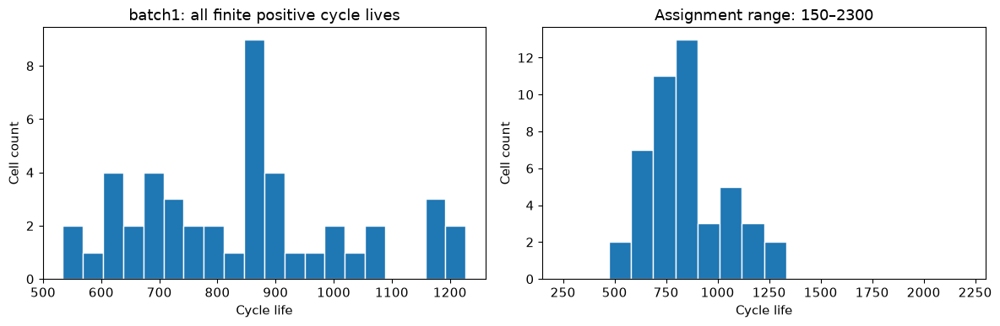
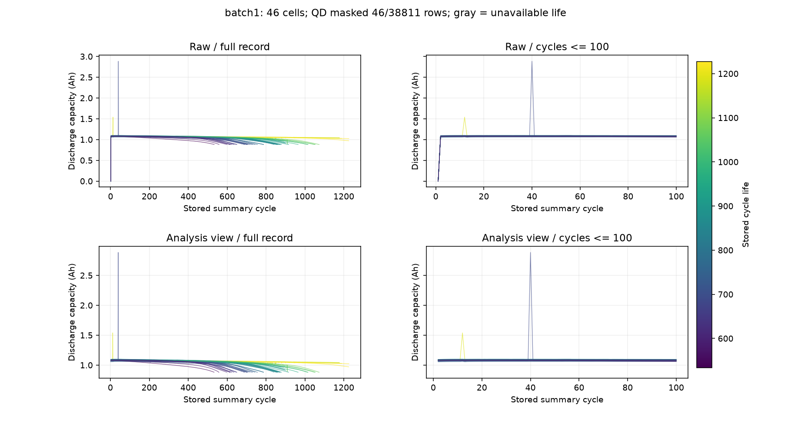
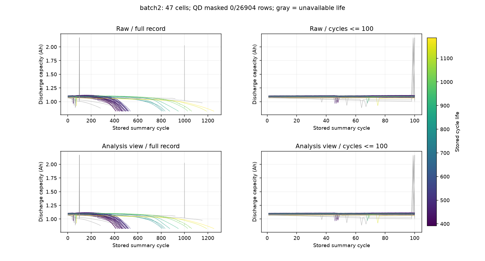
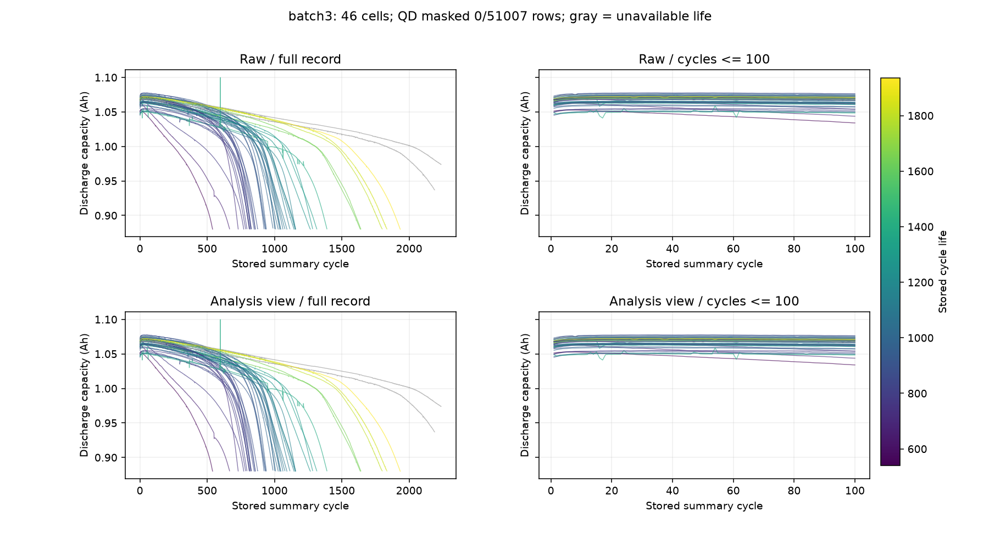
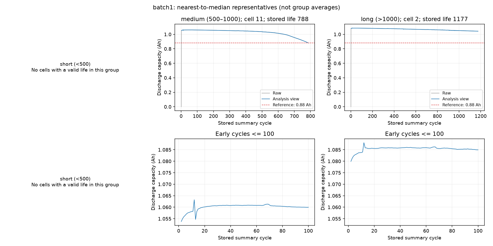
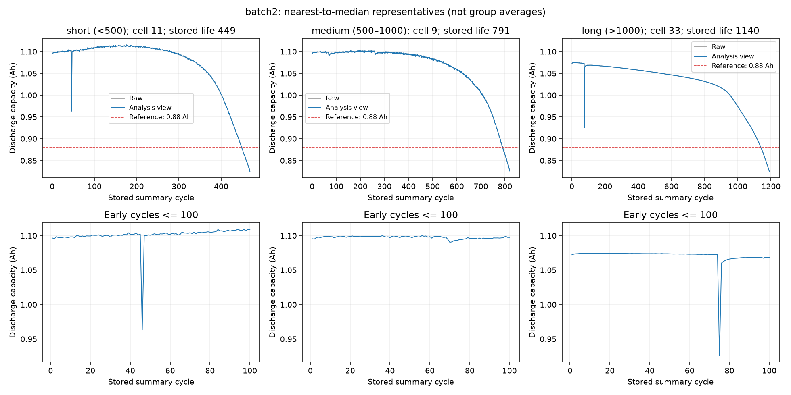
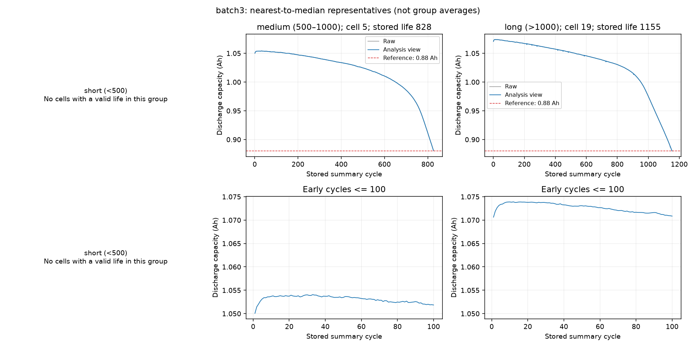

# 초기 EDA 그래프 3종 — 이미지와 관찰 기록

작성일: 2026-10-01

갤러리 이전에 만든 세 가지 그래프를 정리한 문서다. [그래프 작성 전략](../../../docs/day1/08_그래프_작성_전략_및_구현_현황.md)의 E01–E03에 대응한다. **히스토그램 1개와 batch별 개요·대표 곡선 6개, 총 7개 PNG**를 첨부했다.

첫 히스토그램은 기존 batch1 노트북의 실행 출력에서 PNG로 저장했다. 용량 개요와 대표 셀 그래프는 기존에 실행·저장한 세 batch 이미지를 사용했다. 수치는 기존 실행 기록과 셀별 특징 데이터에 근거한다.

## 1. E01 — 초기 수명 히스토그램

**구현 상태:** 완료. `00_data_inspection.ipynb`의 batch1 실행 결과이며 PNG로 저장했다. 이후 노트북 실행에서도 PNG가 저장되도록 저장 코드를 추가했다.

### 읽는 방법

- 가로축은 원본의 `cycle_life`, 세로축은 해당 수명 구간에 속한 셀 수다.
- 왼쪽은 데이터 범위에 맞춘 20개 구간, 오른쪽은 과제 범위 150–2300을 20개 구간으로 나눈 그림이다.
- 같은 데이터라도 구간의 폭과 경계가 달라 막대 높이와 봉우리 모양이 달라진다.

### 관찰한 특징

- batch1의 46개 셀 모두에 유효 수명이 있다. 수명 범위는 **534–1227**, 중앙값은 **858.5**다.
- 왼쪽에서는 850–900 부근의 집중이 눈에 띄지만, 오른쪽에서는 넓은 구간으로 합쳐져 더 큰 무리로 보인다. 봉우리의 세부 모양은 구간 선택에 민감하다.
- 과제 표시 범위 밖의 셀은 없으며, 단기 `<500` 셀도 없다. 중기 셀은 36개, 장기 셀은 10개다.
- 이 그림은 batch1의 첫 구조 확인용이다. 세 batch의 분포 비교는 별도 갤러리 그래프에서 수행했다.

**추가 확인:** 히스토그램의 봉우리만으로 서로 다른 실험 집단이 있다고 판단하지 않는다. 정책이나 다른 메타데이터와의 대응을 확인할 수 있다.

## 2. E02 — 원본·분석용 방전 용량 비교

**구현 상태:** 완료. `01_batch_eda.ipynb`와 `src/eda.py`에 구현되어 있으며 세 batch PNG가 저장되어 있다.

### 읽는 방법과 처리 조건

한 선은 한 셀이다. 위쪽은 원본 QD, 아래쪽은 분석용 QD다. 왼쪽은 전체 기록, 오른쪽은 초기 100 cycle이다. 분석용 QD는 0 이하 또는 비유한 값 등을 결측으로 표시하며 원본 행과 값은 보존한다. 양수 급등값은 기본 조건에서 유지한다.

색은 저장된 수명값이며 회색은 수명 누락이다. **색 범위는 batch별로 다르므로 같은 색을 같은 수명으로 비교하지 않는다.** 패널의 y축 범위도 확인해야 한다.

### batch1

- 원본에서는 첫 cycle의 0값과 이후 약 1.1 Ah 구간이 연결되어 급상승처럼 보인다. 분석용에서는 이 첫 0값을 가려 실제 양수 기록부터 곡선을 본다.
- QD 분석용 마스킹은 **46 / 38,811행**이다. 모든 셀의 첫 cycle에서 QD·QC·IR·온도·충전 시간 지표가 0인 패턴을 확인했다. 그 원인은 아직 확정하지 않았다.
- cell 0의 cycle 12에서 **1.539 Ah**, cell 18의 cycle 40에서 **2.884 Ah**인 급등값이 있다. 아래 분석용 패널에서도 유지된다.
- 급등값 때문에 초기 용량의 작은 차이가 압축되어 보인다. 급등값을 남기는 것과 일반 곡선의 작은 차이를 읽는 것은 별도의 표시 문제다.

### batch2

- QD 마스킹은 **0 / 26,904행**으로, 기본 조건에서는 원본과 분석용 곡선이 같게 보인다. 이것이 모든 값이 정상이라는 뜻은 아니다.
- 초기 구간에서 일시적인 급락과 2 Ah를 넘는 급등이 보인다. 수명 누락인 회색 선에도 특이값이 있다.
- 전체 기록에서는 많은 짧은 수명 셀이 400–500 부근에서 빠르게 감소하고, 더 긴 기록의 셀들도 별도로 보인다.
- 1.32 Ah를 넘는 QD는 **11건**이다. 기본 그림은 이 값들을 유지하므로 전처리 민감도 비교의 대상이 된다.

### batch3

- QD 마스킹은 **0 / 51,007행**으로 원본과 분석용 그림이 같게 보인다. 1.32 Ah 초과 QD는 없다.
- 초기 곡선은 주로 약 1.04–1.08 Ah에 모여 있으며 일부 작은 급락·급등도 보인다.
- 전체 곡선에서 후반 감소가 가팔라지는 셀이 많다. 변화가 가팔라지는 시점과 기록 길이는 셀마다 다르다.
- 회색의 수명 누락 곡선도 그대로 표시된다. 기록이 길다고 저장된 수명값을 임의로 부여하지 않았다.

**추가 확인:** 양수 급등·급락의 원인은 상세 cycle 기록과 실험 절차를 확인해야 한다. 특히 초기 표준편차·기울기를 계산할 때 이런 값이 얼마나 영향을 주는지 비교할 필요가 있다.

## 3. E03 — 수명 그룹별 대표 셀 곡선

**구현 상태:** 완료. `01_batch_eda.ipynb`와 `src/eda.py`에 구현되어 있으며 세 batch PNG가 저장되어 있다.

### 대표 셀 선정과 읽는 방법

수명 그룹별 중앙값에 가장 가까운 셀을 선택했다. 동률이면 cell_id가 작은 셀을 선택한다. **대표 곡선은 그룹 평균이 아니라 실제 한 셀의 기록**이다.

위쪽은 전체 기록의 원본·분석용 QD, 아래쪽은 초기 100 cycle의 분석용 QD다. 전체 패널의 빨간 점선은 0.88 Ah 참조선이며 초기 확대에는 표시하지 않는다. 초기 용량의 작은 변화를 읽기 위해 전체와 초기의 y축 범위는 다르다.

| batch | 단기 <500 | 중기 500–1000 | 장기 >1000 |
|---|---|---|---|
| batch1 | 해당 없음 | cell 11 · 수명 788 | cell 2 · 수명 1177 |
| batch2 | cell 11 · 수명 449 | cell 9 · 수명 791 | cell 33 · 수명 1140 |
| batch3 | 해당 없음 | cell 5 · 수명 828 | cell 19 · 수명 1155 |

### batch1

- 단기 셀이 없으므로 왼쪽 패널은 비어 있다.
- 중기 대표 cell 11은 후반에 감소가 가팔라지고, 장기 대표 cell 2는 전체 기록에서 상대적으로 완만하게 변한다.
- 초기에는 중기 대표가 약 1.06 Ah, 장기 대표가 약 1.085 Ah 부근이며 두 셀 모두 초기에 조금 증가한 뒤 안정되는 형태가 보인다.
- 전체 그림의 첫 0값은 원본 선에서만 보인다. 초기 분석용 그림은 이를 제외해 작은 변화가 드러난다.

### batch2

- 세 그룹 모두 대표 셀이 있다. 선택한 세 셀에서 후기로 갈수록 감소가 가팔라지는 형태가 보인다.
- 단기 대표 cell 11은 초기 약 1.10 Ah, 중기 대표 cell 9도 약 1.10 Ah다. 장기 대표 cell 33은 약 1.07 Ah로 더 낮다. 이 세 셀에서는 초기 용량이 큰 순서와 수명 순서가 같지 않다.
- 단기·장기 대표에 눈에 띄는 일시적 용량 급락이 있다. 급락 직후 값이 다시 올라오므로 이를 곧바로 지속적인 열화로 읽지 않는다.
- 세 셀은 0.88 Ah 아래까지 기록이 이어진다. 기존 전체 데이터 점검에서는 수명값이 있는 39개 셀 모두의 첫 QD≤0.88 Ah cycle이 저장 수명과 일치했다.

### batch3

- 단기 그룹은 비어 있으며, 중기 cell 5와 장기 cell 19를 비교한다.
- 두 셀의 초기 용량은 약 1.05 Ah와 1.07 Ah로 가까운 수준이지만 후기 곡선의 감소가 진행되는 시점은 다르다.
- 두 곡선 모두 초기에는 작은 변화, 후기에는 빠른 감소가 나타난다. knee처럼 보이는 굽음은 있지만 현재 위치를 수치로 검출하지 않았다.

**해석의 범위:** batch1의 46개 및 batch3의 수명 유효 44개 셀은 저장 수명이 기록 최대 cycle+1이며, 유효한 양수 QD가 0.88 Ah 이하인 관측은 없었다. 그림에서 선 끝이 참조선에 가까워 보여도 관측된 기준 도달로 단정하지 않는다. 대표 두세 셀에서 보이는 차이를 전체 그룹의 일반적인 차이로 확정하지 않는다.

## 재현과 다음 확인

- 히스토그램: [00_data_inspection.ipynb](../../../notebooks/00_data_inspection.ipynb)
- 용량 개요·대표 셀: [01_batch_eda.ipynb](../../../notebooks/01_batch_eda.ipynb). `BATCH_NAME`을 바꾸어 실행하고 `SAVE_FIGURES=True`로 저장한다.
- 처리 규칙과 기존 수치: [전처리 기준과 첫 EDA 관찰](../../../docs/day1/07_전처리_기준_및_첫_EDA_관찰.md)
- 이후 확장한 9개 그래프: [갤러리 관찰 보고서](question_graph_observation_report.md)

다음 비교는 양수 QD 급등값을 유지·마스킹했을 때 초기 특징이 얼마나 바뀌는지 확인하는 것이다. 후기 열화 가속 구간의 위치는 별도의 기울기·knee 탐색으로 확인할 수 있다.
