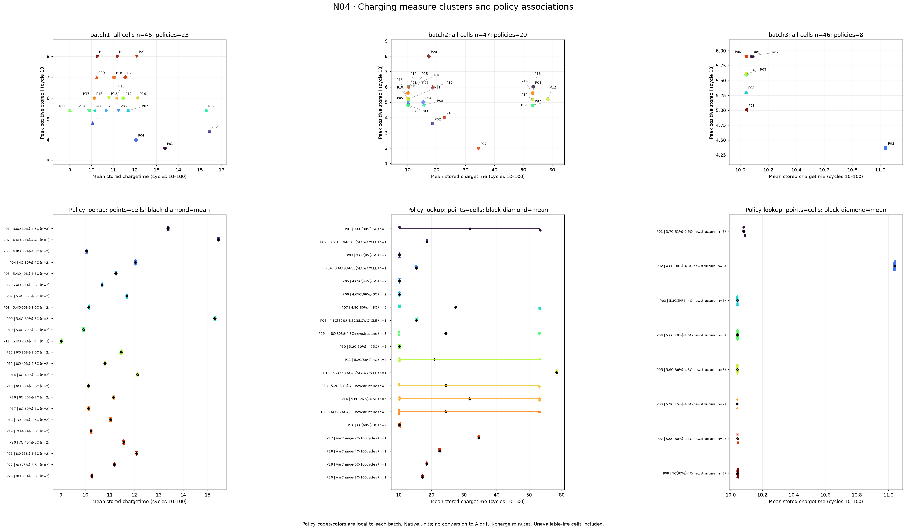
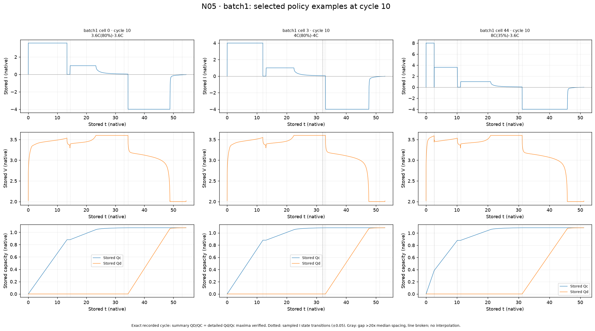
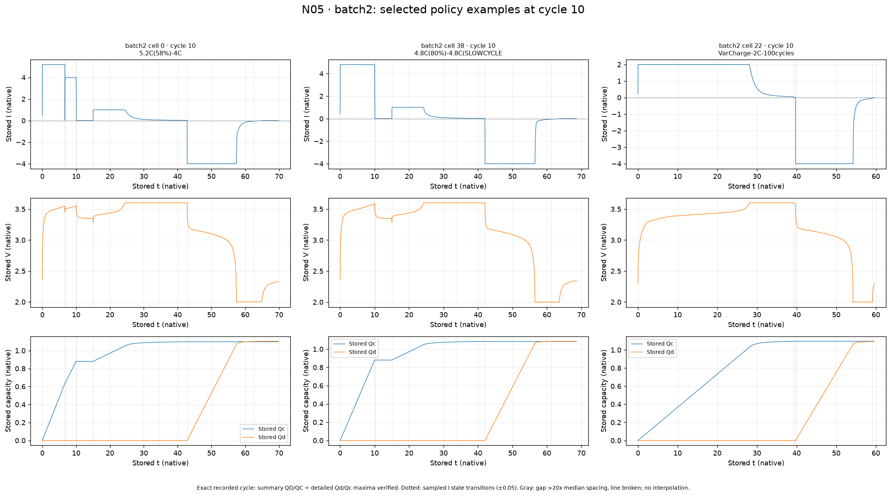
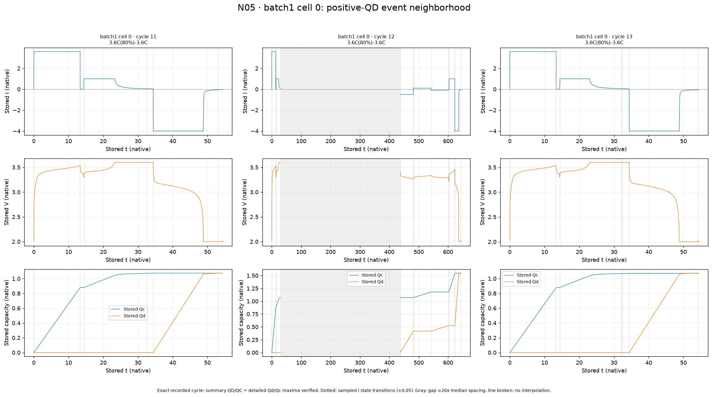
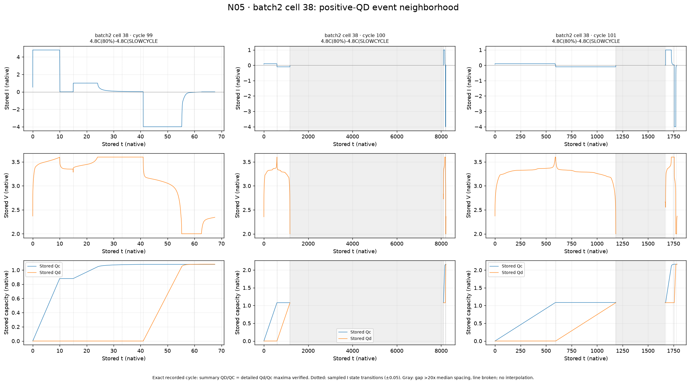
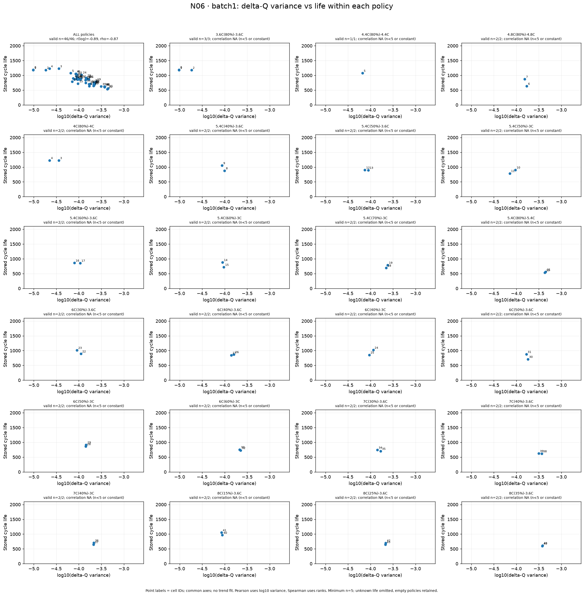
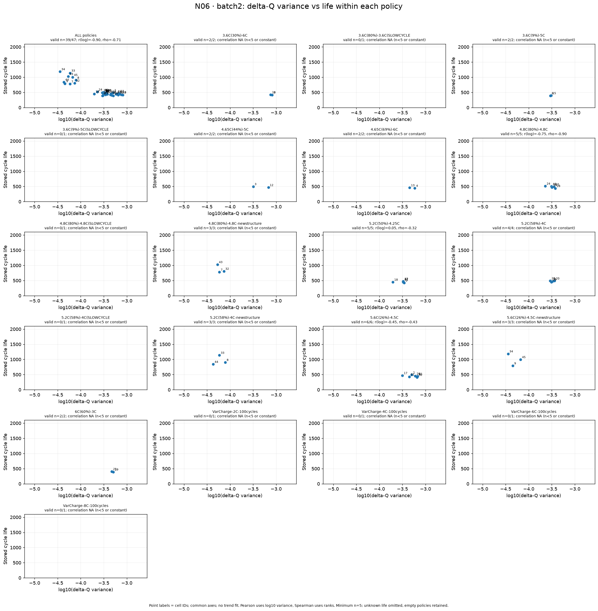
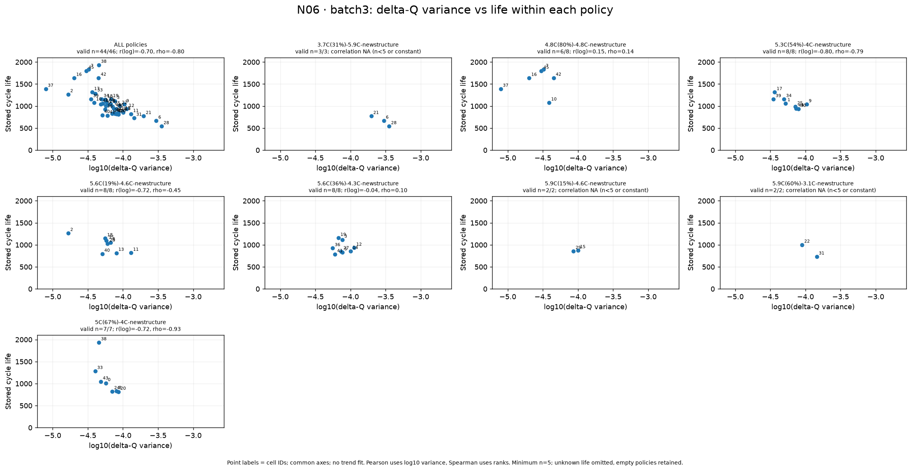

# 충전 정책과 상세 cycle 탐색 — N04–N06

작성일: 2026-10-01

[그래프 전략](../../../docs/day1/08_그래프_작성_전략_및_구현_현황.md)의 첫 묶음 N04–N06을 구현·실행했다. **그래프 9개**를 저장했다: 정책 연결 1개, 상세 cycle 비교 5개, 정책 내부 ΔQ 비교 3개다. 원본 셀 139개를 유지하고, 선택한 상세 cycle 15건의 내용 대응을 확인했다.

노트북은 [04_policy_exploration.ipynb](../../../notebooks/04_policy_exploration.ipynb), 공통 코드는 [policy_eda.py](../../../src/policy_eda.py)다. N07–N08은 다음 묶음으로 남겨두었다.

## 1. N04 — 충전 지표의 무리와 정책 연결

**구현 상태:** 완료. 수명 누락 셀도 포함하여 세 batch를 표시했다.

### 읽는 방법

위쪽은 초기 cycle 10–100의 평균 `chargetime`과 cycle 10의 최대 양수 `I`다. P01 등의 정책 코드는 아래쪽 정책 이름과 연결된다. 아래쪽 점은 개별 셀, 검은 마름모는 정책 평균, 가로선은 최솟값–최댓값이다. **같은 정책의 두 시간 무리가 떨어져 있으면 양쪽에 정책 코드를 표시했다.** 코드와 색은 batch별로 정의된다.

단위와 집계 범위를 확정하지 않았으므로 원본 수치를 완충 시간(분)이나 A로 바꾸지 않았다. 가로선은 평균의 신뢰구간이 아니다.

### 관찰 결과

- **batch1:** 23개 정책에 셀 1–3개씩 있다. 같은 정책의 충전 시간 값은 대부분 가깝고, 정책에 따라 약 9–15.4에 분포한다. 동일한 최대 전류 수준에서도 충전 시간이 다르다. 예를 들어 5.4 계열은 약 9.01부터 15.29까지 차이가 있어 최대 전류만으로 시간 지표를 설명하기 어렵다.
- **batch2:** 20개 정책이 있다. 약 10과 53의 시간 무리는 서로 다른 정책으로만 나뉘는 것이 아니다. **같은 정책 안에서도 두 무리가 나타난다.** `4.8C(80%)-4.8C`의 5개 셀은 10.17–53.29, `5.6C(26%)-4.5C`의 6개 셀은 10.18–53.31에 걸쳐 있다. 이름이 같은 정책만으로 기록 조건을 완전히 설명할 수 없다.
- **batch2 특별 항목:** `VarCharge`의 시간 평균은 약 17.27–34.50, `SLOWCYCLE`은 약 15.33–58.45다. 이 항목들의 수명은 누락되어 있으나 이번 그림에는 모두 포함했다.
- **batch3:** 8개 정책이 있다. 약 11.04의 떨어진 무리는 **`4.8C(80%)-4.8C-newstructure`의 8개 셀**이다. 다른 정책은 약 10.04–10.09에 있다. 이 batch에서는 시간 무리와 정책이 더 뚜렷하게 연결된다.
- **정책 표기와 저장 I:** batch3 위 정책의 최대 양수 I는 약 **4.365–4.373**으로 이름의 `4.8C`와 수치가 같지 않다. 이 차이만으로 오류라고 판정하지 않으며, 원본 전류의 정규화·단위·실제 설정을 확인할 이유가 된다.

**추가 확인:** batch2에서 같은 정책 내부에 긴 시간 지표가 나타나는 셀의 채널, 기록 설정, 회차별 chargetime 변화 등을 확인할 수 있다. 이 그림은 정책과 지표의 대응이며 정책의 수명 인과 효과를 검증한 것은 아니다.

## 2. N05 — 선택한 셀의 상세 cycle 패턴

**구현 상태:** 완료. cycle 10의 정책 비교 9건과 특이 회차 주변 6건을 선택 로드했다.

### 공통 읽기 기준

세로 패널은 I, V, Qc·Qd이며 가로축은 저장된 시간 `t`다. 원본 수치와 표본 순서를 유지한다. 선택 셀은 다른 정책을 살펴보기 위한 사례이며 통계적 대표 표본이 아니다.

- summary cycle 번호를 원래 저장 순서에서 찾았다. 모든 선택 cycle에서 상세 Qd·Qc 최댓값이 각각 요약 QD·QC와 일치했다(상대 허용오차 1e−6, 절대 1e−7).
- 각 상세 필드의 표본 수, 유한값, 시간의 비감소 여부도 확인했다. cycle 10의 저장 인덱스는 9다.
- 점선은 저장 I를 **±0.05**의 탐색용 범위로 나눈 양수·정지·음수 상태가 표본 간 바뀐 지점이다. 실제 제어 명령의 정확한 전환 시각을 검증한 선은 아니다.
- **회색 구간은 인접 시간 간격이 양수 간격 중앙값의 20배를 넘는 관측 공백**이다. 그 구간의 선을 끊어 연속 변화처럼 연결하지 않았다. 회색 구간 내 실제 동작은 이 기록만으로 알 수 없다.
- 선택 기록에서 Qc는 양수 I 구간, Qd는 음수 I 구간에서 증가하는 양상이 보인다. 이 대응을 충·방전 패턴을 읽는 근거로 사용하되 I를 A로 환산하지 않았다.

### 2.1 batch1 — 다른 정책의 cycle 10

- 선택 셀은 0(`3.6C(80%)-3.6C`), 3(`4C(80%)-4C`), 44(`8C(35%)-3.6C`)다.
- cell 44는 초기 I가 약 8에서 3.6으로 바뀌는 단계가 있고, cell 0·3은 초기 약 3.6·4 수준을 유지한다. 최대값 하나로는 단계의 차이를 읽을 수 없다.
- 세 사례 모두 후반 음수 I가 약 −4 수준이며 Qd가 증가한다. 충전 쪽 패턴은 다르지만 이 선택 사례들의 방전 쪽 수준은 비슷하다.
- 기록 시간 범위는 각각 약 54.37, 53.05, 51.17이다. 이것은 전체 상세 기록의 원본 시간 범위이며 N04의 평균 chargetime과 같은 집계값이 아니다.

### 2.2 batch2 — 일반·SLOWCYCLE·VarCharge 사례의 cycle 10

- cell 0(`5.2C(58%)-4C`)은 초기 약 5.2에서 4로 내려가는 단계가 보인다.
- cell 38(`4.8C(80%)-4.8C(SLOWCYCLE`)의 cycle 10은 약 4.81의 초기 양수 I 뒤에 별도 양수 구간과 음수 구간이 이어진다. 이 회차 자체의 최대 Qd는 약 1.086이다.
- cell 22(`VarCharge-2C-100cycles`)는 초기 약 2 수준이 비교적 오래 유지되는 패턴이다. cycle 10만으로 100회 동안의 전류 변화 규칙을 확인한 것은 아니다.
- cell 38의 cycle 10은 아래 cycle 100과 현저히 다른 패턴이다. 정책 문자열의 접미사가 모든 회차의 동일 동작을 뜻한다고 가정하기 어렵다.

### 2.3 batch3 — 다른 정책의 cycle 10

- cell 6(`3.7C(31%)-5.9C-newstructure`)은 양수 I가 약 3.7에서 5.9로 증가하는 단계가 보인다.
- cell 3(`5.6C(36%)-4.3C-newstructure`)은 약 5.6에서 4.3으로 감소하는 단계가 보인다. 정책마다 전류 전환의 방향도 다르다.
- cell 7(`4.8C(80%)-4.8C-newstructure`)의 초기 I는 약 4.37 수준이다. N04에서 확인한 원본 수치와 정책 표기의 차이가 상세 기록에도 나타난다.
- 세 사례의 최대 Qd는 약 1.062–1.070이며 후반 음수 I는 약 −4다. 이 초기 전체 용량 수준만으로 세 정책의 수명 차이를 설명하지 않았다.

### 2.4 batch1 cell 0 — cycle 11·12·13

| cycle | 전체 시간 범위 (원본) | 최대 인접 시간 공백 (원본) | 최대 Qd |
|---|---:|---:|---:|
| 11 | 54.37 | 0.084 | 1.074781 |
| 12 | 642.78 | 407.40 | 1.539054 |
| 13 | 54.38 | 0.084 | 1.073827 |

- 급등값이 있는 cycle 12는 인접 회차보다 훨씬 길고, 전류가 여러 구간으로 바뀌며 Qc·Qd가 단계적으로 누적되는 형태다.
- 약 407.40의 큰 관측 공백이 있다. 공백 앞뒤를 직선으로 이어 그리면 그동안 완만하게 변화한 것처럼 보이므로, 이번 그림에서는 회색 표시와 선 끊기를 적용했다.
- **1.539라는 값은 요약 표에만 따로 있는 값이 아니라 상세 Qd 최댓값과 일치한다.** 요약값 불일치로 생긴 급등은 아니다. 다만 기록 블록과 누적 용량의 의미는 추가 확인이 필요하다.
- 인접 cycle 11·13은 비슷한 약 1.074로 돌아온다. 이 한 회차의 큰 최대값을 일반적인 초기 용량 변화와 동일하게 해석하기 어렵다.

### 2.5 batch2 cell 38 — cycle 99·100·101

| cycle | 전체 시간 범위 (원본) | 최대 인접 시간 공백 (원본) | 최대 Qd |
|---|---:|---:|---:|
| 99 | 67.58 | 0.085 | 1.082088 |
| 100 | 8218.64 | 6921.34 | 2.162267 |
| 101 | 1785.30 | 482.42 | 2.165384 |

- cycle 99는 초기 큰 양수 I와 이후 음수 I를 갖는 일반적인 비교 사례다.
- cycle 100·101은 최대 양수 I가 약 1이며, cycle 99의 약 4.81과 다르다. 긴 시간 범위와 큰 관측 공백도 있다.
- Qc·Qd는 약 1.08 수준까지 누적된 뒤 후반 추가 구간에서 약 2.16까지 이어진다. 한 저장 cycle 안에 반복되는 동작 구간이 포함된 형태가 보인다.
- **상세 Qd 최댓값과 요약 QD는 일치하지만, 2.16을 단일 일반 방전의 용량으로 해석해도 되는지는 아직 확인하지 않았다.** 상세 대응 검증은 표본 블록의 실험적 의미까지 보장하지 않는다.
- 이 셀은 수명 누락과 온도 극단값도 있어, 여러 지표를 함께 검토할 사례다. 이번 작업은 온도 상세 기록의 원인을 확인한 작업은 아니다.

**N05에서 얻은 후속 질문:** 급등값을 삭제하기 전에, 저장 cycle의 블록 구성과 용량 누적 규칙을 확인할 필요가 있다. 긴 관측 공백의 원인이 실제 대기인지 기록 중단인지도 구별되지 않았다.

## 3. N06 — 정책 내부의 ΔQ 분산과 수명

**구현 상태:** 완료. 세 batch의 모든 정책을 표시하고 작은 표본·수명 누락 항목도 패널에 남겼다.

### 계산과 표시 조건

가로축은 **log10(ΔQ 분산)**, 세로축은 저장 수명이다. ΔQ는 기존 cycle 100−10의 상세 곡선 특징을 그대로 사용했다. 같은 축 범위를 모든 정책 패널에 적용하며 숫자는 cell_id다. 수명이 없는 셀은 점에서 제외하지만 분모 n과 빈 정책을 표시한다.

정책 내부 상관은 **유효 n≥5이며 두 변수가 상수가 아닐 때**만 계산했다. n=5가 충분한 추론 표본이라는 뜻은 아니며, 1–3개 점으로 극단적인 상관을 만드는 것을 피하기 위한 표시 기준이다. **Pearson은 log10 분산 기준**이므로 기존 갤러리의 원분산 Pearson과 구별한다. Spearman은 순위 기준이다. 회귀선과 모델을 만들지 않았다.

### 3.1 batch1

- 전체 46개 셀에서는 음의 관계가 뚜렷하다: Pearson(log) **−0.886**, Spearman **−0.871**.
- 각 정책의 유효 셀 수는 1–3개이므로 **23개 정책 모두 내부 상관을 계산하지 않았다**. 전체 관계를 동일 정책 안에서도 성립한다고 확정할 근거는 부족하다.
- 정책 내부 두 점의 방향이 서로 달라 보이는 사례가 있지만, 이 작은 표본의 방향을 일반화하지 않는다.

### 3.2 batch2

- 전체 39개 셀의 Pearson(log)은 **−0.902**, Spearman은 **−0.709**다.
- 유효 n≥5인 정책 세 개에서는 강도와 형태가 다르다.

| 정책 | 유효 n | Pearson(log) | Spearman |
|---|---:|---:|---:|
| `4.8C(80%)-4.8C` | 5 | −0.754 | −0.900 |
| `5.2C(50%)-4.25C` | 5 | +0.046 | −0.316 |
| `5.6C(26%)-4.5C` | 6 | −0.446 | −0.429 |

- 전체에서 강한 관계가 보인다고 모든 정책 내부에 같은 강도로 나타나는 것은 아니다. 특히 `5.2C(50%)-4.25C`의 직선 관계는 거의 0이다.
- `SLOWCYCLE`·`VarCharge` 패널은 수명 유효 n=0이며 점이 없다. “관계가 없다”는 결과가 아니라 비교할 수 없는 상태다.

### 3.3 batch3

전체 44개 셀의 Pearson(log)은 **−0.702**, Spearman은 **−0.797**이다.

| 정책 | 유효 n | Pearson(log) | Spearman |
|---|---:|---:|---:|
| `4.8C(80%)-4.8C-newstructure` | 6 | +0.145 | +0.143 |
| `5.3C(54%)-4C-newstructure` | 8 | −0.797 | −0.786 |
| `5.6C(19%)-4.6C-newstructure` | 8 | −0.722 | −0.452 |
| `5.6C(36%)-4.3C-newstructure` | 8 | −0.040 | +0.095 |
| `5C(67%)-4C-newstructure` | 7 | −0.717 | −0.929 |

- 일부 정책에는 전체와 같은 음의 경향이 보이지만, `4.8C…`와 `5.6C(36%)…` 내부에는 강한 음의 관계가 드러나지 않는다.
- `5C(67%)…`는 긴 수명 셀 하나를 포함해 순위상 음의 관계가 강하다. 개별 영향과 작은 표본의 불확실성은 남아 있다.
- 전체 관계에는 정책 사이의 차이와 정책 내부 차이가 함께 들어간다. 이 작업만으로 두 영향의 비중을 정량 분리한 것은 아니다.

수명 그룹 내부의 상관도 보조 CSV에 저장했다. 예를 들어 batch2 단기 n=28의 Spearman은 −0.288로 전체 −0.709보다 약하다. 그룹이 수명 자체로 정의되어 범위가 제한되므로 이 차이를 독립적인 정책 효과로 해석하지 않는다.

## 산출물과 검증

- [셀·정책·기존 특징 결합](../../figures/policy_exploration/policy_features.csv): batch+cell_id 일대일 결합, 139개 항목 유지.
- [정책별 충전 지표 요약](../../figures/policy_exploration/policy_measures.csv)
- [상세 cycle 검증 및 수치](../../figures/policy_exploration/detail_cycle_audit.csv): 15건의 용량 대응, 시간 범위, 최대 공백, 표본 수 등.
- [선택 상세 원본 표본](../../figures/policy_exploration/selected_cycle_samples.csv): 시간·전류·전압·용량 표본을 보존.
- [전체·정책·수명 그룹 상관](../../figures/policy_exploration/within_group_correlations.csv): 계산하지 못한 그룹도 n과 상태 유지.

프로젝트 `.venv` 새 커널에서 노트북 전체 실행을 완료했다. PNG 9개를 확인했으며, 작은 그룹의 상관 생략·로그 변환·상세 기록 내용 대응·시간 순서 검증을 포함한 테스트를 수행했다. 원본 데이터와 기존 갤러리 이미지는 수정하지 않았다.

## 다음 묶음

**N07 초기 관찰 구간 비교, N08 열화 속도와 knee 후보 탐색**을 수행한다. N07에서는 특히 특별한 cycle 100 블록의 영향을 구별하고, N08에서는 기록 공백·급등을 실제 열화 가속으로 오인하지 않도록 조건을 명시해야 한다.
