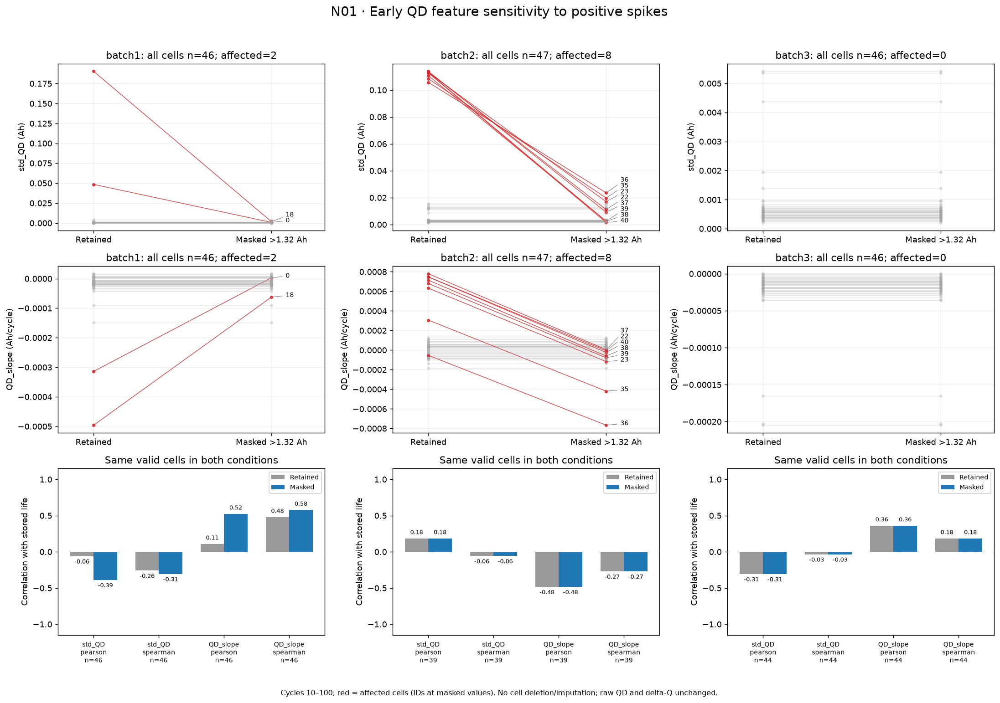
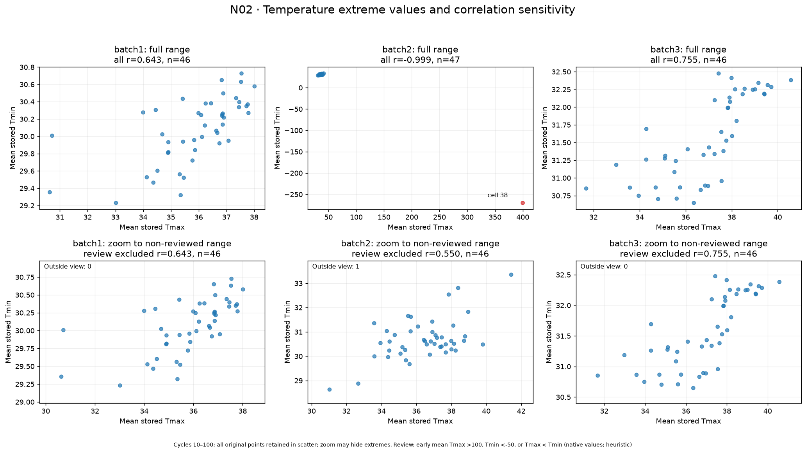
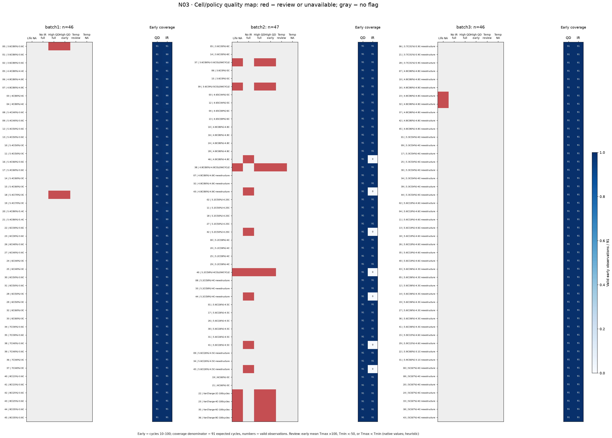

# 데이터 품질과 민감도 — N01–N03 관찰 보고서

작성일: 2026-10-01

[그래프 전략](../../../docs/day1/08_그래프_작성_전략_및_구현_현황.md)의 우선순위 A인 세 항목을 구현·실행한 결과다. 세 batch의 원본 셀 139개를 유지하며, 특이값의 영향과 결측 위치를 확인했다. 전처리 조건 비교는 원본 삭제나 최종 정제 규칙 확정을 의미하지 않는다.

## 1. N01 — 용량 급등값의 영향

**구현 상태:** 코드 작성, 세 batch 노트북 실행, PNG 저장·확인 완료.

### 작성 조건과 읽는 방법

- cycle **10–100**에서 초기 QD 표준편차(`std_QD`, 표본 표준편차)와 직선 기울기(`QD_slope`)를 다시 계산했다.
- 왼쪽 점은 기본 조건, 오른쪽 점은 **QD>1.32 Ah를 분석용 열에서 결측으로 가린 조건**이다. 이 기준은 공칭 용량 1.1 Ah ×1.2의 탐색 기준이다.
- 빨간 선은 초기 구간에 급등값이 있는 셀이다. 회색 선은 나머지 셀이다. 같은 셀의 전후 값을 연결한다.
- 기울기는 실제 cycle 번호를 사용하며 결측 행을 제거한 뒤 회차를 다시 번호 매기지 않는다. 유효 회차가 5개 이상일 때 계산한다.
- 아래쪽은 두 조건에서 특징과 수명이 모두 유효한 **동일 셀 집합**의 수명 상관이다. 전체 유효 표본 기준의 별도 수치도 CSV에 저장했다. 이번 데이터에서는 두 집합의 결과가 같았다.
- 원본 QD, 수명, 상세 Qdlin과 ΔQ 특징은 수정하지 않았다.

### 관찰 결과

**batch1:** 초기 급등값이 있는 셀은 0과 18이다. 두 셀의 표준편차가 크게 줄고 기울기도 바뀐다.

| 셀 | 수명 | 표준편차 유지 → 마스킹 (Ah) | 기울기 유지 → 마스킹 (Ah/cycle) |
|---|---:|---:|---:|
| 0 | 1190 | 0.048530 → 0.000815 | −0.000314 → +0.000003 |
| 18 | 691 | 0.190374 → 0.001751 | −0.000496 → −0.000062 |

상관계수도 바뀌었다. 두 셀의 급등값이 초기 특징의 선형 관계 요약에 영향을 주었다는 것을 확인할 수 있다.

| batch1 · 수명과의 상관, n=46 | 급등 유지 | 급등 마스킹 |
|---|---:|---:|
| 표준편차 · Pearson | −0.061 | −0.389 |
| 표준편차 · Spearman | −0.259 | −0.305 |
| 기울기 · Pearson | +0.109 | +0.524 |
| 기울기 · Spearman | +0.478 | +0.578 |

**batch2:** 초기 급등값이 있는 셀은 **22, 23, 35, 36, 37, 38, 39, 40**이다. 표준편차가 줄고 여러 셀의 기울기가 양수에서 음수로 바뀐다. 마스킹 후에도 남는 급락 등으로 인해 셀 35·36은 큰 음의 기울기를 보인다. 급등값만 가리는 것으로 모든 특이한 기록이 해소되지는 않는다.

이 8개 셀은 **모두 수명이 누락**되어 있다. 따라서 특징값은 바뀌지만 수명 상관의 대상인 39개 셀에는 변화가 없다. 표준편차의 Pearson은 +0.184, 기울기의 Pearson은 −0.484로 유지된다. “상관이 그대로이므로 급등값의 영향이 없다”고 읽으면 안 된다. 영향을 받는 셀이 해당 상관 계산에서 빠져 있었던 것이다.

**batch3:** 급등값이 없으므로 초기 특징과 상관은 모두 같다. 표준편차 Pearson −0.306, 기울기 Pearson +0.361(n=44)이다.

**남은 질문:** 급등값의 기록 원인은 상세 cycle 기록에서 확인해야 한다. 상관이 높아지는 전처리를 골랐다는 이유만으로 최종 처리 기준을 정하지 않는다.

## 2. N02 — 온도 극단값과 상관계수의 민감도

**구현 상태:** 코드 작성, 세 batch 노트북 실행, PNG 저장·확인 완료.

### 작성 조건과 읽는 방법

- 셀별 cycle 10–100의 평균 Tmax·Tmin을 원본 수치로 계산했다. 수명 누락 셀도 포함한다.
- **평균 Tmax>100, 평균 Tmin<−50, 또는 평균 Tmax<Tmin**이면 검토 대상으로 표시했다. 이는 눈에 띄는 값을 찾는 임시 기준이며 검증된 센서 범위나 자동 삭제 규칙이 아니다.
- 위쪽은 전체 범위, 아래쪽은 검토 대상 외 셀의 범위로 확대했다. 산점도 입력에는 모든 점을 유지하며 확대 범위 밖 점 개수를 표시한다.
- 아래쪽 상관계수만 검토 대상 제외 조건으로 계산한다. 확대로 점을 숨기는 것과 계산에서 제외하는 것을 구별했다.
- 이번 데이터에서 초기 평균 Tmax·Tmin을 사용할 수 없는 셀은 없었다. 평균 수준 점검이며 모든 개별 회차의 온도 품질을 검증한 것은 아니다.

### 관찰 결과

| batch | 전체 Pearson / n | 검토 대상 제외 Pearson / n | 검토 셀 |
|---|---|---|---|
| batch1 | +0.643 / 46 | +0.643 / 46 | 없음 |
| batch2 | −0.999 / 47 | +0.550 / 46 | cell 38 |
| batch3 | +0.755 / 46 | +0.755 / 46 | 없음 |

- **batch2 전체 그림:** cell 38이 평균 Tmax=400, Tmin=−270으로 다른 셀 무리에서 크게 떨어진다. 이 점 때문에 나머지 셀의 온도 차이는 한곳에 압축되어 보인다.
- **batch2 확대 그림:** 일반적인 무리에서는 두 평균 온도가 함께 증가하는 경향이 보인다. cell 38 제외 시 Pearson이 −0.999에서 +0.550으로 방향까지 바뀐다.
- **batch1·3:** 검토 기준에 걸린 셀은 없고 전체·제외 조건의 계산이 같다. 두 batch에서도 평균 Tmax와 Tmin이 함께 증가하는 경향이 보이지만 개별 점의 퍼짐은 남아 있다.
- cell 38은 수명도 누락되어 있어 기존 특징–수명 상관에는 들어가지 않았고, 특징끼리의 상관에는 들어갔다. 분석마다 표본 집합을 확인해야 하는 사례다.

**남은 질문:** 400과 −270의 저장 규칙 또는 기록 오류 여부를 확인해야 한다. 이 값만으로 실제 배터리 온도였다고 해석하지 않는다.

## 3. N03 — 셀·충전 정책별 결측·특이값 지도

**구현 상태:** 코드 작성, 세 batch 노트북 실행, PNG 저장·확인 완료.

### 작성 조건과 읽는 방법

행은 **cell_id | 충전 정책**이며 정책 이름순으로 정렬했다. 원본 정책 문자열을 그대로 표시했으므로 일부 `SLOWCYCLE` 이름에는 닫는 괄호가 없는 형태가 남아 있다.

왼쪽 지도에서 빨강은 해당 조건이 있음, 회색은 없음이다.

| 열 | 의미 |
|---|---|
| Life NA | 수명이 비유한값 또는 0 이하 |
| No IR full | 전체 기록에 유효한 분석용 IR이 하나도 없음 |
| High QD full | 전체 기록에 QD>1.32 Ah가 한 번 이상 있음 |
| High QD early | cycle 10–100에 QD>1.32 Ah가 한 번 이상 있음 |
| Temp review | N02의 초기 평균 온도 검토 기준에 해당 |
| Temp NA | 초기 평균 Tmax 또는 Tmin을 사용할 수 없음 |

오른쪽은 초기 QD·IR의 유효 관측 수와 비율이다. **분모는 cycle 10–100의 기대 회차 91개**이며 숫자는 유효 관측 수다. 기본 조건의 양수 급등값은 유효 관측에 포함하되 별도 플래그로 표시한다. 높은 관측 비율이 정상 측정값이라는 보장은 아니다.

### 관찰 결과

| 셀 수 기준 | batch1 | batch2 | batch3 |
|---|---:|---:|---:|
| 수명 누락 | 0 | 8 | 2 |
| 전체 유효 IR 없음 | 0 | 7 | 0 |
| 전체 QD 급등 있음 | 2 | 8 | 0 |
| 초기 QD 급등 있음 | 2 | 8 | 0 |
| 초기 평균 온도 검토 대상 | 0 | 1 | 0 |
| 초기 평균 온도 사용 불가 | 0 | 0 | 0 |

- **batch1:** QD 급등은 셀 0·18에 있다. 모든 셀의 초기 QD는 91개이고, 일부 IR은 90개로 한 회차가 빠진다. 초기 cycle 1의 0값은 10–100 구간의 관측률에 포함되지 않는다.
- **batch2 수명 누락과 급등:** 같은 8개 셀에 두 플래그가 함께 나타난다. 네 개의 `VarCharge` 항목과 네 개의 `SLOWCYCLE` 항목에 해당한다. 이 대응은 관찰된 사실이며 실험 조건이 누락·급등을 발생시켰다는 인과 판단은 아니다.
- **batch2 IR:** 셀 **40–46**은 전체 유효 IR이 없고 초기 IR도 0/91이다. 정책은 여러 종류에 걸쳐 있다. 수명 누락 셀 40과 겹치지만 나머지 6개는 수명이 있다. 수명 누락과 IR 부재를 같은 집합으로 다루면 안 된다.
- **batch2 온도:** cell 38은 수명 누락·QD 급등·온도 검토 플래그가 함께 있다. 각 신호를 원자료에서 확인할 대상으로 좁힐 수 있다.
- **batch3:** 수명 누락 셀 **23·32**는 모두 `4.8C(80%)-4.8C-newstructure` 정책이다. 같은 정책의 다른 셀에는 수명값이 있다. 수명 누락인 두 셀에서도 초기 QD·IR은 모두 91/91이다.
- 세 batch 모든 셀에 초기 summary 회차가 91개씩 있다. 실제 셀 관측 누락과 변수별 분석용 마스킹은 구별된다.

전체 QD 급등 **행**은 batch2 11건이지만, 해당 **셀**은 8개다. 위 표는 셀 수를 세므로 기존 보고서의 11건과 다른 집계 단위다.

**남은 질문:** 특별한 정책의 실험 절차와 수명 라벨 제공 규칙을 확인해야 한다. IR 전체 0값은 정책뿐 아니라 채널·기록 설정과 연결되는지도 확인할 수 있다.

## 재현·산출물·검증

- 실행 노트북: [03_quality_sensitivity.ipynb](../../../notebooks/03_quality_sensitivity.ipynb)
- 계산·그래프 코드: [quality_eda.py](../../../src/quality_eda.py)
- 셀별 전후 특징: [early_qd_sensitivity.csv](../../figures/quality_sensitivity/early_qd_sensitivity.csv)
- 품질 지도 입력: [cell_quality_map.csv](../../figures/quality_sensitivity/cell_quality_map.csv)
- QD 수명 상관 비교: [qd_correlation_sensitivity.csv](../../figures/quality_sensitivity/qd_correlation_sensitivity.csv)
- 온도 상관 비교: [temperature_correlation_sensitivity.csv](../../figures/quality_sensitivity/temperature_correlation_sensitivity.csv)

프로젝트 `.venv`의 새 커널에서 노트북 전체 실행을 완료하고 PNG 3개를 직접 확인했다. 기본 조건의 139개 셀 특징이 기존 갤러리와 일치하며, 급등 없는 셀의 특징은 마스킹 조건에서도 같음을 확인했다. 회차 간격·결측을 고려한 기울기 및 상관의 유효 표본 처리는 테스트로 검증했다.

다음 전략은 **N04 충전 시간·전류 무리와 정책 연결**, **N05 상세 한 cycle 패턴**, **N06 그룹 내부의 ΔQ–수명 관계**다. 특히 batch2의 특별한 정책에 해당하는 상세 기록을 먼저 살펴볼 근거가 생겼다.
