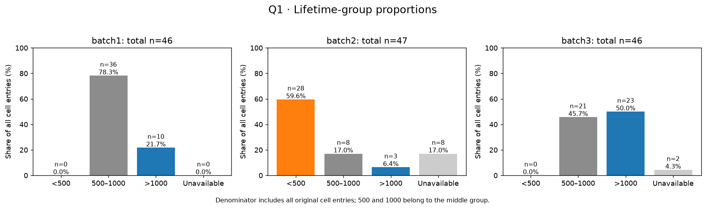
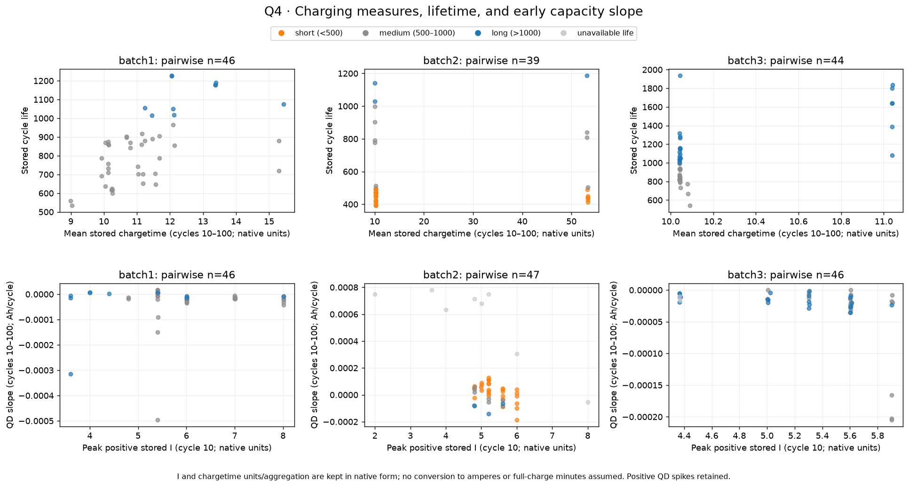

# 배터리 데이터 EDA — 그래프별 관찰 기록

작성일: 2026-10-01

문제 Q1–Q5에 대응해 생성한 **9개 그래프**를 직접 살펴본 기록이다. 각 그림의 읽는 방법, 눈에 보이는 특징, 계산으로 확인한 수치, 추가로 확인할 부분을 정리했다. 수치는 저장된 그래프 입력 데이터에서 계산했으며, 이 문서는 관찰 단계의 보고서다. 실험 조건의 인과 효과나 예측 성능은 아직 검증하지 않았다.

## 데이터와 공통 읽기 기준

- 원본 파일의 셀 항목은 batch1 46개, batch2 47개, batch3 46개다. 수명값이 있는 항목은 각각 46개, 39개, 44개다. batch 간 셀을 병합하지 않았다.
- 여기서 **수명**은 원본의 `cycle_life` 값이다. 기록 종료 시점과 실제 수명 종료의 관계는 별도 확인이 필요하며, 마지막 cycle로 수명을 다시 계산하지 않았다.
- 수명 그룹은 단기 `<500`, 중기 `500–1000`, 장기 `>1000`이다. 500과 1000은 중기에 포함한다. 수명 누락은 별도 그룹이다.
- 초기 요약 특징은 **cycle 10–100**에서 계산했다. `QD`는 cycle별 방전 용량, `IR`은 내부 저항이다. 분석용 QD·IR의 0 이하 및 비유한 값은 결측으로 처리했지만, 양수 용량 급등값은 유지했다.
- `ΔQ(V) = Q₁₀₀(V) − Q₁₀(V)`는 같은 전압에서의 방전 용량 차이다. cycle별 요약 용량 차이인 `delta_QD`와 구별한다. 상세 기록과 요약 기록의 용량 대응은 139개 셀 × 2개 cycle, 총 278건에서 확인했다.
- 충전 시간(`chargetime`)과 전류(`I`)는 원본 수치 그대로 사용했다. 단위를 확정하기 전에는 완충에 걸린 분이나 A로 해석하지 않는다.
- 수명 관련 그림은 수명 누락 항목을 제외한다. 변수 간 상관관계 그림은 수명 누락 항목도 포함하고, 각 변수 쌍의 유효값만 사용한다. 결측값을 채우지 않았다.

## 1. Q1 — 수명 분포와 개별 셀

**읽는 방법:** 위쪽은 수명 구간별 셀 수, 아래쪽은 상자 그림과 개별 셀이다. 빨간 테두리는 해당 batch의 사분위 범위(IQR)를 기준으로 표시한 값이다. 세 batch에 같은 수명 축을 사용했다.

| 항목 | batch1 | batch2 | batch3 |
|---|---:|---:|---:|
| 수명 유효 / 전체 | 46 / 46 | 39 / 47 | 44 / 46 |
| 평균 수명 | 844.7 | 565.7 | 1059.7 |
| 중앙값 | 858.5 | 472.0 | 1005.5 |
| 최솟값–최댓값 | 534–1227 | 392–1186 | 541–1935 |
| 중앙 50% 범위 | 703.3–914.3 | 439.5–508.5 | 828.0–1155.3 |

**관찰한 특징**

- **batch1:** 중간 수명 구간에 주로 모여 있다. 평균과 중앙값이 가깝고, IQR 기준으로 표시된 셀은 없다.
- **batch2:** 400–500 부근에 큰 무리가 있고, 오른쪽에 더 오래가는 셀이 떨어져 있다. 평균이 중앙값보다 약 94 cycle 높다. 긴 수명 쪽 값이 평균을 끌어올리는 형태다.
- **batch3:** 중심 위치가 가장 높고, 긴 수명 쪽으로 넓게 퍼져 있다. 최대 1935까지 이어지는 꼬리가 보인다.
- IQR 표시 셀은 batch2의 `7, 8, 9, 32, 33, 34, 43, 44, 45`, batch3의 `7, 38, 45`다. 모두 높은 수명 쪽이다. 이 표시는 분포에서 떨어져 있다는 뜻이며 측정 오류 판정은 아니다.

**추가 확인:** batch2의 긴 수명 셀들이 어떤 충전 정책과 연결되는지는 그림 6에서 함께 확인할 수 있다. 누락된 수명 항목까지 포함한 분포는 현재 알 수 없다.

## 2. Q1 — 수명 그룹의 비율

**읽는 방법:** 모든 셀 항목을 분모로 계산했다. 수명 누락도 하나의 막대이므로 각 batch의 비율 합은 100%다.

| 그룹 | batch1 | batch2 | batch3 |
|---|---:|---:|---:|
| 단기 | 0개 · 0.0% | 28개 · 59.6% | 0개 · 0.0% |
| 중기 | 36개 · 78.3% | 8개 · 17.0% | 21개 · 45.7% |
| 장기 | 10개 · 21.7% | 3개 · 6.4% | 23개 · 50.0% |
| 수명 누락 | 0개 · 0.0% | 8개 · 17.0% | 2개 · 4.3% |

**관찰한 특징**

- **batch1:** 중기 셀이 대부분이며, 단기 셀은 관측된 수명값 중에 없다.
- **batch2:** 전체 항목의 약 60%가 단기다. 수명 누락도 17%로 세 batch 중 가장 많다.
- **batch3:** 전체 항목의 절반이 장기이며, 중기와 장기 셀 수가 비슷하다.
- 세 batch는 수명 그룹 구성이 상당히 다르다. 이후 그룹별 곡선을 비교할 때, batch1·3에서는 단기 그룹을 비교할 수 없고 batch2의 장기 그룹은 3개뿐이라는 점을 함께 봐야 한다.

**추가 확인:** 이 구간 기준은 현재 관찰을 위한 분류다. 단기 그룹이 없는 batch에서 단기 셀의 특성을 추론할 수는 없다.

## 3. Q2 — 방전 용량의 전체 변화와 초기 변화

**읽는 방법:** 한 선이 한 셀의 기록이다. 위쪽은 전체 기록, 가운데는 cycle 1–100, 아래쪽은 전체 기록의 용량 축을 0.8–1.15 Ah로 확대했다. 색은 수명값이며 회색은 수명 누락이다.

**관찰한 특징**

- **전체 기록:** 여러 셀에서 완만한 변화 뒤에 용량 감소가 가팔라지는 구간이 보인다. 감소 시점과 기록 길이는 셀마다 다르다. 시각적으로 보이는 굽음의 위치를 아직 수치로 검출하지 않았다.
- **초기 구간:** 많은 곡선이 약 1 Ah 부근에서 겹친다. 일부는 초기에 용량이 조금 증가하거나 거의 유지된다. 초기 용량 수준만으로 수명 그룹이 깔끔하게 나뉘는 모습은 아니다.
- **batch1:** cell 0의 cycle 12에서 약 1.539 Ah, cell 18의 cycle 40에서 약 2.884 Ah인 양수 급등값이 있다. 초기 곡선의 세로 축이 넓어져 나머지 작은 변화를 읽기 어려워진다.
- **batch2:** 양수 급등과 급격한 하락이 눈에 띄고, 셀 간 변화 양상도 다양하다. QD가 1.32 Ah를 넘는 기록은 11건이다.
- **batch3:** QD가 1.32 Ah를 넘는 기록은 없으며, 확대 그림에서 셀별 완만한 차이와 후반 감소를 확인하기 쉽다.
- 1.32 Ah 초과 기록은 batch1 2건, batch2 11건, batch3 0건이다. 아래 확대 패널에는 축 밖 점이 있으므로 위쪽 전체 범위 그림을 함께 봐야 한다.

**추가 확인:** 급등값의 원인이 실험 과정인지 기록 문제인지 확인해야 한다. 현재 이 값들을 유지했으므로 초기 표준편차와 기울기에도 영향을 줄 수 있다. 기록 끝을 곧바로 실제 수명 종료로 읽지 않는다.

## 4. Q3 — 전압별 ΔQ 곡선

**읽는 방법:** 얇은 선은 개별 셀의 ΔQ, 굵은 선은 각 전압 지점에서 계산한 그룹 중앙값이다. 음수는 같은 전압에서 cycle 100의 용량이 cycle 10보다 작다는 뜻이다. 굵은 선은 실제 한 셀의 곡선이 아니다.

**관찰한 특징**

- 여러 곡선에서 중간 전압 구간의 ΔQ가 음수이며, 높은 전압 쪽에서는 0에 가까워지는 형태가 보인다. 일부 곡선에는 양수 봉우리도 있다. 전압별 차이를 한 방향의 감소로만 요약하기 어렵다.
- **batch1:** 장기 그룹의 중앙값 곡선이 중기 그룹보다 대체로 0에 가깝다. 음의 골이 상대적으로 얕지만, 개별 곡선은 서로 겹친다.
- **batch2:** 단기 그룹의 중앙값은 중기·장기보다 음의 골이 깊다. 수명 누락 그룹에는 약 −0.136 Ah까지 내려가는 개별 곡선이 있다. 장기 그룹 중앙값은 3개 셀에서 계산됐다.
- **batch3:** 중기와 장기 그룹의 중앙값 차이는 batch1·2보다 작게 보이며, 개별 곡선도 많이 겹친다. 일부 장기 셀은 약 3.0–3.2 V 부근에서 양수 봉우리를 보인다.

**추가 확인:** 차이가 두드러지는 전압 구간이 모든 셀에 동일한지 살펴볼 수 있다. 양수 봉우리나 깊은 골의 원인은 이 그림만으로 확정할 수 없다.

## 5. Q3 — ΔQ 분산과 수명의 관계

**읽는 방법:** 한 점이 한 셀이다. 가로축은 한 셀의 전압별 ΔQ 값들의 분산이며 로그 축이다. 오른쪽으로 갈수록 전압에 따른 ΔQ의 퍼짐이 크다. 셀들 사이의 수명 분산이나 cycle에 따른 변동성을 나타내는 축은 아니다.

**관찰한 특징**

- **세 batch 공통:** 작은 ΔQ 분산 쪽에 긴 수명 셀이, 큰 분산 쪽에 짧은 수명 셀이 더 많이 위치한다.
- **batch1:** 장기 셀은 주로 왼쪽 위에 있고, 중기 셀은 오른쪽 아래로 이어진다. 그룹 경계 주변에서는 점들이 겹친다.
- **batch2:** 단기 셀은 오른쪽 아래에 밀집하고, 중기·장기 셀은 그보다 왼쪽 위에 주로 있다. 장기 셀의 수는 적다.
- **batch3:** 전체적으로 오른쪽 아래로 내려가는 패턴이 보이지만, 작은 분산 구간에서도 수명 차이가 크다. 분산 하나로 수명이 정해지는 모습은 아니다.

| 수명과 ΔQ 분산의 상관 | batch1 | batch2 | batch3 |
|---|---:|---:|---:|
| Pearson | −0.84 | −0.73 | −0.59 |
| Spearman | −0.87 | −0.71 | −0.80 |
| 사용 셀 수 | 46 | 39 | 44 |

상관계수는 저장된 **원래 분산값**으로 계산했다. 그림의 로그 가로축을 그대로 넣어 계산한 계수는 아니다. 분산은 전압 지점 전체에서 `ddof=0`으로 계산했다.

**추가 확인:** batch마다 같은 방향의 관계는 관찰되지만, 예측 가능성을 판단하려면 별도의 검증이 필요하다. 이 그림에는 회귀선이나 예측 결과가 없다.

## 6. Q4 — 충전 정책별 수명

**읽는 방법:** 점은 개별 셀, 검은 마름모는 평균, 가로 막대는 평균 ± 표본 표준편차다. 신뢰구간이 아니다. 정책은 수명 순위가 아니라 이름순으로 배치했고, 오른쪽 `n`은 수명값이 있는 셀 수다.

**관찰한 특징**

- **batch1:** 정책별 평균 수명의 차이가 크다. 예를 들어 `4C(80%)-4C`는 평균 1226.5, `5.4C(80%)-5.4C`는 546.5다. 각각 셀 2개에서 계산한 값이다. 대부분 정책의 표본이 1–3개로 작다.
- **batch2:** `newstructure` 접미사가 있는 일부 정책은 비슷한 기본 이름의 정책보다 높은 수명 구간에 있다. 예를 들어 `4.8C(80%)-4.8C`는 평균 483.6(n=5), `4.8C(80%)-4.8C-newstructure`는 871.7(n=3)이다. 이름의 차이를 실험 구조의 효과로 곧바로 해석할 수는 없다.
- **batch2 수명 누락:** `SLOWCYCLE` 및 `VarCharge` 관련 항목은 이 그림에서 n=0으로 남아 있다. 이는 수명값을 사용할 수 없다는 뜻이며 수명이 0이라는 뜻은 아니다.
- **batch3:** `4.8C(80%)-4.8C-newstructure`는 평균 1564.2(n=6)로 높은 위치에 있다. 반면 `3.7C(31%)-5.9C-newstructure`는 평균 660.0(n=3)이다.
- **정책 내부 차이:** batch3의 `5C(67%)-4C-newstructure`는 813–1935(n=7)로 넓게 퍼진다. 같은 정책 이름 안에서도 수명이 크게 달라질 수 있다.

**추가 확인:** 정책 이름이 비슷해도 batch, 실험 구조, 다른 조건이 같다는 보장은 없다. 현재 표본 평균만으로 최적 충전 정책이나 정책의 인과 효과를 확정하지 않는다.

## 7. Q4 — 충전 시간·전류와 수명·초기 기울기

**읽는 방법:** 위쪽은 cycle 10–100의 평균 충전 시간과 수명, 아래쪽은 cycle 10의 최대 양수 전류와 초기 QD 기울기다. 아래 그림은 수명 누락 셀도 회색 점으로 표시한다. batch별 축 범위가 다르므로 시각적인 기울기 크기를 직접 비교하지 않는다.

**관찰한 특징**

- **batch1 위쪽:** 충전 시간 수치가 커질수록 수명이 높아지는 경향이 있다. 다만 비슷한 시간에서도 수명이 퍼져 있고, 약 15 부근에도 중기와 장기 셀이 함께 있다. Pearson 0.56, Spearman 0.62다.
- **batch2 위쪽:** 충전 시간이 약 10과 50 부근의 두 무리로 나뉜다. 두 무리 모두 여러 수명값을 포함한다. Pearson 0.09와 Spearman −0.39가 달라, 단순한 직선 관계로 요약하기 어렵다.
- **batch3 위쪽:** 약 10.04에 많은 셀이 모이고 약 11.04에 별도 무리가 있다. 같은 10.04 부근에서도 수명 차이가 크다. Pearson 0.64에 비해 Spearman은 0.20이다. 소수의 떨어진 점과 무리 구성이 관계에 영향을 줄 수 있다.
- **아래쪽 공통:** 전류값이 몇 가지 위치에 모여 세로 띠처럼 보인다. 연속적인 전류 변화보다 실험 조건별 무리가 반영된 형태일 수 있다.
- **batch1·3 아래쪽:** 많은 셀의 기울기가 0에 가깝거나 작은 음수다. 일부 셀만 큰 음의 기울기를 보인다. 전류 증가에 따라 모든 셀의 감소가 일관되게 빨라지는 형태는 아니다.
- **batch2 아래쪽:** 양의 초기 기울기를 갖는 셀도 많고, 수명 누락 셀 중 일부는 특히 큰 양의 값을 보인다. 초기 용량 증가와 급등값의 영향을 함께 확인해야 한다.

**추가 확인:** `chargetime`의 집계 범위와 `I`의 단위·스케일을 확인해야 한다. 초기 기울기는 cycle 10–100의 직선 요약값이므로 전체 수명 동안의 열화 속도와 동일하지 않다.

## 8. Q5 — 초기 특징과 수명의 상관관계

**읽는 방법:** 빨강은 양의 상관, 파랑은 음의 상관이다. Pearson은 값들의 직선 관계, Spearman은 순위 관계를 요약한다. 각 칸의 `n`은 해당 특징과 수명이 모두 유효한 셀 수다.

**관찰한 특징**

- **가장 일관된 방향:** `deltaQ_var`는 세 batch 모두 음의 상관, `deltaQ_min`은 모두 양의 상관이다. `deltaQ_min`이 크다는 것은 음의 최솟값이 덜 깊고 0에 더 가깝다는 뜻이다.

| 특징 | batch1 Pearson / Spearman | batch2 Pearson / Spearman | batch3 Pearson / Spearman |
|---|---:|---:|---:|
| `deltaQ_var` | −0.84 / −0.87 | −0.73 / −0.71 | −0.59 / −0.80 |
| `deltaQ_min` | 0.88 / 0.85 | 0.82 / 0.66 | 0.69 / 0.78 |
| `QD_slope` | 0.11 / 0.48 | −0.48 / −0.27 | 0.36 / 0.18 |
| `mean_chargetime` | 0.56 / 0.62 | 0.09 / −0.39 | 0.64 / 0.20 |
| `mean_Tavg` | −0.49 / −0.37 | 0.43 / 0.17 | −0.02 / 0.03 |

- **batch별 차이:** 초기 QD 기울기와 평균 온도는 batch에 따라 상관 방향이 달라진다. 모든 batch에 같은 관계가 있다고 가정하기 어렵다.
- **계수 차이:** batch1의 QD 기울기, batch2의 평균 IR, batch3의 충전 시간 등은 Pearson과 Spearman의 크기가 상당히 다르다. 떨어진 값, 군집, 비선형적인 모양을 원래 산점도에서 확인할 필요가 있다.
- **유효 표본 수:** batch2의 IR 관련 수명 상관은 n=33이며, 다른 특징의 n=39보다 작다. 일부 셀의 IR이 0으로만 저장되어 분석값을 사용할 수 없기 때문이다.
- **약한 관계:** batch3의 온도 관련 특징은 수명과의 상관이 대체로 0에 가깝다. 현재 표본에서 뚜렷한 전체 관계가 드러나지 않는다.

**추가 확인:** 상관계수는 현재 데이터의 관계 요약이다. 통계적 유의성이나 새로운 셀에 대한 예측 성능을 확인한 결과는 아니다. 특정 특징의 계수가 크다는 이유만으로 사용 변수를 확정하지 않는다.

## 9. Q5 — 특징끼리의 상관관계

**읽는 방법:** 각 칸은 두 특징의 Pearson 상관이다. 대각선의 1은 자기 자신과의 상관이다. 수명 누락 셀도 포함하며, 변수 쌍별 사용 셀 수가 다를 수 있다. 이 그림의 표본은 그림 8과 다르다.

**관찰한 특징**

- **ΔQ 특징의 중복:** `deltaQ_var`와 `deltaQ_min`은 batch1 −0.973, batch2 −0.938, batch3 −0.934로 강한 음의 상관이다. 같은 ΔQ 곡선에서 계산한 두 특징이 상당 부분 함께 움직인다.
- **batch1:** `std_QD`와 `QD_slope`가 −0.910이며, 평균 Tavg와 Tmax는 0.957이다. 초기 용량 특징과 온도 특징 내부에 강한 관계가 보인다.
- **batch3:** `delta_QD`와 `QD_slope`는 0.992, `std_QD`와 `QD_slope`는 −0.967이다. 용량의 양 끝 차이, 직선 기울기, 표준편차가 밀접하게 연결되어 있다. 평균 Tavg와 Tmax도 0.971이다.
- **batch2:** `delta_QD`와 `delta_IR`는 0.993(n=40)으로 매우 높다. 반면 다른 batch의 같은 쌍은 batch1 0.269, batch3 −0.603이다. 이 관계의 차이는 해당 셀의 원래 기록을 확인할 필요가 있다.
- **batch2 온도의 특이사항:** 평균 Tmax와 Tmin은 −0.999(n=47)로 거의 완벽한 음의 상관이다. 입력 데이터를 확인하면 **cell 38의 평균 Tmax=400, Tmin=−270**이라는 극단값이 있다. 이 셀 하나를 제외해 같은 계산을 하면 상관은 **+0.550(n=46)**으로 바뀐다. 해당 셀은 수명이 누락되어 그림 8에는 포함되지 않지만 그림 9에는 포함된다.

**추가 확인:** cell 38의 온도 수치가 무엇을 의미하는지 원자료와 기록 규칙을 확인해야 한다. 위 제외 계산은 민감도 확인이며, 저장된 그래프와 입력 데이터에서 그 셀을 제거한 것은 아니다. 나머지 강한 상관도 소수 극단값의 영향을 받는지 점검할 수 있다.

## 관찰 후 남겨둘 질문

1. batch1·2의 양수 QD 급등값과 batch2 cell 38의 온도 극단값은 어떤 기록 과정에서 발생했는가?
2. batch2의 수명 누락 및 IR=0 셀은 특정 실험 조건에 연결되는가?
3. ΔQ와 수명의 관계가 그룹 안에서도 유지되는가, 또는 정책별 무리 차이의 영향을 크게 받는가?
4. 충전 시간의 약 10·50, 약 10.04·11.04 무리는 어떤 실험 설정에 대응하는가?
5. batch 간 수명값의 정의와 기록 종료 조건은 동일한가?

## 재현 및 참조 파일

- 그래프 생성 노트북: [02_question_graphs.ipynb](../../../notebooks/02_question_graphs.ipynb)
- 그림 생성·특징 계산 코드: [question_gallery.py](../../../src/question_gallery.py)
- 셀별 특징 입력: [cell_features_for_gallery.csv](../../figures/question_gallery/cell_features_for_gallery.csv)
- 상세 cycle 대응 확인: [cycle_alignment_audit.csv](../../figures/question_gallery/cycle_alignment_audit.csv)

이미지와 특징 입력은 기존 갤러리 산출물을 사용했다. 정책별 수치와 온도 극단값의 민감도 계산은 위 관찰을 확인하기 위해 추가 계산했다.
