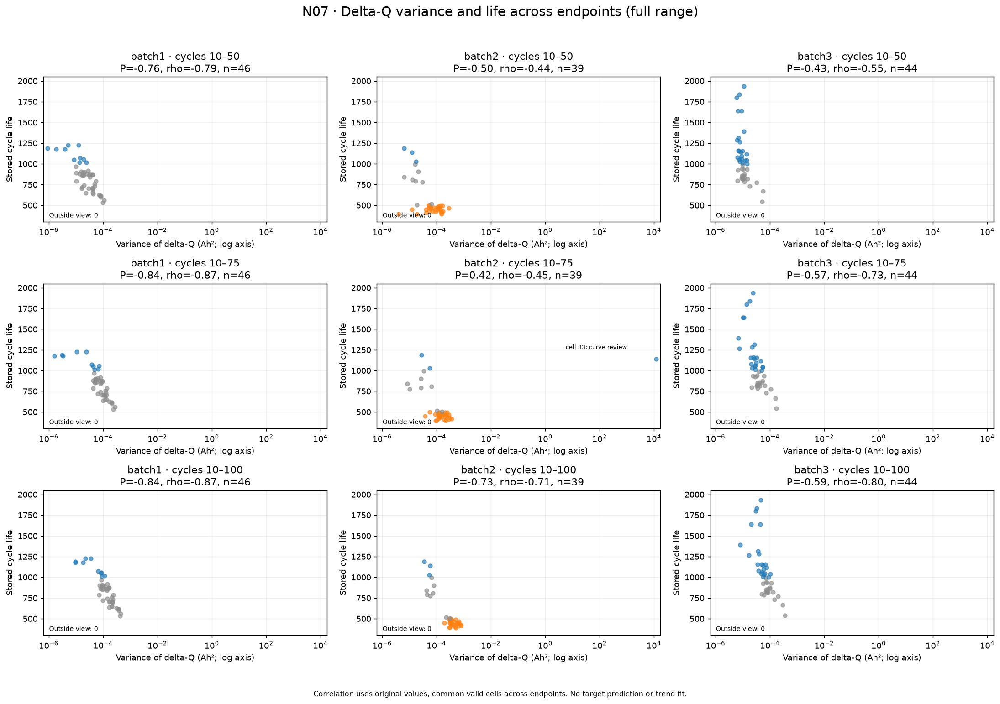
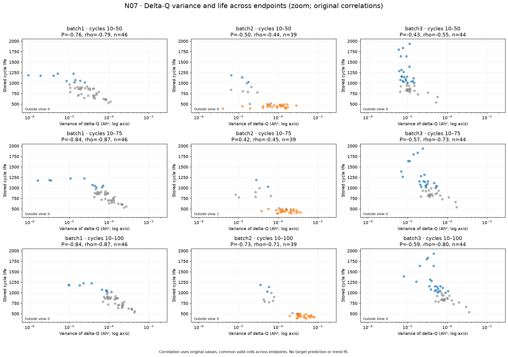
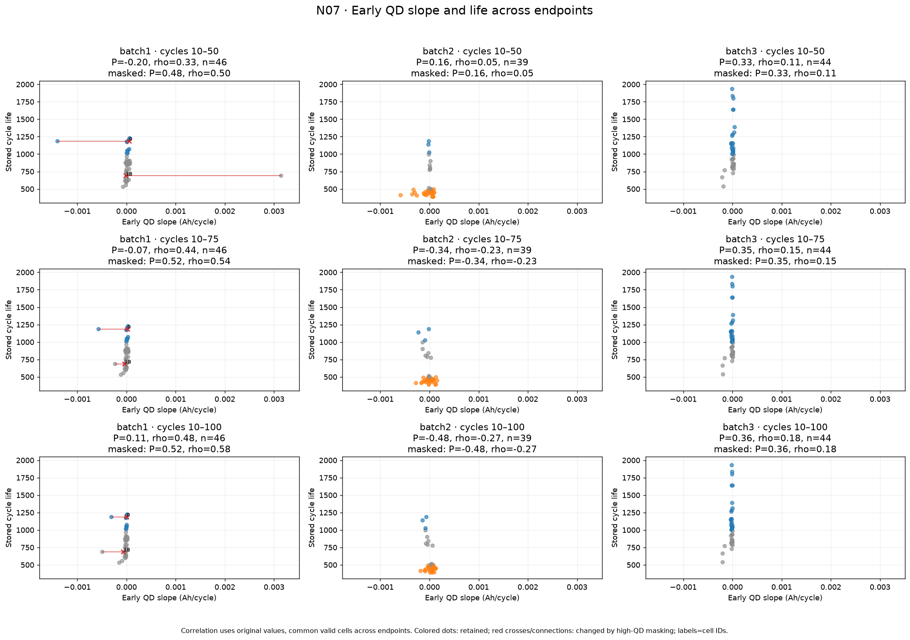
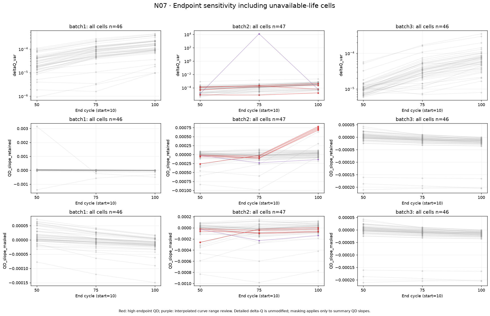
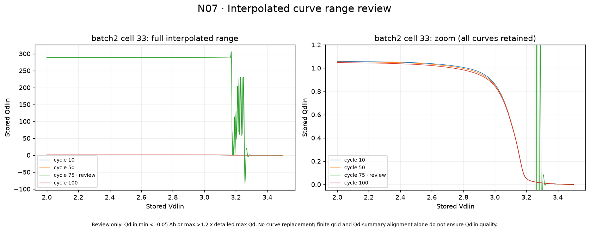
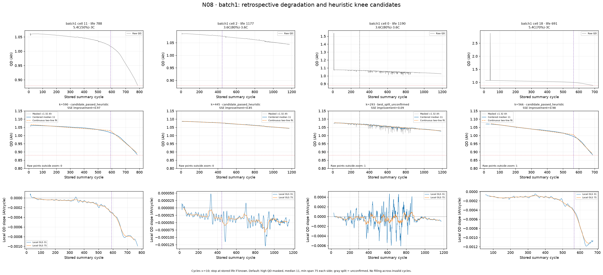
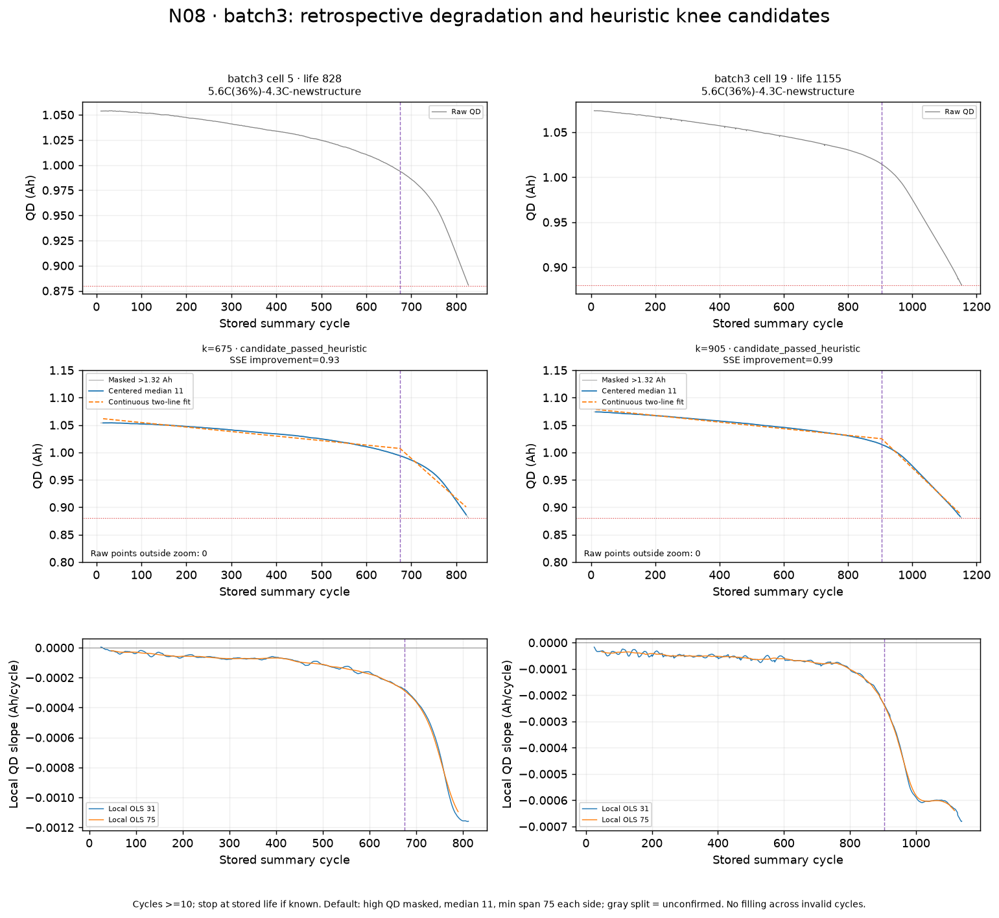
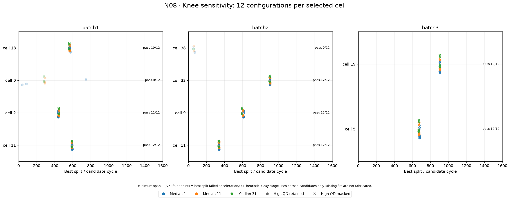

# 초기 관찰 구간과 knee 후보 — N07–N08

작성일: 2026-10-01

두 번째 묶음인 [N07–N08 전략](../../../docs/day1/08_그래프_작성_전략_및_구현_현황.md)을 구현·실행한 결과다. 초기 특징의 관찰 구간 비교와, 전체 기록을 사용한 사후 열화 탐색을 구별한다. **이미지 9개**와 계산 입력·검증 CSV를 저장했다.

- N07: 원본 셀 139개 × 종료 cycle 3개 = **417개 특징 행**. 상세 cycle 10·50·75·100의 **556건**을 확인했다.
- N08: 기존 그룹 대표 7개와 특이값 사례 3개, 총 **10개 셀 ×12조건 =120개 적합 결과**를 저장했다. 전체 셀의 knee 분포를 추정한 작업은 아니다.
- 실행 노트북: [05_window_knee_exploration.ipynb](../../../notebooks/05_window_knee_exploration.ipynb)
- 계산·그래프 코드: [window_knee_eda.py](../../../src/window_knee_eda.py)

## 1. N07 — 초기 관찰 구간 비교

**구현 상태:** 코드 작성, 세 batch 실행, PNG 저장·확인 완료.

ΔQ는 Q50(V)−Q10(V), Q75(V)−Q10(V), Q100(V)−Q10(V)다. 초기 QD 기울기는 각각 cycle 10–50, 10–75, 10–100에서 계산했다. 같은 번호의 상세 기록과 요약 QD 대응, 전압 격자의 길이·유한값·단조성 및 cycle 간 일치를 확인했다.

기본 상관은 세 종료 구간에 공통으로 유효한 수명 셀로 계산한다. 사용 수는 batch1 **46**, batch2 **39**, batch3 **44**로 모두 같다. 결측을 채우거나 수명을 다시 계산하지 않았다.

### 1.1 ΔQ 분산과 수명 — 전체 범위

한 점은 한 셀이다. 가로축은 로그 표시지만 **Pearson은 원래 분산값**으로 계산했다. 아래 표에서 각 값은 Pearson / Spearman이다.

| batch | 10–50 | 10–75 | 10–100 |
|---|---:|---:|---:|
| batch1 | −0.756 / −0.792 | −0.838 / −0.865 | −0.838 / −0.871 |
| batch2 | −0.504 / −0.437 | **+0.425 / −0.449** | −0.733 / −0.709 |
| batch3 | −0.430 / −0.549 | −0.574 / −0.728 | −0.590 / −0.797 |

**관찰 결과**

- **batch1:** cycle 50에서도 분산이 작은 쪽에 장기 셀이 많다. 75·100에서는 순위 관계가 더 강하며 75→100의 변화는 작다.
- **batch3:** 종료 cycle이 뒤로 갈수록 음의 순위 상관이 강해진다. 분산의 절댓값도 달라지므로 서로 다른 구간에 같은 수치 경계를 적용한 결과는 아니다.
- **batch2:** 75의 Pearson만 양수가 된다. 오른쪽 끝의 긴 수명 셀은 cell 33이며 다른 점에서 크게 떨어져 있다. Spearman은 음수로 유지된다. 아래에서 원곡선과 민감도를 확인했다.

### 1.2 같은 ΔQ 비교 — 일반적인 무리를 확대

검토 대상 곡선 외 데이터의 분산 범위로 축을 확대했으며, **원래 점과 상관계수는 유지**했다. batch2 10–75에서 cell 33 하나가 축 밖에 있다(`Outside view: 1`). 확대 그림의 보이는 점들만으로 제목의 상관을 읽으면 안 된다.

- 전체 범위에서 압축되어 있던 분산–수명 무리를 확인하기 쉽다.
- 세 batch 모두 50에서도 음의 패턴이 관찰되지만 점의 퍼짐과 그룹 구성이 다르다.
- 더 큰 cycle 종료값에서 높은 상관이 나왔다고 새로운 셀의 예측 성능이나 최적 관찰 시점을 확정하지 않았다.

### 1.3 초기 QD 기울기 — 급등 유지·마스킹 비교

기본 점은 급등값을 유지한 기울기다. 빨간 연결선과 ×는 QD>1.32 Ah를 가렸을 때 바뀐 같은 셀의 값이다. 기울기는 실제 cycle 번호를 사용한다.

| Pearson · 수명과의 상관 | 10–50 | 10–75 | 10–100 |
|---|---:|---:|---:|
| batch1 · 급등 유지 | −0.205 | −0.070 | +0.109 |
| batch1 · 급등 마스킹 | +0.479 | +0.520 | +0.524 |
| batch2 · 두 조건 동일 | +0.157 | −0.344 | −0.484 |
| batch3 · 두 조건 동일 | +0.332 | +0.347 | +0.361 |

- **batch1:** cell 0·18의 급등값을 유지하면 구간 길이에 따라 기울기의 상관 방향까지 바뀐다. 마스킹 조건에서는 세 구간 모두 양의 관계다. 특히 cell 18은 10–50에서 유지 기울기가 큰 양수이고, 이후 긴 구간에서는 음수가 된다.
- **batch2:** 수명 유효 셀의 기울기는 50에서 약한 양수, 75·100에서 음의 상관이다. 초기 용량 증가와 감소의 상대적 비중이 구간에 따라 달라질 수 있다. 유지·마스킹이 같은 이유는 급등으로 영향받는 셀들이 수명 누락이기 때문이다.
- **batch3:** Pearson은 약한 양의 관계를 유지하지만 Spearman은 각각 +0.108, +0.146, +0.184로 작다. 단순한 순위 구분이 강하다고 보기 어렵다.

**남은 질문:** 초기 기울기는 전처리와 구간 선택에 모두 민감하다. 단일 기울기를 batch 전체에 공통 의미로 사용할지는 추가 검토가 필요하다.

### 1.4 수명 누락 셀까지 포함한 구간별 변화

한 선은 같은 셀의 50→75→100 변화다. 빨강은 종료 cycle 중 요약 QD 급등이 있는 셀, 보라는 Qdlin 범위 검토 대상 셀이다. 위는 ΔQ 분산, 아래 두 줄은 QD 기울기의 급등 유지·마스킹 조건이다.

- **batch1·3:** 많은 셀에서 종료 구간이 뒤로 갈수록 ΔQ 분산이 커진다. 이것은 특징 자체의 구간 의존성을 보여준다.
- **batch2:** cell 33은 75에서만 분산이 크게 튄다. 별도로 일부 수명 누락 셀은 100을 포함할 때 QD 유지 기울기가 크게 바뀐다.
- cell 38은 cycle 100이 특이한 블록이지만 ΔQ 분산은 50 약 0.000132, 75 약 0.000185, 100 약 0.000061이다. **요약 QD 급등과 전압별 ΔQ 분산이 같은 방식으로 증가하는 것은 아니다.** 마스킹은 요약 QD 기울기에만 적용했다.
- 그래프의 위·아래 축과 batch별 범위가 다르므로 선의 눈에 보이는 기울기만으로 변화량을 직접 비교하지 않는다.

### 1.5 새 점검 대상 — batch2 cell 33의 cycle 75 Qdlin

상세 Qd와 전압별 보간 곡선 Qdlin은 서로 다른 필드다. 요약 QD가 상세 Qd의 최대와 맞고 Qdlin이 유한값이라는 사실만으로 보간 곡선의 품질이 보장되지는 않았다.

| cell 33 · 구간 종료 | ΔQ 분산 | ΔQ 최솟값 |
|---|---:|---:|
| 50 | 약 0.000012 | 약 −0.010845 |
| 75 | **12469.423860** | **−84.286020** |
| 100 | 약 0.000059 | 약 −0.024085 |

- cycle 75 요약 QD와 상세 Qd 최대는 모두 **0.925753 Ah**다. 그러나 Qdlin의 범위는 **−84.265228–306.735963**이다. 다른 확인 cycle의 약 0–1 수준과 크게 다르다.
- Qdlin 최솟값 <−0.05 또는 최댓값 >상세 최대 Qd×1.2라는 **검토용 범위 기준**을 추가했다. 확인한 556개 곡선 중 이 기준에 해당하는 것은 해당 곡선 하나다. 삭제·치환은 하지 않았다.
- batch2 10–75의 원래 상관은 Pearson **+0.425**, Spearman **−0.449**(n=39)다. 해당 검토 곡선이 포함된 셀을 이 구간에서만 제외한 민감도 조건에서는 Pearson **−0.612**, Spearman **−0.559**(n=38)로 달라진다.
- 이 제외 수치는 원래 결과를 대신하지 않는다. “75회에서 관계가 뒤집혔다”는 결론보다 먼저 보간 필드의 원자료와 생성 규칙을 확인해야 한다.

**남은 질문:** 같은 회차의 Qd–V 원기록과 Qdlin 생성·저장 과정을 확인할 필요가 있다. 이번 작업에서 보간 곡선을 재계산하거나 수정하지 않았다.

## 2. N08 — 열화 속도와 knee 후보

**구현 상태:** 코드 작성, 선택 셀 10개·120조건 실행, PNG 저장·확인 완료.

### 계산 방법과 해석 범위

knee는 여기서 **완만한 감소와 이후 빠른 감소를 두 직선으로 요약하는 후보 위치**다. 실제 물리적 전환점이나 관측된 수명 종료 회차로 확정한 값이 아니다.

1. cycle≥10을 사용한다. 수명이 알려졌으면 저장 수명까지, 누락이면 전체 기록을 사용한다. 이 수명 기준 자르기는 **사후 관찰 목적**이며 초기 예측 입력 생성 규칙이 아니다.
2. QD>1.32 Ah 유지·마스킹, 중앙 이동 중앙값 창 1·11·31, 후보 양쪽 최소 길이 30·75의 **12조건**을 비교한다. 창 1은 평활 없음이다.
3. 평활은 창 안의 모든 값이 유효할 때만 계산한다. 결측이나 없는 cycle을 이어 붙이지 않는다. 적합은 가장 긴 유효 연속 구간에 제한한다. 조건에 따라 사용 구간의 시작·끝도 달라질 수 있다.
4. 후보마다 `QD = a + b·(cycle−시작) + c·max(0, cycle−후보)`인 **연속 분할 직선**을 맞춘다. 약 5 cycle 간격으로 후보를 탐색해 제곱 오차 합(SSE)이 최소인 위치를 찾는다. 양쪽 최소 관측은 각 20개다.
5. 같은 적합 구간의 단일 직선 대비 SSE 개선≥20%, 이후 기울기<0, 기울기 감소>1e−5 Ah/cycle, 이전 기울기가 음수이면 감소 크기가 1.5배 이상일 때 **탐색 기준 통과**로 표시한다. 이 숫자들은 이번 탐색의 명시적 휴리스틱이며 검증된 knee 정의가 아니다.

**기본 그림 조건:** 급등 마스킹, 평활 11, 양쪽 최소 길이 75다. 전체·용량 확대·국소 기울기의 세 줄을 표시한다. 국소 기울기는 원래 마스킹 QD에서 31·75개의 완전한 연속 창에 직선을 맞춘 값이다. 중앙 평활과 국소 창은 미래 측정값도 사용한다.

보라 점선은 기준을 통과한 후보, 회색 점선은 최소 SSE 분할이지만 기준을 통과하지 못한 위치다. 기록이 부족하면 선을 만들지 않는다. 빨간 0.88 Ah는 참조선이다.

### 2.1 batch1 — 대표 셀과 급등 사례

- **cell 11:** 기본 후보는 590이다. 국소 기울기는 후반에 더 음수로 내려가고, 눈에 보이는 후기 감소와 후보가 연결된다.
- **cell 18:** 기본 후보는 566이다. 초기 급등 한 건은 원본 전체 패널에 남기고, 마스킹 곡선과 국소 기울기에서 후반 감소를 확인했다.
- **cell 2:** 기본 후보는 445이며 기준을 통과하지만, 원래 용량 곡선의 변화는 비교적 작고 국소 기울기도 흔들린다. **급격한 꺾임이 없어도 상대적인 기울기 변화가 휴리스틱을 만족할 수 있다.** 445를 강한 물리적 knee로 단정하지 않는다.
- **cell 0:** 기본 최적 분할은 293이지만 SSE 개선은 약 9.1%로 기준에 못 미친다. 여러 일시적 흔들림이 있으며 **후보 미확정**이다. 모든 셀에 knee를 강제로 부여하지 않았다.

### 2.2 batch2 — 대표 셀과 짧은 특이 기록

- 대표 cell 11·9·33의 기본 후보는 각각 **340·605·905**다. 초기의 일시적 급락과 후반 지속적 감소는 국소 기울기에서 서로 다른 형태로 보인다.
- cell 33의 cycle 75 Qdlin 문제는 위 N07의 전압별 보간 필드 문제다. 여기서는 별도 필드인 summary QD 곡선을 사용한다. 요약 곡선에도 같은 회차의 급락이 있지만, Qdlin의 수백 단위 값을 넣어 적합한 것은 아니다.
- cell 38은 101회까지 기록되며 급등 마스킹·평활 후 기본 적합 구간은 **15–94**, 80개 회차다. 후보 양쪽에 75 cycle씩 요구하는 기본 조건을 충족하지 못해 **기록 부족**이다.
- cell 38의 일부 완화 조건은 최적 분할을 계산할 수 있어도 가속 기준을 통과하지 않는다. 특이한 cycle 100 블록을 열화 knee로 판정하지 않았다.
- 수명 이후 구간은 이번 knee 적합에서 제외했으므로, 기존 전체 개요 그림과 끝 위치가 다를 수 있다.

### 2.3 batch3 — 두 대표 셀

- cell 5의 기본 후보는 **675**, cell 19는 **905**다.
- 두 셀 모두 후반에 국소 기울기가 더 음수로 내려간다. 창 75는 창 31보다 매끄럽지만 변화의 세부 위치도 함께 완만해진다.
- 두 대표는 같은 `5.6C(36%)-4.3C-newstructure` 정책인데 후보의 시점과 기록 길이가 다르다. 동일 정책이 동일 열화 시점을 보장하지 않는다.
- 0.88 Ah 참조선에 가까워지는 그림을 실제 기준 도달 판정으로 사용하지 않는다. 기존 점검에서 batch3 수명 유효 셀의 기록 내 양수 QD≤0.88 Ah 관측은 없었다.

### 2.4 평활·구간 길이·급등 처리에 따른 후보 변화

색은 평활 창, ○는 급등 유지, ×는 마스킹이다. 진한 점은 기준 통과, 옅은 점은 미확정 최적 분할이다. 회색 가로 범위는 **통과 후보만**의 최솟값–최댓값이다. `pass n/12`는 조건 수이며 신뢰도나 확률이 아니다.

| batch / cell | 기본 위치 | 기본 상태 | 통과 조건 수 | 통과 후보 범위 |
|---|---:|---|---:|---|
| batch1 / 11 | 590 | 탐색 기준 통과 | 12/12 | 590–595 |
| batch1 / 2 | 445 | 탐색 기준 통과 | 12/12 | 440–445 |
| batch1 / 0 | 293 | 최적 분할 미확정 | 0/12 | 없음 |
| batch1 / 18 | 566 | 탐색 기준 통과 | 10/12 | 560–566 |
| batch2 / 11 | 340 | 탐색 기준 통과 | 12/12 | 335–340 |
| batch2 / 9 | 605 | 탐색 기준 통과 | 12/12 | 595–610 |
| batch2 / 33 | 905 | 탐색 기준 통과 | 12/12 | 900–905 |
| batch2 / 38 | 없음 | 기록 부족 | 0/12 | 없음 |
| batch3 / 5 | 675 | 탐색 기준 통과 | 12/12 | 670–680 |
| batch3 / 19 | 905 | 탐색 기준 통과 | 12/12 | 905 |

- 기본 조건에서는 10개 중 8개가 기준을 통과했다. 대부분 통과 후보의 범위는 좁지만 같은 연속 분할 직선 방법 안에서의 안정성이다. 다른 knee 정의까지 확인한 결과는 아니다.
- cell 18은 급등 유지·평활 없음의 두 조건에서 미확정이다. 원래 급등값이 적합의 판단을 바꿀 수 있다.
- cell 0은 최적 분할 위치가 조건에 따라 크게 바뀌지만 모두 미확정이다. “어떤 위치가 계산됐다”와 “knee 후보로 사용할 근거가 있다”를 구분할 수 있다.
- 약 5 cycle 간격 탐색이므로 작은 차이에 과도한 정밀도를 부여하지 않는다. 후보 범위는 통계적 신뢰구간이 아니다.

## 산출물·검증·다음 확인

- [구간별 특징](../../figures/window_knee_exploration/endpoint_features.csv): 417행, 보간 곡선 검토 플래그 포함.
- [상세 curve 검증](../../figures/window_knee_exploration/endpoint_alignment_audit.csv): 556건의 위치·QD 대응·Qdlin 범위.
- [구간별 상관](../../figures/window_knee_exploration/endpoint_correlations.csv): 공통 셀, 전체 유효 셀, 검토 대상 제외 조건을 구분.
- [knee 120조건](../../figures/window_knee_exploration/knee_candidates.csv): 후보·상태·사용 구간·전후 기울기·SSE 개선.
- [선택 열화 곡선 및 국소 기울기](../../figures/window_knee_exploration/selected_degradation_curves.csv)
- [검토 셀의 원본 Qdlin 표본](../../figures/window_knee_exploration/curve_review_samples.csv)

새 커널에서 노트북 전체 실행과 PNG 9개 저장을 완료했다. 상세 대응 556건이 통과했지만 **Qdlin 범위 검토 1건은 별도로 남았다**. 검증에 통과한 항목의 의미를 원자료 품질 보장으로 확대하지 않는다. 구간 10–100의 기존 특징과 재계산 결과가 일치하는지 확인했으며, 결측을 건너뛰지 않는 계산과 직선 데이터에서 강제 knee를 만들지 않는 동작을 포함해 테스트 11개가 통과했다.

N01–N08의 계획된 그래프 탐색은 구현되었다. 다음은 **batch2 cell 33 cycle 75의 Qd–V 원기록과 보간 곡선 점검**, 그리고 특이 cycle·IR·온도·수명 누락에 대한 처리 기준 정리다. 여기까지의 관찰을 근거로 분석 입력을 정리한 뒤 Feature와 모델 전략을 검토할 수 있다.
