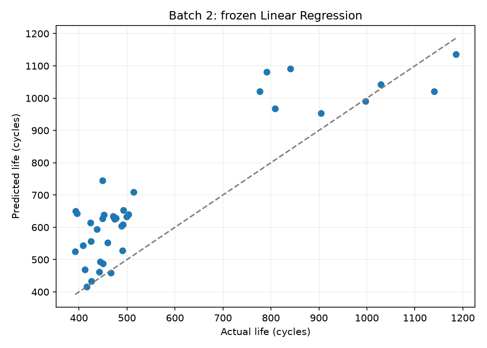
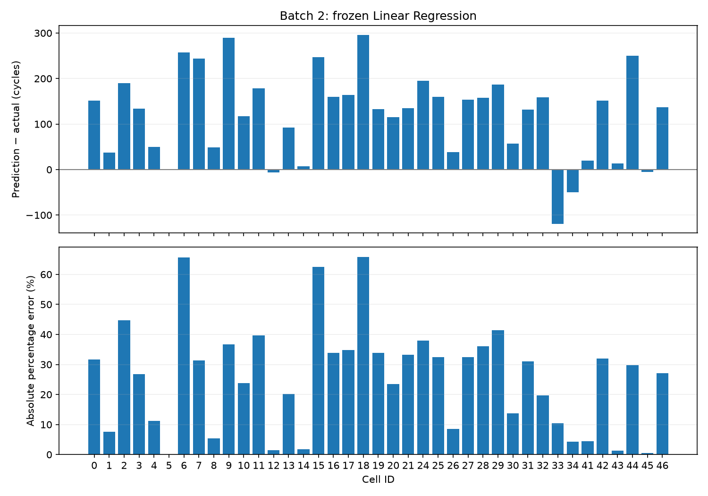

# DAY2 Batch 2 최종 테스트 평가

작성일: 2026-10-02. CV와 Batch 1 Hold-out 뒤 고정한 Linear Regression을 Batch 1 유효 셀 36개 전체로 학습하고 Batch 2 테스트 39개를 평가했다. **Batch 2 MAPE는 25.61%**로, 과제 기준 9.1%보다 **16.51%p 높다**. 테스트를 보고 모델을 다시 선택하지 않았다.

## 평가 설정

Feature(입력)는 초기 관측에서 계산한 ΔQ 분산의 log10 값 하나(log10_deltaQ_var), Target(정답)은 변환하지 않은 전체 수명(cycle_life)이다. Linear Regression과 StandardScaler를 Pipeline으로 묶어 Batch 1의 36개에서만 표준화와 학습을 적합했다. 예측 clipping은 하지 않았다. 선택 설정은 [후보 기록](../../tables/day2/boosting_comparison/candidate_selection.json)과 같다.

Batch 2 정답은 점수 계산에만 사용했다. 실제 셀 식별자 교집합은 없고, 프로토콜 그룹 구성도 다르다. 데이터 점검에서 과제 Batch 2와 원저자 코드의 Batch 2 구성이 다름을 확인했다. 따라서 9.1%는 과제 제시 기준과의 수치 비교이지, 논문 결과를 동일 조건으로 재현했다는 주장이 아니다.

## 성능과 요구 목표 Gap

MAPE는 셀별 절대 오차 비율의 평균이다. MAE와 RMSE는 cycle 단위 오차이며 RMSE는 큰 오차에 더 민감하다. Gap은 결과 양식에 맞춰 계산 방향을 표시했다.

| 항목 | MAPE (%) | 정의 |
|---|---:|---|
| Train: Batch 1 개발 CV | 8.62 | 개발 29개, 고정 5-fold 평균 |
| Valid: Batch 1 Hold-out | 9.08 | 개발에서 제외한 7개 |
| Test: Batch 2 | **25.61** | Batch 1 유효 36개로 학습, Batch 2 39개 |
| Gap (Train-Valid) | +0.46%p | Valid − CV |
| Gap (Valid-Test) | +16.53%p | Test − Valid |
| Gap (Target-Test) | +16.51%p | Test − 9.1% |

Batch 2의 MAE는 **129.23 cycle**, RMSE는 **153.03 cycle**이다. 음수 예측은 없다. CV·Hold-out·Test는 표본 수와 셀·프로토콜 구성이 다르므로 Gap 하나로 과적합 또는 batch 효과를 확정하지 않는다.

## 원 논문의 실제 실험·분석과 현재 결과 비교

원 논문은 상용 A123 APR18650M1A 원통형 LFP/graphite 셀 124개(명목용량 1.1 Ah)를 사용했다. 셀을 30°C 환경 챔버에서 동시에 시험하고, 72개 1단계·2단계 급속 충전 정책을 적용했다. 충전은 0–80% SOC 구간에서 셀별 정책으로 진행했고, 이후 80–100%는 모든 셀에 동일한 1C CC-CV를 적용했다. 방전도 모든 셀에 동일한 4C CC-CV(2.0 V cut-off)로 수행했다. 논문에서 수명은 nominal capacity의 80%, 즉 0.88 Ah까지 도달하는 cycle 수다. [원 논문 실험 방법](https://web.mit.edu/braatzgroup/Severson_NatureEnergy_2019.pdf)

논문에서 사용한 입력도 전체 수명 곡선이 아니다. cycle 10과 100의 방전 용량-전압 곡선 Q(V)를 맞춰 ΔQ(V)=Q100(V)−Q10(V)를 만들고, 그 곡선의 log variance 등 초기 Feature를 계산한다. 논문 모델은 log 수명을 예측하는 regularized linear model이며 Lasso/Elastic Net으로 계수와 Feature 선택을 했다. 본 프로젝트는 같은 종류의 ΔQ 분산 신호에서 출발했지만, ΔQ 분산 하나만 사용하고 **변환하지 않은 cycle_life**를 예측하는 일반 Linear Regression을 선택했다. 따라서 Feature 아이디어는 가깝지만 Target 표현과 모델 학습 방식은 같지 않다. 또한 이번 분석은 원 논문과 동일한 보간 격자·전처리·데이터 조합을 재현했다고 검증하지 않았다.

| 비교 항목 | 원 논문 실험·모델 | 현재 프로젝트 평가 |
|---|---|---|
| 물리 실험 | 30°C; 충전 정책 72종; 공통 4C 방전 | 원자료에 기록된 각 셀의 charging_policy를 사용. 현 Batch 2의 챔버·rest 차이는 이 파일만으로 원 논문 조건과 동일하다고 확인할 수 없음 |
| 논문 배치 날짜·분할 | 2017-05-12에서 학습 41개, 2017-06-30 primary test 43개, 모델 개발 후 생성한 2018-04-12 secondary test 40개 | 2017-05-12 Batch 1에서 유효 36개 학습, 2018-02-20 Batch 2에서 39개 테스트 |
| Feature | 초기 discharge voltage curve의 ΔQ(V) 기반; variance model은 log variance 하나 | ΔQ 분산에서 계산한 log10_deltaQ_var 하나 |
| Target·회귀 | log(cycle life); Lasso/Elastic Net 정규화·Feature 선택 | 변환하지 않은 전체 cycle_life; Linear Regression |
| 검증 절차 | 별도 train·primary test·후속 secondary test, 훈련 내부에서 4-fold CV 및 Monte Carlo sampling | Batch 1 개발 29개 5-fold 그룹 CV, Hold-out 7개, 이후 Batch 1 전체 36개로 학습해 Batch 2 39개 평가 |

우리 프로젝트의 2018-02-20 Batch 2는 원 논문 primary test인 2017-06-30 batch와 날짜가 다르다. 같은 공개 데이터 계열에서 온 파일이라는 점만으로 같은 셀 집합·실험 조건·분할이라고 간주할 수 없다. 파일 점검에서는 현재 유효 수가 Batch 1/2/3에서 각각 36/39/44이고, 원 저자의 통합 코드가 사용한 41/43/40과 다름을 확인했다. [프로젝트 데이터 점검 보고서](data_audit_report.md) · [원 저자 Batch 2 로더](https://github.com/rdbraatz/data-driven-prediction-of-battery-cycle-life-before-capacity-degradation/blob/master/BuildPkl_Batch2.ipynb)

성능 수치도 평가 모델을 구분해야 한다. 원 논문 초록은 첫 100 cycle 기반 cycle-life 예측의 9.1% test error를 대표 성과로 보고한다. 그러나 논문 Table 1의 단일 Feature **variance model** 점수는 primary test 14.7%, secondary test 11.4%다. 따라서 과제 기준 9.1%와 현재 25.61%의 차이는 과제의 요구 목표 대비 Gap으로는 유효하지만, 원 논문의 동일 모델·동일 테스트셋과의 재현 오차라고 해석할 수 없다. 논문의 세부 모델·분할별 결과는 [원 논문 Table 1 및 Methods](https://web.mit.edu/braatzgroup/Severson_NatureEnergy_2019.pdf)에서 확인할 수 있다.

우리 Batch 2에서 낮은 수명의 셀이 많은 관찰은 높은 방향 오차와 함께 나타났다. 원 논문 모델을 그대로 적용해 비교한 것이 아니며, Batch 2 날짜도 원 논문의 primary test와 다르다. 그러므로 현재 오류를 실험 protocol shift 하나의 결과라고 확정하지 않는다. 다음 탐색에서는 원자료에서 확인 가능한 충전 정책·초기 Q(V) 신호·수명 분포를 함께 그려, 어떤 차이가 오류 셀과 동반되는지 살펴보는 것이 적절하다. 이는 설명을 위한 후속 분석이며 이미 계산한 최종 Test MAPE를 바꾸지 않는다.

## 셀별 오차

오차는 예측 − 실제다. 양수면 수명을 크게 예측했다. 아래는 절대 비율 오차가 큰 10개 셀이다. 전체 39개는 [예측표](../../tables/day2/batch2_evaluation/batch2_predictions.csv)에 있다.

| 셀 | 프로토콜 | 실제 수명 | 예측 수명 | 오차 (cycle) | 절대 비율 오차 (%) |
|---:|---|---:|---:|---:|---:|
| 18 | 5.2C(50%)-4.25C | 449 | 744.3 | +295.3 | 65.76 |
| 6 | 3.6C(9%)-5C | 393 | 650.7 | +257.7 | 65.57 |
| 15 | 3.6C(9%)-5C | 396 | 643.4 | +247.4 | 62.48 |
| 2 | 5.2C(50%)-4.25C | 424 | 613.9 | +189.9 | 44.78 |
| 29 | 5.2C(58%)-4C | 452 | 639.2 | +187.2 | 41.42 |
| 11 | 5.2C(50%)-4.25C | 449 | 627.1 | +178.1 | 39.67 |
| 24 | 4.8C(80%)-4.8C | 514 | 709.2 | +195.2 | 37.98 |
| 9 | 5.6C(26%)-4.5C-newstructure | 791 | 1080.6 | +289.6 | 36.61 |
| 28 | 4.8C(80%)-4.8C | 437 | 594.4 | +157.4 | 36.02 |
| 17 | 5.6C(26%)-4.5C | 471 | 635.0 | +164.0 | 34.83 |

39개 중 35개를 실제보다 크게 예측했다. 가장 큰 오차인 셀 18·6·15는 실제 수명 449·393·396회보다 각각 295·258·247회 크게 예측했다. 이는 눈에 띄는 사례이며 세 셀만으로 전체 원인을 단정하지 않는다.

## 도메인 관점 해석

Batch 1 학습 수명의 중앙값은 772.5 cycle, Batch 2 테스트 중앙값은 472 cycle이다. Batch 2에는 낮은 수명 셀이 더 많고 예측도 대체로 높은 방향으로 치우쳤다. 이는 관측된 표본 분포와 오차 방향이 함께 달랐다는 기술적 관찰이지, 분포 차이가 오류의 단독 원인이라는 증명은 아니다.

프로토콜 구성도 다르며 Batch 2에는 Batch 1 학습에 없는 그룹이 다수 있다. 그룹별 셀 수가 2–6개이므로 그룹별 점수를 일반적인 프로토콜 효과로 해석하지 않는다. 이 단일 ΔQ Feature와 선형 관계는 이번 Batch 2 표본에 잘 전이되지 않았다. 이후 분석 아이디어로 Train/Test의 수명·Feature 분포와 프로토콜 구성을 나란히 확인하고, 큰 오차 셀의 ΔQ 신호를 검토할 수 있다. 다만 이 최종 테스트 점수에 맞춰 모델을 다시 고르면 Batch 2는 독립 평가 자료 역할을 잃는다.

## 재현 파일

- [평가 노트북](../../../notebooks/11_day2_batch2_evaluation.ipynb)
- [실행 코드](../../../src/day2_batch2_evaluation.py)
- [예측·계수·실험 기록](../../tables/day2/batch2_evaluation/INDEX.md)
- [Hold-out 보고서](holdout_evaluation_report.md)
- [모델 선택 보고서](boosting_comparison_report.md)
