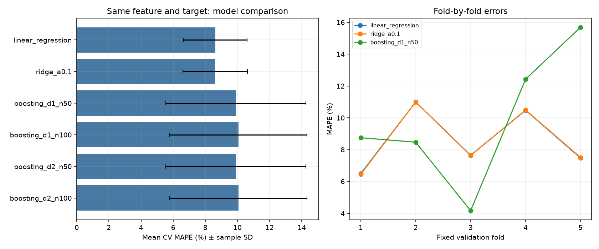
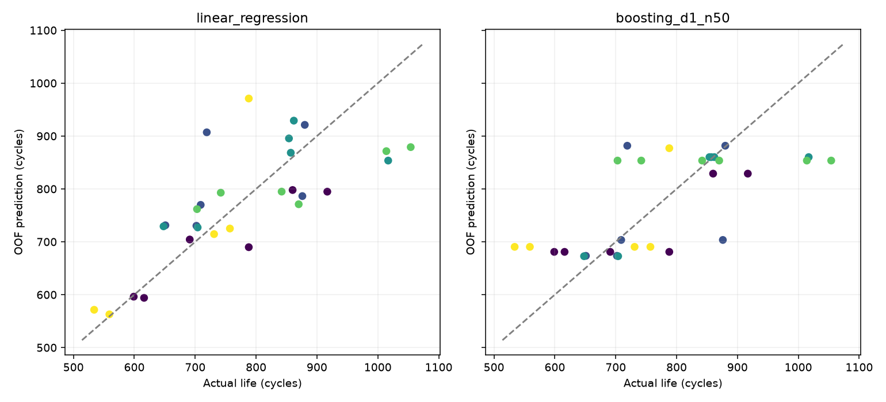
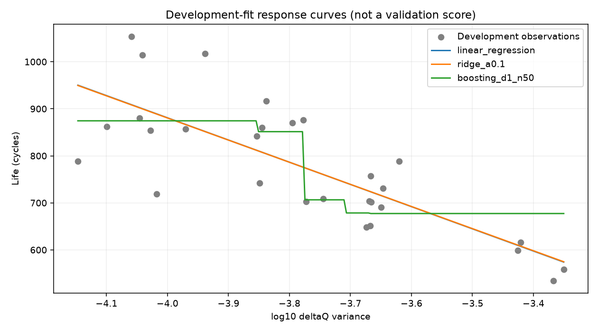

# DAY2 모델 교체 비교 — Linear Regression과 Gradient Boosting

작성일: 2026-10-02. **ΔQ 분산 하나 + 변환하지 않은 전체 수명 + Linear Regression을 유지한다.** 설계한 Boosting 대안을 구현했으나 같은 개발 CV에서 교체할 이득이 확인되지 않았다. Ridge는 비교 기준으로 보존한다. 이번 결과는 후보 선택을 위한 개발 결과다.

## 1. 무엇을 비교했는가

Feature(입력)는 초기 관측에서 계산한 `log10_deltaQ_var`, 즉 ΔQ 분산의 log10 값 하나다. Target(정답)은 변환하지 않은 전체 `cycle_life`이며 단위는 cycle이다. 입력 Feature의 로그 변환과 Target 로그 변환은 별개다.

Batch 1 개발 29개와 기존 프로토콜 그룹 5-fold를 그대로 사용했다. 각 회차는 학습 23/검증 6개 또는 학습 24/검증 5개다. 동일 프로토콜이 한 회차의 학습과 검증에 동시에 들어가지 않는다. StandardScaler는 학습 fold에서만 적합했다. 트리에 필수인 처리는 아니지만 공통 Pipeline을 유지했다. 예측값을 임의로 자르지 않았다.

Gradient Boosting은 작은 트리들을 차례로 학습해 이전 예측의 오차를 보완하는 모델이다. 최대 깊이 1·2와 트리 수 50·100을 비교했고, `min_samples_leaf=10`, `learning_rate=0.05`, `random_state=42`, `loss=squared_error`, `subsample=1.0`을 고정했다. 비교 6개 구성 × 5회 = 30회 학습을 수행했다. Hold-out 7개를 평가하지 않았고 Batch 2 파일은 읽지 않았다.

## 2. 평균 오차와 편차

MAPE는 실제 수명에 대한 절대 오차 비율의 평균이며 낮을수록 좋다. 아래 CV는 5개 검증 fold MAPE의 단순 평균이다. SD는 fold 사이의 표본 표준편차이며 신뢰구간이 아니다.

| 모델 | 요청 최대 깊이 | 트리 수 | 평균 CV MAPE (%) | SD (%p) | 가장 큰 fold MAPE (%) | 평균 fold MAE (cycle) |
|---|---:|---:|---:|---:|---:|---:|
| Linear Regression | — | — | 8.617 | 1.992 | 10.997 | 69.89 |
| Ridge α=0.1 | — | — | 8.612 | 2.002 | 10.986 | 69.84 |
| Gradient Boosting | 1 | 50 | 9.899 | 4.364 | 15.689 | 74.41 |
| Gradient Boosting | 2 | 50 | 9.899 | 4.364 | 15.689 | 74.41 |
| Gradient Boosting | 1 | 100 | 10.058 | 4.269 | 15.701 | 75.91 |
| Gradient Boosting | 2 | 100 | 10.058 | 4.269 | 15.701 | 75.91 |

가장 낮은 Boosting(깊이 1, 트리 50)의 평균 오차는 선형 회귀보다 **1.282%p** 컸다. fold 2·3에서는 개선됐지만 1·4·5에서는 악화됐고, 특히 fold 5는 7.48%에서 15.69%로 증가했다. Ridge와 선형 회귀의 차이는 약 0.0044%p여서 교체할 근거로 삼지 않았다. 이전 선형 비교의 두 기준 점수를 재현했다.

## 3. 평균이 숨기는 셀별 변화

OOF prediction은 각 셀을 학습에서 제외한 회차의 예측이다. 가장 낮은 Boosting은 **15개 셀을 개선하고 14개를 악화**시켰다. 단순히 대부분 셀이 악화된 상황은 아니다. 일부 큰 악화가 평균을 높였다. 아래 셀 번호는 Batch 1 원본의 0부터 시작하는 `cell_id`다.

| 셀 | fold | 실제 수명 | 선형 예측 | Boosting 예측 | 선형 절대 비율 오차 (%) | Boosting 오차 (%) | 변화 (%p) |
|---|---:|---:|---:|---:|---:|---:|---:|
| 11 | 5 | 788 | 970.98 | 876.99 | 23.22 | 11.29 | −11.93 |
| 26 | 4 | 870 | 771.02 | 853.61 | 11.38 | 1.88 | −9.49 |
| 43 | 2 | 651 | 731.23 | 673.47 | 12.32 | 3.45 | −8.87 |
| 21 | 5 | 559 | 562.80 | 690.46 | 0.68 | 23.52 | +22.84 |
| 20 | 5 | 534 | 571.46 | 690.46 | 7.01 | 29.30 | +22.28 |
| 45 | 1 | 599 | 596.23 | 680.97 | 0.46 | 13.68 | +13.22 |

낮은 수명의 셀 20·21은 Boosting에서 같은 값으로 예측됐고 오차가 크게 증가했다. 이전 선형 회귀에서 큰 오차를 보인 셀 15는 26.15%→22.63%로 일부 개선됐지만 여전히 오차가 크다. 셀 24는 소폭 개선됐고 9·23은 악화됐다. 따라서 특정 모델이 모든 큰 오차 셀을 해결하지는 않았다.

29개 셀을 같은 가중치로 합친 OOF MAPE는 선형 8.656%, Boosting 9.699%로 차이는 1.043%p다. 위 fold 평균 차이 1.282%p와 다른 이유는 fold의 검증 셀 수가 5·6개로 다르기 때문이다. 모델 선택에는 사전에 사용한 fold 평균 기준을 유지한다.

## 4. 깊이 2를 요청했는데 왜 같은 결과인가

CV에서 학습한 트리 1,500개를 점검했다. 실제 최대 깊이는 모두 1이고 최대 리프 수는 2였다. 각 리프에 최소 10개를 두면 리프 3개에 최소 30개가 필요한데 학습 fold에는 23–24개만 있다. 따라서 요청한 깊이 2를 활용하지 못했다. 동일 트리 수의 깊이 1·2 설정은 예측이 같았다.

이는 명목상 네 Boosting 설정이 실질적으로 두 가지 결과만 만든다는 뜻이다. 깊이가 더 깊은 Boosting까지 충분히 검증했다는 주장은 하지 않는다. 이 제약을 기록하고, 점수를 낮추기 위한 추가 탐색 없이 예정된 비교를 마무리한다.

## 5. 입력과 예측 관계를 확인하는 그림

이 그림은 개발 29개 전체로 모델 3개를 별도 적합한 **해석용 그림**이다. CV 검증 점수가 아니며 최종 모델도 아니다. 관측된 입력 범위 안에서 선형 회귀·Ridge의 직선과 Boosting의 구간별 예측을 보여준다. 현재 Boosting은 일부 낮은 수명 방향에서 예측이 평평해지는 모습이다. 셀별 OOF 악화와 함께 볼 수 있지만 그림만으로 원인을 확정하지 않는다.

## 6. 선택 이유와 한계

- **유지:** ΔQ 분산 하나, 변환하지 않은 전체 수명, Linear Regression. 현재 기준에서 평균 오차와 fold 편차가 더 작고 설명이 단순하다.
- **비교 기준 보존:** Ridge α=0.1. 차이가 작아 우위로 확정하지 않는다.
- **교체하지 않음:** 이번 제한된 Gradient Boosting. 개선 셀도 있었으나 평균 오차·일부 낮은 수명 셀의 악화·fold 편차가 교체를 지지하지 않았다.

적은 표본과 리프 제한으로 복잡한 분할이 제한됐다. 이는 현재 Feature·표본·설정에 관한 결과이며 모든 Boosting 모델의 부적합이나 비선형 관계의 부재를 뜻하지 않는다. fold 편차만으로 과적합을 확정할 수도 없다. 여러 후보를 같은 CV로 비교·선택했으므로 이 점수를 최종 일반화 성능이나 과제 목표 달성으로 해석하지 않는다.

학습 목적에 맞춰 설계 → 대안 구현 → 같은 조건에서 비교 → 유지 근거 기록의 과정을 완료했다. 다음에는 설정을 고정해 개발 29개에 학습하고 Hold-out 7개를 평가한다. 이후 Batch 1 유효 36개로 재학습해 Batch 2를 평가하며, 그 결과는 별도 보고서에 기록한다.

## 7. 코드·산출물·검증

- [실행 노트북](../../../notebooks/09_day2_boosting_comparison.ipynb)
- [Boosting 비교 코드](../../../src/day2_boosting_comparison.py), [공통 CV 코드](../../../src/day2_linear_comparison.py)
- [표·실험 정보 목록](../../tables/day2/boosting_comparison/INDEX.md)
- [선택 설정 기록](../../tables/day2/boosting_comparison/candidate_selection.json)

평균·회차별 점수, 174개 OOF 예측, 셀별 차이, 학습 fold 표준화 통계, 실제 트리 깊이와 리프 수를 저장했다. CV 적합 30회와 해석용 개발 적합 3회는 구분해 기록했다. Boosting·기존 선형·Feature 비교 테스트 7개가 통과했고, 노트북은 프로젝트 `.venv`의 새 커널에서 실행해 출력을 저장했다.

재실행은 프로젝트 루트의 가상환경에서 `python -m src.day2_boosting_comparison`을 사용한다. 노트북도 동일 CV 결과를 다시 계산해 저장된 평균 점수와 비교한다.
