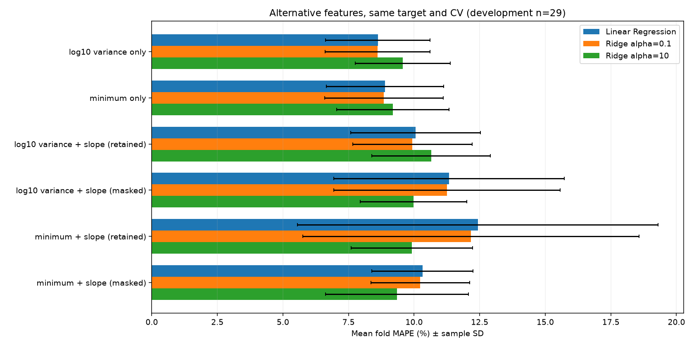
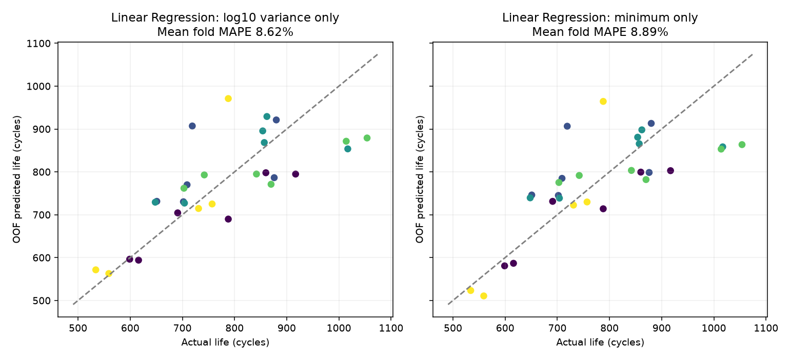
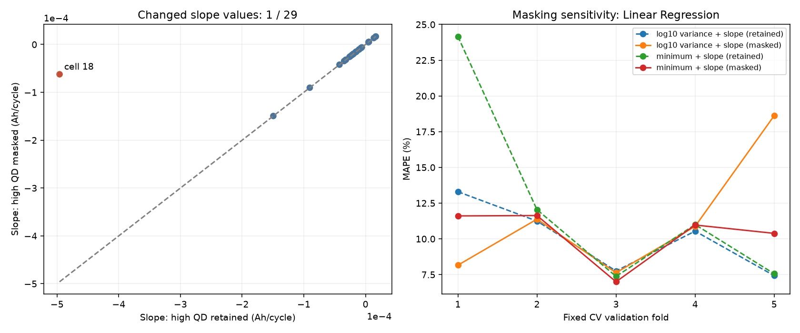

# DAY2 Feature 대체·용량 급등값 처리 비교

작성일: 2026-10-02 · 개발 CV 완료, Hold-out·Batch 2 평가 미실행

## 1. 이번 결정

**ΔQ 분산 하나를 입력으로 사용하고, 변환하지 않은 전체 수명을 Linear Regression으로 예측하는 기준 구성을 유지한다.** ΔQ 최솟값으로 교체하거나 용량 기울기를 추가해야 할 충분한 개선 근거는 이번 비교에서 확인되지 않았다.

ΔQ 최솟값은 비슷한 성능을 보인 대체 후보로 보존한다. 용량 급등값을 가리는 masking의 효과는 함께 쓰는 Feature와 Ridge 설정에 따라 달라, 항상 예측을 개선하는 처리로 확정하지 않는다. 기준 구성은 용량 기울기를 사용하지 않아 이번 QD masking 변경의 영향을 받지 않는다.

다음 작업은 같은 Feature·Target·CV를 유지한 채 Linear Regression과 제한된 Gradient Boosting을 비교하여 **모델을 바꿀 이유가 있는지** 확인하는 것이다.

## 2. 이번에 무엇을 바꾸었는가?

Feature는 모델 입력, Target은 예측할 정답이다. [첫 모델 비교](linear_comparison_report.md)의 용어 설명도 함께 참고할 수 있다.

| 비교 요소 | 현재 표현 | 대안 |
|---|---|---|
| 핵심 Feature | ΔQ 분산: 전압별 곡선 차이값이 퍼진 정도 | ΔQ 최솟값: 전압별 곡선 차이값 중 가장 작은 값 |
| 추가 Feature | 용량 기울기 없이 학습 | 초기 방전 용량의 증가·감소 추세를 나타내는 기울기 추가 |
| 기울기 계산 | 급등값 유지(retained) | QD>1.32 Ah를 계산에서 가림(masked) |
| 모델 | Linear Regression | 같은 입력의 Ridge alpha=0.1·10 |

ΔQ는 같은 전압에서 계산한 Q100−Q10 방전 곡선 차이다. **분산 입력은 기존 log10 변환값, 최솟값 입력은 부호를 포함한 원래 값**을 쓴다. 최솟값에 절댓값이나 로그를 적용하지 않았다. 따라서 이번 실험은 단순히 같은 스케일에서 통계량만 비교한 것이 아니라, 설계한 두 통계의 입력 표현까지 포함한 비교다. 분산과 최솟값을 동시에 입력하지 않는다.

Target은 모든 구성에서 **변환하지 않은 cycle_life**, 즉 전체 수명이다. 새 원본 추출이나 Feature 계산 없이 저장된 Parquet의 초기 특징을 재사용했다. 같은 개발 데이터 29개·고정 프로토콜 그룹 5-fold를 적용하고 학습 fold 내부에서만 표준화했다. Hold-out 7개와 Batch 2는 평가하지 않았다.

분산/최솟값 각각에 대해 단독·기울기 유지·기울기 masking의 세 조합을 만들어 총 6개 Feature set을 비교했다. 모델 설정은 Linear Regression과 Ridge 두 alpha로 고정해 **18개 구성·90회 학습·522개 셀별 OOF 예측**을 저장했다. OOF는 해당 셀을 학습에서 제외한 모델의 예측이다.

## 3. 핵심 Feature를 바꾼 결과

### 3.1 단일 Feature끼리 같은 모델로 비교

| 모델 | 분산만: 평균 CV MAPE (%) | 최솟값만: 평균 CV MAPE (%) | 최솟값 − 분산 (%p) |
|---|---:|---:|---:|
| Linear Regression | 8.62 | 8.89 | +0.27 |
| Ridge alpha=0.1 | 8.61 | 8.85 | +0.24 |
| Ridge alpha=10 | 9.56 | 9.19 | −0.38 |

Linear Regression에서 분산의 회차 간 MAPE 표준편차는 1.99%p, 최솟값은 2.23%p였다. 최솟값은 5회 중 4회에서 분산보다 오차가 컸고, 3회차에서는 작았다. 가장 나쁜 회차의 MAPE도 분산 11.00%, 최솟값 11.68%였다.

다만 차이가 작고 Ridge alpha=10에서는 최솟값이 더 좋았다. **ΔQ 분산이 모든 조건에서 우수하다고 결론 내리지 않는다.** 현재 선정했던 Linear Regression과 약한 Ridge에서는 교체를 뒷받침할 개선이 없어 분산을 유지한다. 최솟값의 Linear Regression 계수는 모든 회차에서 양수였다. 분산의 음수 계수와 부호가 다르지만 두 통계의 정의가 달라 모순이라고 해석하지 않는다.

### 3.2 전체 입력 조합과 모델 비교

그림의 `variance`는 ΔQ 분산, `minimum`은 최솟값, `slope`는 용량 기울기다. `retained/masked`는 급등값 유지/가림 조건이다. 검은 막대는 5회 MAPE의 표본 표준편차로 신뢰구간이 아니다.

- 두 단일 Feature 구성은 비슷한 성능을 보인다.
- 기울기를 추가한 구성은 Feature와 Ridge 설정에 따라 평균·편차가 크게 달라졌다.
- 이번 18개 구성 전체에서는 기존의 분산 단독·약한 Ridge가 수치상 최저 평균 MAPE였으며, 설정이 없는 Linear Regression과 거의 같았다.

### 3.3 실제 수명과 예측 수명 비교

가로축은 실제 수명, 세로축은 예측 수명이며 대각선에 가까울수록 정확하다. 두 통계 모두 수명의 일부 차이를 반영하지만, 어떤 셀은 개선되고 다른 셀은 나빠졌다. Feature를 교체한다고 모든 셀의 오차가 함께 줄지는 않는다. 평균 점수만 아니라 회차·셀별 예측을 비교하는 이유다.

## 4. 용량 급등값 처리의 영향

### 4.1 실제 입력 변화는 cell 18 하나

개발 29개 중 기울기가 바뀐 셀은 **Batch 1 cell 18**뿐이다. 이 셀에는 초기 구간에서 QD>1.32 Ah 관측이 1개 있었다. 원본 값을 삭제하지 않고 이미 계산한 두 기울기를 비교했다.

| 항목 | 확인 결과 |
|---|---|
| 실제 barcode | EL150800453240 |
| 검증 회차 | fold 1 |
| 급등값 유지 기울기 | 약 −4.96×10⁻⁴ Ah/cycle |
| 급등값 masking 기울기 | 약 −6.23×10⁻⁵ Ah/cycle |

1.32 Ah는 기존 1.1 Ah 용량 기준값의 1.2배인 탐색용 기준이다. 이 값만으로 측정 오류를 확정하지 않는다. 분석용 값의 타당성과 모델의 오차 개선은 별개의 판단이다.

### 4.2 masking의 예측 효과는 조합에 따라 달랐다

다음 표는 **masking 평균 MAPE − 유지 평균 MAPE**다. 음수는 masking에서 오차가 줄었다는 뜻이다.

| 모델 | 분산 + 기울기 (%p) | 최솟값 + 기울기 (%p) |
|---|---:|---:|
| Linear Regression | +1.28 | −2.11 |
| Ridge alpha=0.1 | +1.31 | −1.94 |
| Ridge alpha=10 | −0.68 | −0.57 |

Linear Regression에서 분산+기울기는 유지 조건 10.05% → masking 11.33%로 나빠졌지만, 최솟값+기울기는 12.43% → 10.32%로 좋아졌다. Ridge alpha=10에서는 두 통계 모두 masking으로 개선됐다. 따라서 masking을 모든 모델에서 유리한 처리로 선택할 수는 없다.

다만 각 두-Feature 계열에서 가장 좋은 구성을 선택해도 단일 분산 기준을 넘지 못했다. 분산+기울기의 최저 평균 MAPE는 9.94%, 최솟값+기울기는 9.34%였으며, 단일 분산의 Linear Regression 8.62%보다 낮지 않았다. **기울기를 기본 입력에 추가하지 않는 결정을 유지**한다.

### 4.3 한 셀의 변화가 다른 검증 회차에도 영향을 준다

왼쪽에서 cell 18만 대각선에서 벗어난다. 오른쪽은 Linear Regression의 조건별 fold MAPE다.

fold 1에서는 cell 18이 검증 데이터에 있어, 이 셀의 입력을 바꾸면 예측이 크게 바뀐다. 실제 수명은 691회이며, 분산+기울기의 예측은 유지 조건 927.00회 → masking 713.83회, 최솟값+기울기는 1282.79회 → 762.21회였다. 해당 셀만 보면 두 조합 모두 오차가 줄었다.

그러나 나머지 네 회차에서는 cell 18이 학습 데이터에 들어간다. 이 한 셀의 입력 변화가 학습 평균·표준편차·계수를 바꾸어 다른 셀의 예측에도 영향을 줄 수 있다. 분산+기울기에서는 fold 5 MAPE가 유지 7.43% → masking 18.62%로 증가했다. **한 셀의 예측 개선과 전체 CV 개선은 같지 않다.** 작은 표본과 함께 쓰는 Feature의 관계를 고려해야 한다.

## 5. 유지·교체 기록

| 검토한 선택 | 결정 | 이유 |
|---|---|---|
| ΔQ 분산 → 최솟값 | **분산 유지**, 최솟값은 대체 후보 | 현재 기준 모델에서 명확한 평균·안정성 개선 없음 |
| 용량 기울기 추가 | **기본 입력에서 제외 유지** | 유지/masking 조건을 비교해도 단일 분산 기준보다 좋지 않음 |
| 급등값 masking을 항상 사용 | 전역 우위로 확정하지 않음 | 통계·Ridge 설정에 따라 효과 방향이 다르고 변화 셀은 1개 |
| Linear Regression → Ridge | 기준 후보는 **Linear Regression 유지** | 약한 Ridge와 거의 같으며, 추가 설정이 적음 |

이번 결정으로 새로운 학습 데이터를 만들거나 기존 Parquet을 덮어쓰지 않았다. 저장된 비교용 Feature와 초기 품질 플래그를 재사용했다. 최솟값을 Feature로 쓰는 모델을 실제로 학습했으며, 이름만 바꾼 비교가 아니다.

## 6. 코드·산출물·검증

- [실행 노트북](../../../notebooks/08_day2_feature_comparison.ipynb): 입력 조합·변화 셀·CV·표·그래프·계수·결정 과정.
- [Feature 비교 코드](../../../src/day2_feature_comparison.py): 실험 구성과 저장·그래프.
- [공통 CV 코드](../../../src/day2_linear_comparison.py): 이전 실험과 동일한 평가 흐름을 재사용.
- [결과 표 목록](../../tables/day2/feature_comparison/INDEX.md): 회차별 MAPE 차이·셀별 예측·입력 변화·계수·표준화 통계.
- [검증 테스트](../../../tests/test_day2_feature_comparison.py): 최솟값의 실제 사용, 동일 기울기일 때 동일 예측, 잘못된 입력·Target 유입 거부.

프로젝트 루트에서 `.venv/bin/python -m src.day2_feature_comparison`으로 재생성한다. 이전 분산 단독·masking 구성 네 가지의 평균 MAPE가 기존 저장 결과와 일치함을 확인했다. 새 테스트 3개와 기존 CV 테스트 2개가 통과했고, 노트북의 새 `.venv` 커널에서 전체 실행한 결과도 저장된 표와 일치했다. 그래프 3개를 저장하고 시각적으로 확인했다.

## 7. 다음 작업과 한계

다음에는 **분산 하나·변환하지 않은 수명·동일 CV**를 유지하고, Linear Regression/Ridge와 제한된 Gradient Boosting을 비교한다. 입력과 분할을 고정해 모델 변경의 추가 효과를 확인하고, 결과에 따라 유지·교체 근거를 기록한다.

현재 비교는 29개 개발 셀과 고정된 프로토콜 분할에 한정된다. 같은 CV를 반복해서 선택에 사용했으므로 일반화 성능으로 확정하지 않는다. masking에 관한 결론은 한 변화 셀에 의존한다. Hold-out·Batch 2 평가와 목표 대비 Gap은 이후 단계에서 확인한다.
