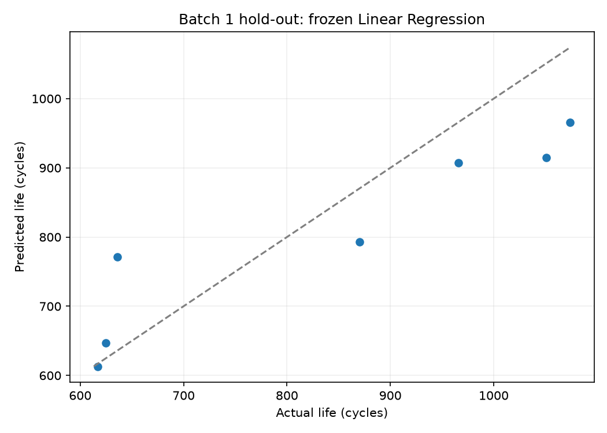

# DAY2 Batch 1 Hold-out 평가

작성일: 2026-10-02. 개발 CV에서 고른 Linear Regression을 고정해 Batch 1 Hold-out 7개 셀을 평가했다. Hold-out MAPE는 **9.08%**였고, 개발 CV 평균보다 **+0.46%p** 높았다. 설정은 다시 고르지 않았다.

## 평가 설정과 범위

Feature(입력)는 ΔQ 분산의 log10 값 하나(log10_deltaQ_var), Target(정답)은 변환하지 않은 전체 수명(cycle_life)이다. 개발 데이터 29개로 StandardScaler와 Linear Regression을 적합한 뒤 별도로 보관한 Hold-out 7개를 평가했다. 저장된 프로토콜 그룹은 개발과 Hold-out 사이에 겹치지 않는다. Batch 2는 읽거나 평가하지 않았다.

Hold-out은 후보 선택에 쓰지 않았다. 5-fold 개발 CV 평균 MAPE는 8.62%, Hold-out은 9.08%로 차이는 +0.46%p다. Hold-out 표본은 7개뿐이므로 몇 셀의 오차가 평균에 크게 반영된다. 이 차이만으로 과적합 원인을 단정하지 않는다.

## 셀별 예측

오차는 예측에서 실제 수명을 뺀 값이다. 양수면 크게 예측하고 음수면 작게 예측했다.

| 셀 번호 | 실제 수명 (cycle) | 예측 수명 (cycle) | 오차 (cycle) | 절대 비율 오차 (%) |
|---:|---:|---:|---:|---:|
| 5 | 1074 | 965.3 | -108.7 | 10.12 |
| 6 | 636 | 771.7 | +135.7 | 21.33 |
| 7 | 870 | 792.8 | -77.2 | 8.88 |
| 38 | 617 | 613.1 | -3.9 | 0.63 |
| 39 | 625 | 646.9 | +21.9 | 3.50 |
| 40 | 966 | 906.9 | -59.1 | 6.12 |
| 41 | 1051 | 914.6 | -136.4 | 12.98 |

셀 6은 실제 636회보다 약 136회 크게 예측되어 개별 오차가 가장 컸다(21.33%). 셀 38은 약 4회 작게 예측해 가장 작았다(0.63%). 셀 5·41은 각각 약 109회·136회 작게 예측됐다. 일곱 셀만으로 프로토콜의 일반적 효과를 결론내리지는 않는다.

## 성능 요약과 다음 단계

| 평가 자료 | 셀 수 | MAPE (%) | MAE (cycle) | RMSE (cycle) |
|---|---:|---:|---:|---:|
| Batch 1 개발 5-fold 평균 | 29 | 8.62 | CV 보고서 참조 | CV 보고서 참조 |
| Batch 1 Hold-out | 7 | 9.08 | 77.56 | 91.64 |

현재 설정을 유지한다. 다음에는 이를 바꾸지 않고 Batch 1 유효 셀 36개로 다시 학습한 뒤 Batch 2 39개에서 최종 성능과 목표 9.1%와의 차이를 기록한다.

## 재현 파일

- [평가 노트북](../../../notebooks/10_day2_holdout_evaluation.ipynb)
- [실행 코드](../../../src/day2_holdout_evaluation.py)
- [산출물 목록](../../tables/day2/holdout_evaluation/INDEX.md)
- [선택 설정](../../tables/day2/boosting_comparison/candidate_selection.json)

개발 29개로 한 번 적합하고 Hold-out 7개를 평가했다. 예측 clipping은 하지 않았다.
