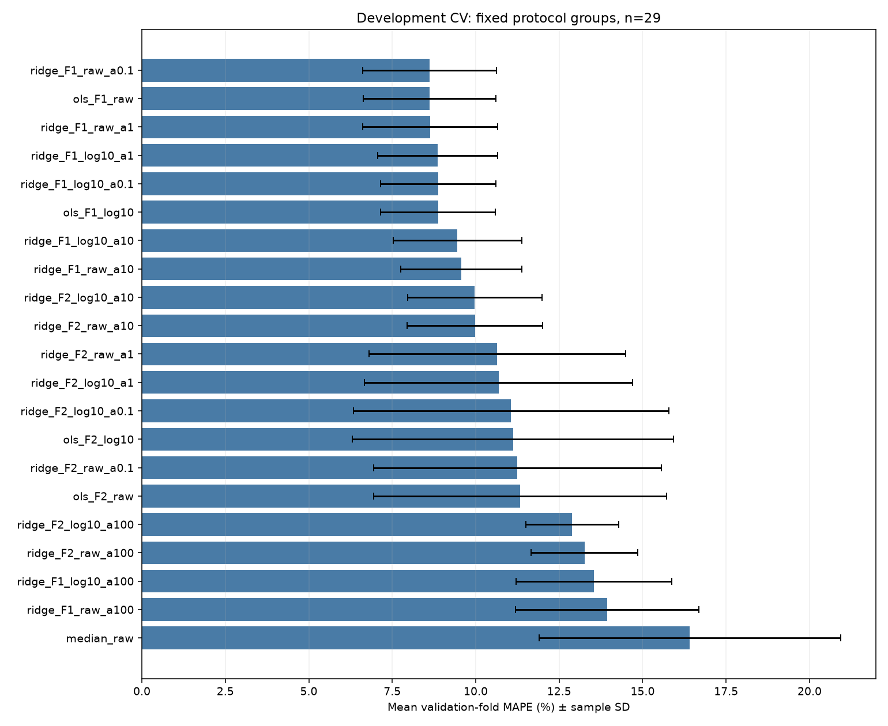
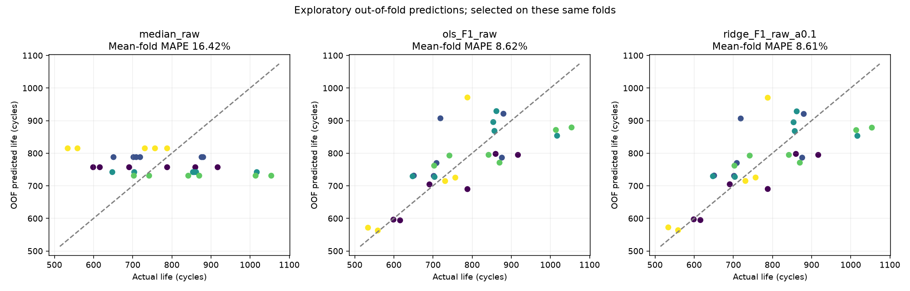
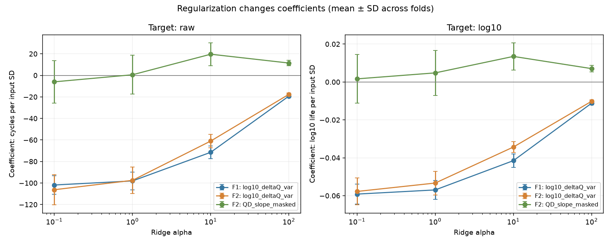

# DAY2 첫 모델 비교 — 입력 정보·정답 표현·모델의 선택

작성일: 2026-10-02 · 개발 데이터의 Cross-validation 완료, Hold-out·Batch 2 평가 미실행

## 1. 이번에 무엇을 결정했는가?

다음 실험에서는 **ΔQ 분산 하나를 입력으로 사용하고, 변환하지 않은 전체 수명(cycle_life)을 Linear Regression으로 예측하는 구성**을 기준 후보로 사용한다. 최종 모델을 확정했다는 뜻이 아니라, 다음 대안의 결과를 이 구성과 비교하기로 정했다는 뜻이다.

DAY1에서는 ΔQ 분산에 초기 용량 기울기를 더하고, 수명을 log10으로 변환한 뒤 Ridge를 사용하는 구성을 먼저 검토하기로 했다. 실제 비교에서는 용량 기울기를 추가한 이득이 확인되지 않았다. ΔQ 분산 하나만 사용한 Linear Regression과 Ridge(alpha=0.1)는 평균 MAPE 차이가 약 0.0044%p로 거의 같았다. 따라서 설정이 적은 Linear Regression을 기준 후보로 삼고, Ridge는 비교 후보로 유지한다.

이번 작업은 설계한 대안을 같은 데이터 분할에서 구현·비교하고 선택을 수정한 과정이다. 최종 모델 선정은 ΔQ의 다른 통계, 용량 급등값 처리, Boosting 모델 비교를 거친 뒤 수행한다.

## 2. 보고서에서 사용하는 용어

### 2.1 Feature, Target, F1·F2

**Feature는 모델에 넣는 정보**, **Target은 모델이 예측하려는 정답**이다. 여기서는 배터리 하나가 데이터 표의 한 행이며, 계산한 초기 관측 정보가 Feature, 전체 수명 `cycle_life`가 Target이다.

F1·F2는 모델 이름이나 개별 Feature의 이름이 아니라, 설계 문서에서 붙인 **Feature set(입력 정보 조합)의 식별 이름**이다. 기존 EDA에서 계산한 Feature를 이번 학습에 재사용했다.

| 이름 | 모델에 넣는 Feature | 쉽게 설명하면 |
|---|---|---|
| ΔQ 분산만 사용 (F1) | `log10_deltaQ_var` 하나 | 100회차와 10회차의 방전 곡선을 같은 전압에서 뺀 뒤, 전압별 차이값들이 얼마나 퍼져 있는지 계산하고 log10 변환한 값 |
| ΔQ 분산 + 용량 기울기 (F2) | 위 값 + `QD_slope_masked` | 위 정보에 더해, 초기 10–100회 동안 방전 용량이 증가·감소하는 추세를 나타내는 직선의 기울기 |

`QD`는 방전 용량이다. `masked`는 계산할 때 특정 값을 가렸다는 뜻이다. 용량 기울기 계산에서는 0 이하·비유한 QD와 1.32 Ah보다 높은 QD를 제외했다. 원본 측정값을 삭제하거나 바꾼 것은 아니다.

### 2.2 변환하지 않은 수명과 로그 변환한 수명

| Target 표현 | 수명이 800회인 배터리의 학습 정답 | 예측값 해석 |
|---|---|---|
| **변환하지 않은 수명** | `cycle_life = 800` | 모델이 cycle 횟수를 직접 예측 |
| **로그 변환한 수명** | `log10(800) ≈ 2.90` | 모델의 출력을 `10**예측값`으로 되돌려 cycle 횟수로 평가 |

둘 다 **배터리의 전체 수명**을 예측한다. 초기 100회를 관측했다고 해서 정답을 `800−100=700회`의 잔여 수명으로 바꾸지는 않는다. ΔQ 분산 Feature의 log10 변환과 Target의 log10 변환은 별개의 처리다. F1에서는 입력에 log10을 적용하지만 Target은 변환하지 않고 학습할 수 있다.

### 2.3 모델·학습·검증 용어

| 용어 | 이 실험에서의 의미 |
|---|---|
| Linear Regression | 입력과 수명의 관계를 직선 형태의 식으로 학습하는 선형 회귀 모델 |
| Ridge / Regularization | 선형 회귀에 계수 크기를 제한하는 조건을 더한 모델. alpha가 클수록 제약이 강해짐 |
| Coefficient(계수) | 학습한 식에서 각 Feature에 곱하는 값. 함께 사용한 다른 Feature와 입력 스케일에 영향을 받음 |
| Standardization(표준화) | 학습 데이터의 평균·표준편차로 입력 스케일을 맞추는 처리 |
| Pipeline | 표준화와 모델 학습을 하나의 실행 흐름으로 묶은 코드 |
| Cross-validation(CV) / fold | 개발 데이터를 여러 그룹으로 나눠 학습·검증을 반복하는 방식 / 그 분할의 한 회차 |
| Hold-out | 모델 선택에 사용하지 않고 따로 보관한 검증 데이터. 여기서는 Batch 1의 7개 셀 |
| Out-of-fold(OOF) prediction | 해당 셀을 학습에서 제외한 모델이 그 셀에 대해 만든 예측 |
| MAPE / APE | MAPE는 실제 수명 대비 절대 오차율의 평균. APE는 셀 하나의 절대 오차율. 낮을수록 좋음 |
| MAE | 절대 오차의 평균. 여기서는 몇 cycle 틀렸는지를 나타냄 |
| %p(퍼센트포인트) | 두 백분율의 단순 차이. 예: 10%와 8%의 차이는 2%p |

## 3. 실제 수행한 작업

[확정 학습 테이블](dataset_preparation_report.md)의 Batch 1 개발 데이터 29개만 사용했다. 충전 프로토콜이 학습·검증에 겹치지 않도록 저장한 5-fold 분할을 사용했고, 매회 23–24개로 학습한 뒤 나머지 5–6개의 수명을 예측했다. Hold-out 7개는 이번 학습·검증에서 제외했으며 Batch 2/3 파일은 실험 코드에서 읽지 않았다.

| 비교 대상 | 구현 |
|---|---|
| Median baseline(중앙값 기준 모델) | 매회 학습 데이터의 수명 중앙값을 모든 검증 셀에 똑같이 예측 |
| 두 Feature set | ΔQ 분산만 사용(F1) / 용량 기울기까지 추가(F2) |
| Linear Regression | 학습 데이터의 StandardScaler → LinearRegression |
| Ridge | 같은 표준화 → Ridge, alpha 0.1·1·10·100 비교 |
| 두 Target 표현 | 변환하지 않은 cycle_life / log10(cycle_life) |

기준 모델 1개, Linear Regression 4개, Ridge 16개로 총 **21개 구성·105회 학습**을 수행했다. 각 구성마다 개발 셀 29개에 대한 OOF 예측이 하나씩 생겨 총 609개를 저장했다.

로그 Target은 `TransformedTargetRegressor`로 처리했다. Feature 결측이 없어 결측 대체를 적용할 필요는 없었다. 표준화에 필요한 평균·표준편차는 각 fold의 학습 데이터만으로 계산했다. 예측값을 임의 범위로 잘라내거나 오차가 큰 셀을 삭제하지 않았다. 0 이하 예측은 모든 구성에서 0개였다.

주 지표는 **5회 검증 MAPE의 단순 평균**이다. `pooled OOF MAPE`는 29개 셀의 APE를 한꺼번에 평균한 값이다. 검증 셀 수가 회차마다 달라 두 값은 조금 다르며 별도로 저장했다. CV 결과로 설정을 선택했으므로 이 점수를 독립적인 최종 성능으로 해석하지 않는다.

## 4. 주요 비교 결과

| Feature set | Target 표현 | 모델 | 평균 CV MAPE (%) | 회차 간 표준편차 (%p) | 평균 CV MAE (cycle) |
|---|---|---|---:|---:|---:|
| Feature 사용 안 함 | 변환하지 않은 수명 | Median baseline | 16.42 | 4.52 | 123.54 |
| ΔQ 분산만 (F1) | 변환하지 않은 수명 | **Linear Regression** | **8.62** | **1.99** | **69.89** |
| ΔQ 분산만 (F1) | 변환하지 않은 수명 | Ridge alpha=0.1 | 8.61 | 2.00 | 69.84 |
| ΔQ 분산만 (F1) | 로그 변환한 수명 | Ridge alpha=1 | 8.86 | 1.79 | 71.53 |
| ΔQ 분산 + 용량 기울기 (F2) | 변환하지 않은 수명 | Linear Regression | 11.33 | 4.39 | 85.40 |
| ΔQ 분산 + 용량 기울기 (F2) | 변환하지 않은 수명 | Ridge alpha=10 | 9.98 | 2.04 | 77.66 |
| ΔQ 분산 + 용량 기울기 (F2) | 로그 변환한 수명 | Ridge alpha=10 | 9.97 | 2.01 | 78.21 |

ΔQ 분산만 사용하는 Linear Regression의 평균 MAPE는 8.616772%, Ridge alpha=0.1은 8.612355%다. 반올림된 8.62/8.61 표시를 큰 모델 차이로 보지 않는다. 전체 결과는 [summary.csv](../../tables/day2/linear_comparison/summary.csv)를 참고한다.

### 4.1 전체 후보의 평균 오차와 회차별 차이

그림과 CSV의 식별 이름은 코드와 연결하기 위해 유지했다. `ols`는 Linear Regression, `F1/F2`는 위에서 정의한 Feature set, `raw/log10`은 Target 변환 여부, `a0.1`은 Ridge alpha=0.1을 뜻한다. 예를 들어 `ridge_F1_raw_a0.1`은 ΔQ 분산만 입력하고 변환하지 않은 수명을 Ridge alpha=0.1로 예측한 구성이다.

- ΔQ 분산만 사용하는 Linear Regression과 제약이 작은 Ridge가 상위에 모여 있다. alpha=100에서는 평균 오차가 커져 필요한 관계까지 지나치게 줄일 가능성을 보여준다.
- 용량 기울기를 추가하면 제약이 작은 Ridge에서 회차별 오차 차이가 크다. alpha=10이 이를 줄였지만 ΔQ 분산만 쓰는 구성보다 좋은 결과는 아니었다.
- 검은 오차 막대는 5회 MAPE의 표본 표준편차다. 신뢰구간이나 모델 간 유의성 검정이 아니다. CV 회차끼리는 학습 데이터를 공유하므로 독립 실험으로 보지 않는다.

### 4.2 실제 수명과 학습에서 제외된 셀의 예측

- 가로축은 실제 수명, 세로축은 예측 수명이다. 대각선에 가까울수록 정확한 예측이다. 점의 색은 검증 회차(fold)를 구분한다.
- 중앙값 기준 모델은 실제 수명에 따른 차이를 표현하지 못한다. ΔQ 분산을 사용하는 모델은 낮은 수명과 높은 수명의 일부 차이를 반영한다.
- Linear Regression과 Ridge alpha=0.1의 예측 분포는 거의 같다. 점수뿐 아니라 예측 자체가 유사함을 확인했다.
- 두 모델 모두 대각선에서 멀어진 셀이 남는다. 평균 개선이 모든 셀에서 정확한 예측을 보장하지 않는다.

ΔQ 분산만 사용하는 Linear Regression에서 상대 오차가 큰 사례는 아래와 같다. 원인을 확정한 것이 아니라 후속 오류 분석 대상으로 남긴다.

| cell_id | 검증 회차(fold) | 실제 수명 (cycle) | 예측 수명 (cycle) | 셀별 절대 오차율 APE (%) |
|---:|---:|---:|---:|---:|
| 15 | 2 | 719 | 907.01 | 26.15 |
| 11 | 5 | 788 | 970.98 | 23.22 |
| 9 | 4 | 1054 | 879.03 | 16.60 |
| 24 | 3 | 1017 | 853.59 | 16.07 |
| 23 | 4 | 1014 | 871.42 | 14.06 |

cell_id는 Batch 1 파일 안에서 0부터 시작하는 셀 위치다. 실제 barcode와 충전 프로토콜은 예측 CSV에서 대조할 수 있다. 이 표를 근거로 셀을 제외하지 않는다.

### 4.3 Ridge의 제약 강도와 계수 변화

- ΔQ 분산만 사용하는 Linear Regression에서는 모든 회차의 ΔQ 계수가 음수였다. 다른 조건이 같을 때 ΔQ 분산 입력값이 커질수록 예측 수명이 작아지는 방향이며, 기존 EDA와 부합한다.
- 용량 기울기까지 사용하는 Linear Regression에서는 기울기 계수가 3개 회차에서 음수, 2개에서 양수였다. ΔQ 분산과 함께 쓸 때의 추가 관계가 이 표본에서 안정적이지 않다는 단서다. 실제 원인이나 인과 효과의 부호를 뜻하지 않는다.
- Ridge는 ΔQ 계수의 절댓값을 줄인다. 서로 연관된 Feature를 함께 쓰면 계수가 재배분되면서 개별 Feature의 부호·크기가 바뀔 수 있다. 모든 계수가 alpha 증가에 따라 일정하게 감소한다고 해석하지 않는다.
- 왼쪽은 변환하지 않은 수명, 오른쪽은 로그 수명 계수여서 단위가 다르다. 세로축은 학습 입력 표준편차 한 단위에 해당하는 계수다. 회차별 학습 평균·표준편차도 함께 저장했다.

## 5. 무엇을 유지하고 무엇을 바꿨는가?

### 5.1 입력 정보를 두 개에서 하나로 변경

변환하지 않은 수명을 Linear Regression으로 예측했을 때, ΔQ 분산만 쓴 구성의 MAPE는 회차별 6.49·11.00·7.64·10.47·7.48%였다. 용량 기울기까지 추가하면 8.16·11.38·7.63·10.87·18.62%였다. 두 Feature를 쓰는 구성은 5회 중 4회에서 나빴고, 3회차 개선은 작았다. 특히 5회차에서 오차가 커졌다.

EDA에서 용량 기울기와 수명의 관계를 관찰했지만, ΔQ 분산을 이미 쓰고 있을 때 추가 예측 정보를 주는지는 별도 문제다. **용량 기울기는 기본 입력에서 제외하고 ΔQ 분산만 사용한다.** 비선형 모델에서도 효과가 없다고 결론 내리지는 않는다.

### 5.2 Ridge 우선안에서 Linear Regression 기준 후보로 변경

Ridge는 두 Feature를 사용하는 구성의 회차별 편차를 줄여 Regularization의 효과를 확인할 수 있었다. 그러나 ΔQ 분산만 사용할 때는 Ridge alpha=0.1과 Linear Regression이 거의 같고, 가장 나쁜 회차의 MAPE도 약 10.99%로 비슷하다.

**추가 설정 없이 비슷한 결과를 얻는 Linear Regression을 기준 후보로 채택**하고 Ridge를 비교 후보로 남긴다. 표본이 작다는 이유만으로 Regularization이 반드시 더 좋은 결과를 주지는 않는다는 학습 결과다.

### 5.3 로그 변환한 수명에서 변환하지 않은 수명 우선으로 변경

ΔQ 분산만 쓰는 로그 Target 구성의 최저 평균 MAPE는 8.86%로, 변환하지 않은 수명과 Ridge alpha=0.1을 사용한 8.61%보다 낮지 않았다. 로그 Target은 회차 간 표준편차가 조금 작았으므로 전반적으로 열등하다고 확정하지 않는다.

**cycle 단위의 관계와 계수를 해석하기 쉬운 변환하지 않은 수명을 우선**한다. 로그 Target 비교 결과도 보존한다.

## 6. 코드·결과를 확인하는 방법

- [실행 노트북](../../../notebooks/07_day2_linear_comparison.ipynb): 후보 생성, Pipeline, CV 실행, 표·그래프·계수·오류·선택 이유.
- [학습 코드](../../../src/day2_linear_comparison.py): 공통 CV 계산·저장·그래프.
- [결과 표 목록](../../tables/day2/linear_comparison/INDEX.md): 회차별 점수, 셀별 예측, 계수, 표준화 통계, 실험 설정.
- [검증 테스트](../../../tests/test_day2_linear_comparison.py): 보관한 검증·테스트 데이터가 실험에 들어오면 거부하는지, 표준화·중앙값이 fold 학습 데이터만 사용하는지, OOF 예측과 MAPE가 일치하는지 확인.

프로젝트 루트에서 `.venv/bin/python -m src.day2_linear_comparison`으로 재생성할 수 있다. 테스트 2개가 통과했고, 노트북의 새 `.venv` 커널 실행 결과가 저장된 성능표와 일치함을 확인했다. 그래프 3개를 저장하고 시각적으로 확인했다. 최종 모델 파일은 아직 만들지 않았다.

## 7. 다음 비교와 현재 결과의 범위

다음은 같은 개발 CV에서 ΔQ 분산 대신 ΔQ 최솟값을 입력으로 사용해 보고, 용량 기울기를 쓰는 비교안에서는 급등값을 유지하거나 가리는 처리의 영향을 확인하는 단계다. **ΔQ 분산만 쓰는 구성은 용량 기울기를 사용하지 않으므로 QD 급등값 처리 변경의 영향을 받지 않는다.** 이후 선정한 Feature로 제한된 Boosting 모델과 비교해 Linear Regression을 교체할 이유가 있는지 확인한다.

현재 CV를 여러 대안 선택에 반복 사용했으므로 선택한 구성의 오차는 낙관적일 수 있다. 표본도 작고 Batch 1 안의 특정 프로토콜 분할에 한정된다. Hold-out 평가와 Batch 2의 성능·목표 대비 Gap은 이후 단계에서 확인한다. 현재 MAPE가 9.1%보다 작다는 이유로 과제의 테스트 목표를 달성했다고 선언하지 않는다.
