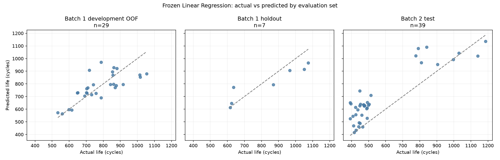
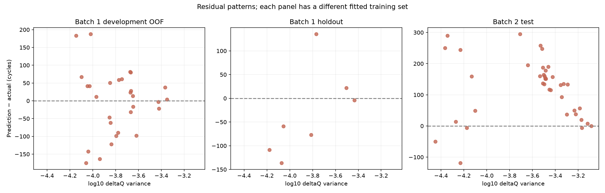
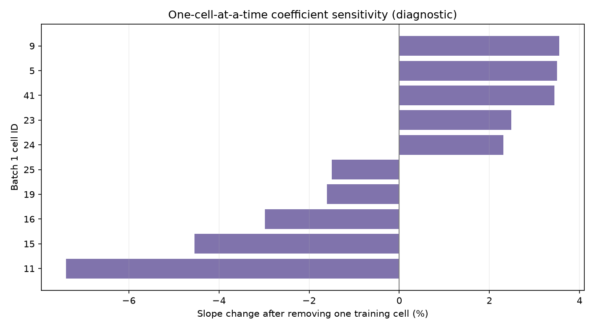

# DAY2 Linear Regression 오류 진단

작성일: 2026-10-02. 기존 ΔQ 분산 Feature와 고정 Linear Regression은 그대로 두고, 저장된 개발 OOF, Batch 1 Hold-out, Batch 2 예측을 셀 단위로 살펴봤다. **모델·Feature·계수는 바꾸지 않았고 성능을 다시 선택하지 않았다.** 이 문서는 최종 테스트 뒤의 설명용 진단이다.

## 세 평가 묶음의 예측 차이

OOF는 개발 셀이 자기 예측을 만드는 학습 fold에서 빠져 있었던 교차검증 예측이다. 세 묶음은 학습된 모델의 표본 수와 평가 셀 구성이 다르므로, 차이를 같은 조건의 반복 측정처럼 보지 않는다.

| 자료 | 셀 수 | 셀별 OOF/평가 MAPE (%) | 평균 signed error (cycle) | 실제 수명 중앙값 (cycle) | ΔQ Feature 중앙값 |
|---|---:|---:|---:|---:|---:|
| Batch 1 개발 OOF | 29 | 8.66 | -3.5 | 757 | -3.778 |
| Batch 1 Hold-out | 7 | 9.08 | -32.5 | 870 | -3.813 |
| Batch 2 Test | 39 | 25.61 | +119.9 | 472 | -3.487 |

Batch 2의 39개 중 35개를 실제보다 높게 예측했고, 평균 signed error는 +119.9 cycle이다. Batch 1 개발 OOF는 16개 과대·13개 과소 예측, Hold-out은 2개 과대·5개 과소 예측이었다. Hold-out 7개는 작아 방향 비율을 일반화할 수 없다.

잔차는 예측−실제다. Batch 2 잔차가 Feature 축 전반에서 대체로 양수인 경향은 확인되지만, 해당 산점도는 각 표본 묶음에서 다른 크기의 학습 자료로 적합한 모델을 비교한다. 이 패턴만으로 원인을 식별할 수 없다.

## Batch 2 충전 프로토콜과 큰 오차

프로젝트에 저장된 프로토콜 문자열을 정확히 비교했을 때 Batch 2의 12개 프로토콜 중 **10개가 Batch 1 학습 셀에 없었다**. Batch 1과 이름이 동일한 것은 4.8C(80%)-4.8C와 6C(60%)-3C 두 그룹이다. 그룹별 수가 적어 이름이 같은 셀끼리도 실험 환경·구조까지 동일하다고 보장하지는 않는다.

| Batch 2 프로토콜 | 셀 수 | Batch 1 학습에 동일 이름 있음 | 평균 절대 비율 오차 (%) | 평균 signed error (cycle) |
|---|---:|---|---:|---:|
| 3.6C(9%)-5C | 2 | 아니오 | 64.0 | +252.6 |
| 5.2C(50%)-4.25C | 5 | 아니오 | 42.9 | +193.7 |
| 6C(60%)-3C | 2 | 예 | 33.6 | +134.2 |
| 5.2C(58%)-4C | 4 | 아니오 | 32.3 | +153.3 |
| 4.8C(80%)-4.8C | 5 | 예 | 31.8 | +153.2 |

학습에 없던 프로토콜의 오차가 크게 나타난 그룹이 있지만, 같은 이름이 학습에 있었던 4.8C(80%)-4.8C(n=5, 평균 절대 비율 오차 31.8%)와 6C(60%)-3C(n=2, 33.6%)에서도 과대 예측이 컸다. 따라서 **미관측 프로토콜만으로 Batch 2 오류를 설명할 수 없다.** 그룹당 2–6개 셀뿐이며, 프로토콜 문자열만으로 다른 실험 조건을 통제할 수도 없다. 그룹별 숫자는 원인 분석이 아니라 추가로 들여다볼 대상을 정하는 기술 요약이다.

## 한 셀이 회귀식에 미치는 영향

Batch 1 유효 36개 전체에서 같은 한-Feature OLS 식을 계산하고, 한 번에 셀 하나씩 빼서 기울기 변화를 기록했다. 이는 영향 민감도 확인이며 모델을 재선택하거나 Hold-out 점수를 새로 계산하는 절차가 아니다.

전체자료 기울기는 약 **-527.9 cycle / Feature 단위**였다. 가장 큰 기울기 민감도는 셀 11을 제외했을 때 나타났다. 그 셀을 뺀 추정 기울기는 -566.9로 전체 기울기 대비 -7.4% 변했다. 개별 관측이 기울기에 영향을 주지만, 이 진단에서 단일 셀 하나가 회귀 관계를 뒤집는 상황은 관찰되지 않았다. 단, 영향 분석은 관계의 안정성을 보장하거나 표본 밖 성능을 입증하지 않는다.

큰 Batch 2 오차 사례는 [최종 Batch 2 평가 보고서](batch2_evaluation_report.md)의 셀별 표와 함께 확인할 수 있다. 현재 입력 Feature의 상·하한을 넘어서는 Batch 2 셀이 존재하므로 직선의 바깥 구간 사용도 잠재적인 위험이다. 다만 현재 잔차 패턴은 입력 범위 안에서도 나타나며, 범위 바깥 예측만으로 오차를 설명하지 않는다.

## 결론과 범위

이번 진단으로 확인한 내용은 세 가지다.

- Batch 2에는 실제보다 높게 예측하는 셀이 많았고, Batch 1 내부 OOF와 Hold-out에서는 같은 방향의 편향이 뚜렷하지 않았다.
- Batch 2 프로토콜 대부분은 학습에서 보지 못한 이름이지만, 학습에 있던 프로토콜도 오차가 커서 프로토콜 미관측 여부만으로 설명되지 않았다.
- 한 셀씩 제외한 기울기 점검에서 일부 셀의 영향은 있었으나, 큰 Batch 2 잔차의 물리적 원인을 식별하지는 못했다.

따라서 이번 모델은 현재 Batch 2 평가셋에 충분히 전이되지 않았다는 것이 관찰 결과다. 입력 하나, 제한된 셀 수, 배치·프로토콜 차이 및 해당 데이터에서 관찰되지 않은 요소가 함께 작용했을 수 있다. 어느 요인이 원인인지는 현 자료만으로 분리할 수 없다. 배터리 열화 메커니즘이나 충전 정책의 인과효과를 이번 회귀식이 밝혀낸 것은 아니다.

이 진단은 저장된 예측 결과를 해석하는 단계다. Batch 2를 보고 모델을 고치거나 새 점수를 내지 않았다. 이미 Batch 2 결과를 확인했으므로, 그 점수는 현재 고정 모델의 최종 보고값으로 보존하고, 차후 모델 개발은 새로운 실험으로 표시해야 한다.

## 재현 파일

- [진단 노트북](../../../notebooks/12_day2_model_diagnostics.ipynb)
- [진단 코드](../../../src/day2_model_diagnostics.py)
- [통합 셀별 예측·평가 묶음 요약·프로토콜 오류·기울기 민감도](../../tables/day2/model_diagnostics/INDEX.md)
- [최종 테스트 보고서](batch2_evaluation_report.md)
